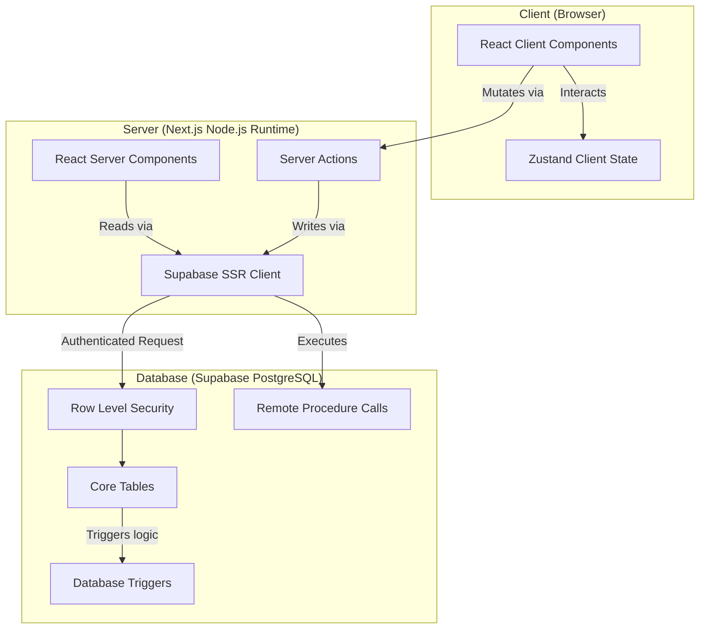

# VASUDHA OS — System Architecture

<p align="center">
  <strong>Server Components · Thin Client · Cloud-Native Design</strong><br/>
  <em>Architectural blueprint for a production-grade Web ERP</em>
</p>

---

## Table of Contents

- [System Overview](#system-overview)
- [Architecture Principles](#architecture-principles)
- [High-Level Architecture](#high-level-architecture)
- [Data Flow](#data-flow)
- [Security Layers](#security-layers)

---

VASUDHA OS is a **cloud-native ERP** built with Next.js 16 (App Router), leveraging React Server Components for maximum performance and security. The system uses Supabase (PostgreSQL) as its primary backend, shifting heavy business logic directly to the database layer via RPCs and Triggers.

### Architecture at a Glance



### Key Architecture Decisions

| Decision | Choice | Rationale |
|----------|--------|-----------|
| Architecture Pattern | Thin Client / Thick DB | Business logic (e.g. outstanding balances) lives in PostgreSQL, ensuring 100% consistency across all clients. |
| Rendering Strategy | Server Components (RSC) | Zero client-side JS for data fetching, faster page loads, secure DB access without exposing keys. |
| State Management | Zustand | Minimal overhead for client UI state; actual data state is managed by React Server Components and URL searchParams. |
| Database Auth | Supabase SSR (`@supabase/ssr`) | Passes Next.js cookies to Supabase so PostgreSQL RLS policies can securely identify the user and company. |
| Styling | Tailwind CSS v4 | Rapid, scalable, and responsive utility-first CSS. |

---

## Architecture Principles

### 1. Database as the Source of Truth
Instead of calculating mathematical aggregates (like outstanding balances or aging reports) in JavaScript, VASUDHA OS relies on PostgreSQL Views, RPCs, and Triggers. This guarantees that data is always consistent, regardless of what frontend accesses it.

### 2. Server Components by Default
By default, all Next.js pages and components are Server Components. We only use `"use client"` when interactive hooks (`useState`, `onClick`) are absolutely required.

### 3. Progressive Enhancement with URL State
Pagination, filtering, and searching are controlled via the URL (`searchParams`). This allows the Server Components to automatically re-fetch and render the correct data without needing complex client-side state management.

### 4. Supabase SSR Integration
Because we use Server Components, the standard Supabase client cannot access browser cookies. We use `@supabase/ssr` to securely forward Next.js cookies to Supabase. This allows PostgreSQL Row Level Security (RLS) to enforce data isolation (e.g., `company_id = auth.company_id()`).

---

## High-Level Architecture

### The Next.js App Router Structure

```
src/
├── app/
│   ├── (auth)/             # Authentication routes (login, setup)
│   ├── (app)/              # Protected ERP routes
│   │   ├── dashboard/      # KPI dashboard
│   │   ├── collections/    # Daily route collections
│   │   ├── invoices/       # Billing and invoices
│   │   ├── payments/       # Payment records
│   │   └── reports/        # Analytics and GST
│   ├── layout.tsx          # Root layout
│   └── page.tsx            # Landing page
├── components/             # Reusable UI elements
│   ├── ui/                 # Generic buttons, inputs, modals
│   ├── collections/        # Domain-specific components
│   └── reports/            # Export buttons, charts
├── lib/
│   ├── supabase/           # Database clients
│   │   ├── client.ts       # Browser client
│   │   └── server.ts       # SSR client (requires cookies)
│   └── utils/              # Helper functions (formatting)
```

---

## Data Flow

### Read Flow (e.g. Dashboard Loading)

1. User navigates to `/dashboard`.
2. Next.js Server Component initializes `createClient()` from `@/lib/supabase/server`.
3. Server securely reads auth cookies and sends a request to Supabase.
4. Supabase PostgreSQL applies RLS (ensuring the user only sees their company's data).
5. PostgreSQL returns the data.
6. Server Component renders the HTML and sends it to the client.
7. Client browser instantly displays the fully rendered dashboard.

### Write Flow (e.g. Generating an Invoice)

1. User fills out the invoice form (Client Component).
2. User submits the form, triggering a Next.js **Server Action**.
3. Server Action validates the data using Zod.
4. Server Action uses `createClient()` to write to the `invoices` table.
5. PostgreSQL accepts the write, and a Database Trigger automatically updates the restaurant's outstanding balance.
6. Server Action calls `revalidatePath('/dashboard')` to instantly update the UI.

---

## Security Layers

1. **Edge/Middleware:** Next.js middleware verifies the session cookie before allowing access to `/` protected routes.
2. **Server Actions:** Validate all incoming data using strict Zod schemas before touching the database.
3. **Database RLS:** The ultimate security net. Even if a Server Action has a bug, PostgreSQL RLS physically prevents a user from reading or modifying data belonging to another `company_id`.

---

<p align="center">
  <strong>VASUDHA OS Architecture</strong> — Scalable, Secure, and Blazing Fast.
</p>
