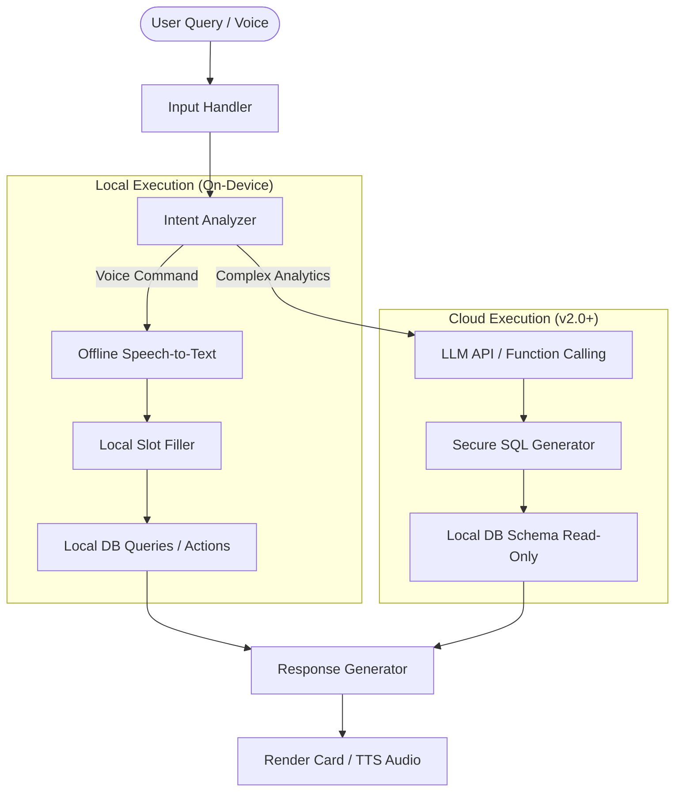

# VASUDHA OS — AI Agent Architecture

<p align="center">
  <strong>Intelligent Analytics, Natural Language Queries & Voice Entry</strong><br/>
  <em>Integrating LLMs and Local AI for Smart ERP Operations</em>
</p>

---

## Table of Contents

- [Vision & Strategy](#vision--strategy)
- [Agent Capabilities](#agent-capabilities)
- [Architecture & Flow](#architecture--flow)
- [Natural Language Query (NLQ) Engine](#natural-language-query-nlq-engine)
- [Voice Entry Engine (Offline-First)](#voice-entry-engine-offline-first)
- [Predictive Analytics & Forecasting](#predictive-analytics--forecasting)
- [Anomaly Detection](#anomaly-detection)
- [Privacy, Security & Local Execution](#privacy-security--local-execution)
- [Implementation Timeline](#implementation-timeline)

---

## Vision & Strategy

For small business owners and field staff in India, traditional ERP interfaces can feel complex and intimidating. The VASUDHA OS AI Agent bridges this gap by enabling users to interact with their business data using natural language, voice commands, and automated predictive alerts.

### Goals
1. **Reduce Friction**: Allow drivers and agents to record transactions using voice commands in regional languages (Hindi, Hinglish, Marathi, etc.).
2. **Provide Actionable Insights**: Transform dry databases into instant answers ("Who owes me the most money in MG Road?").
3. **Proactive Management**: Alert owners about stockout risks or abnormal payment delays before they become problems.

---

## Agent Capabilities

| Capability | Phase | Execution | Target Users | Description |
|------------|-------|-----------|--------------|-------------|
| **Natural Language Query (NLQ)** | v2.0 | Cloud API | Owners, Accountants | Query data via text (e.g. "Show me last month's top restaurant") |
| **Voice-to-Text Entry** | v2.5 | Local/Cloud hybrid | Collection Agents | Dictate daily deliveries: "Rajdhani hotel, 12 cans" |
| **Demand Forecasting** | v3.0 | Local / Edge AI | Managers | Predict weekly product demand based on seasonal history |
| **Fraud & Anomaly Detection** | v3.5 | Cloud API | Owners | Flag abnormal return rates or collection discrepancies |

---

## Architecture & Flow

The AI Agent acts as an orchestration layer above the standard domain services. It parses user intent, executes queries, and synthesizes responses.



---

## Natural Language Query (NLQ) Engine

The NLQ engine converts user text queries into safe SQL read operations.

### Query Pipeline
1. **Sanitization**: Filter out destructive SQL keywords (e.g. `DROP`, `DELETE`, `UPDATE`).
2. **Schema Mapping**: Provide the LLM context with a minimal, read-only definition of SQLite tables.
3. **Execution**: Execute the generated SQL query locally within a strict read-only transaction.
4. **Formatting**: Pass raw row data back to the LLM to format into a conversational answer or summary table.

### Sample Inputs and Targets
*   *Input*: "Who has the highest outstanding balance?"
    *   *SQL*: `SELECT name, outstanding_balance FROM restaurants ORDER BY outstanding_balance DESC LIMIT 1;`
*   *Input*: "Show sales of 20L Water Cans for last week."
    *   *SQL*: `SELECT SUM(net_quantity) FROM collection_items WHERE product_name = '20L Water Can' AND created_at >= date('now', '-7 days');`

---

## Voice Entry Engine (Offline-First)

For field agents driving delivery vehicles, typing is slow and dangerous. The voice entry engine uses an offline-capable, lightweight Whisper or Vosk model compiled for mobile devices (iOS/Android).

### Voice Commands Patterns (Hinglish/English)
*   *"Rajdhani Hotel me das water bottle deliver kiya aur do khali return mila"*
*   *Parsed Entity*:
    *   `restaurant_alias`: "Rajdhani Hotel"
    *   `product`: "20L Water Can"
    *   `delivered_qty`: 10
    *   `returned_qty`: 2

### Intent Parser

```dart
class LocalIntentParser {
  /// Parse simple speech-to-text string to structured delivery details
  ParsedDelivery parseDeliveryPhrase(String text) {
    // 1. Match restaurant name using fuzzy string matching on local database names
    // 2. Extract quantities using regex matching numbers near keywords ("bottle", "can", "milk")
    // 3. Confirm match confidence score before submitting
  }
}
```

---

## Predictive Analytics & Forecasting

### Demand Planning (v3.0)
Uses local historical collection data to compute seasonal demand variations.

```
Weekly Forecast = Base Average × Area Trend Factor × Seasonal Multiplier
```
*   *Benefit*: Prevents dairy or water stockouts during hot summer weeks or festival periods.

---

## Anomaly Detection

To protect business owners from internal leaks or losses:
1. **Abnormal Return Rates**: Flags if an agent records returns exceeding 15% of delivered volume for three consecutive visits to a restaurant.
2. **Collection Delay Warning**: Detects if a historically weekly-paying restaurant has not made a payment in 45 days.
3. **GPS Distance Alert (v2.0)**: Flags if a collection was recorded when the device GPS coordinates were > 500 meters away from the restaurant's saved location.

---

## Privacy, Security & Local Execution

1. **Read-Only Database Access**: The LLM engine cannot generate write statements. All writes must go through structured GUI forms or predefined, validated API endpoints.
2. **No PII Transmission**: Customer phone numbers and PIN hashes are stripped from context payloads sent to third-party LLM providers.
3. **Offline Mode Fallback**: In offline zones, complex natural language queries are disabled; the app reverts to simple regex-based local voice command mapping.

---

## Implementation Timeline

- **Phase 1 (v2.0)**: Cloud-based LLM integrations for read-only conversational dashboard queries.
- **Phase 2 (v2.5)**: On-device offline Speech-to-Text engine for dictating delivery counts.
- **Phase 3 (v3.0)**: Demand forecasting engine using regression models directly on SQLite tables.

---

<p align="center">
  <strong>VASUDHA OS AI Agent</strong> — Transforming business operations with intelligence. 🧠
</p>
