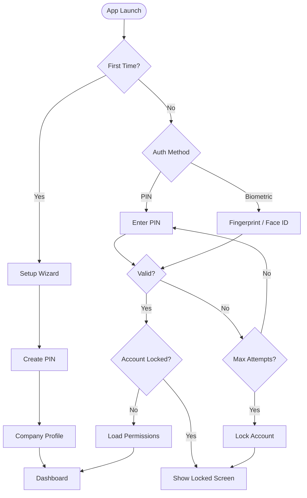
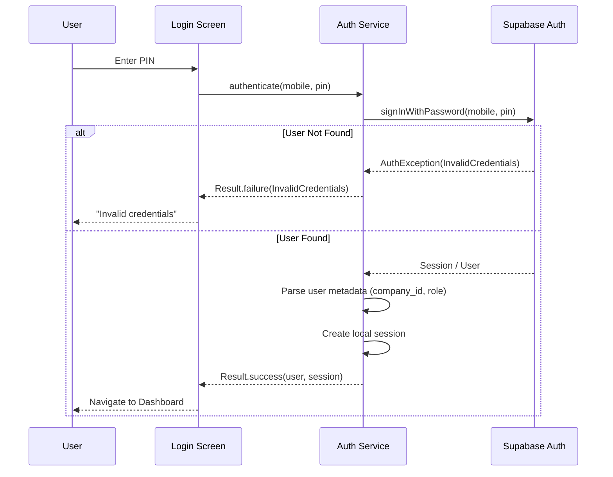
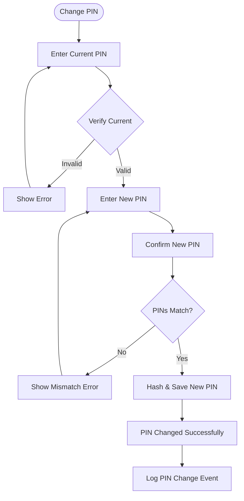
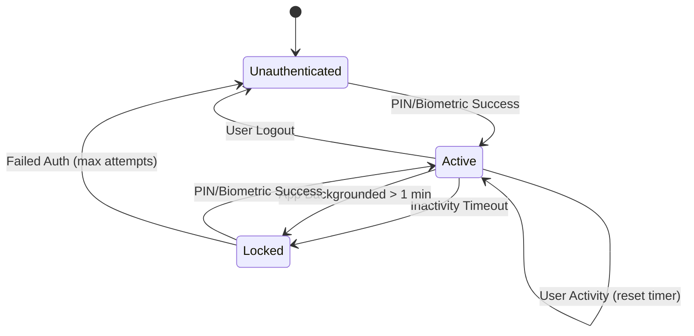
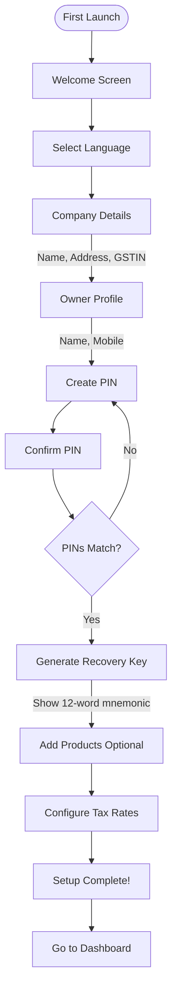

# VASUDHA OS — Authentication & Authorization

<p align="center">
  <strong>Auth Flows, RBAC & Permission Matrix</strong><br/>
  <em>Complete authentication and authorization specification</em>
</p>

---

## Table of Contents

- [Authentication Overview](#authentication-overview)
- [Auth Flow](#auth-flow)
- [PIN Authentication](#pin-authentication)
- [Biometric Authentication](#biometric-authentication)
- [Session Management](#session-management)
- [Role-Based Access Control (RBAC)](#role-based-access-control-rbac)
- [Permission Matrix](#permission-matrix)
- [First-Time Setup](#first-time-setup)
- [Account Security](#account-security)
- [Future OAuth/SSO (v2.0)](#future-oauthsso-v20)

---

## Authentication Overview

VASUDHA OS uses a **local-first authentication** system designed for offline operation. In v1.0, all authentication happens on-device against the local SQLite database. In v2.0, cloud-based authentication will be layered on top.



---

## Auth Flow

### Login Flow



### PIN Storage

```dart
class PinService {
  /// Hash PIN using bcrypt before storage
  static String hashPin(String pin) {
    return BCrypt.hashpw(pin, BCrypt.gensalt(rounds: 10));
  }

  /// Verify PIN against stored hash
  static bool verifyPin(String pin, String hash) {
    return BCrypt.checkpw(pin, hash);
  }
}
```

---

## PIN Authentication

### PIN Requirements

| Requirement | Specification |
|-------------|--------------|
| Length | 4–6 digits |
| Characters | Numeric only (0–9) |
| Storage | bcrypt hash with 10 rounds |
| Input UI | Custom PIN pad (no system keyboard) |
| Visibility | Dots (masked) with optional show/hide toggle |
| Auto-submit | Submit on last digit (no "Submit" button needed) |

### PIN Change Flow



PIN recovery and user management are handled through the Supabase dashboard or via admin-authorized API commands:

1. Owners can reset any user's PIN from Settings → User Management (which calls a secure backend RPC or Supabase Auth update API).
2. Owner recovery can be initiated via Supabase standard password reset flows (SMS OTP / Email link).

---

## Biometric Authentication

### Implementation (v1.1)

```dart
class BiometricService {
  final LocalAuthentication _localAuth = LocalAuthentication();

  Future<bool> isBiometricAvailable() async {
    final isAvailable = await _localAuth.canCheckBiometrics;
    final isDeviceSupported = await _localAuth.isDeviceSupported();
    return isAvailable && isDeviceSupported;
  }

  Future<bool> authenticate() async {
    return await _localAuth.authenticate(
      localizedReason: 'Authenticate to access VASUDHA OS',
      options: const AuthenticationOptions(
        stickyAuth: true,
        biometricOnly: false,  // Allow device PIN/pattern as fallback
      ),
    );
  }
}
```

### Biometric Flow

| Step | Action |
|------|--------|
| 1 | User enables biometric in Settings |
| 2 | User authenticates with PIN to confirm |
| 3 | App registers biometric for future logins |
| 4 | On app launch, biometric prompt shown first |
| 5 | If biometric fails 3 times, fallback to PIN |
| 6 | PIN is always available as fallback |

---

## Session Management

### Session Configuration

| Parameter | Value | Description |
|-----------|-------|-------------|
| Session timeout | 5 minutes | Lock screen after inactivity |
| Background timeout | 1 minute | Lock when app goes to background |
| Max concurrent devices | 1 (v1.0) / 3 (v2.0) | Active sessions per user |
| Session storage | In-memory | No persistent session (re-auth on app kill) |

### Session Lifecycle



### Activity Tracking

```dart
class SessionWatcher extends WidgetsBindingObserver {
  Timer? _inactivityTimer;
  static const _timeoutDuration = Duration(minutes: 5);

  void resetTimer() {
    _inactivityTimer?.cancel();
    _inactivityTimer = Timer(_timeoutDuration, _lockSession);
  }

  @override
  void didChangeAppLifecycleState(AppLifecycleState state) {
    if (state == AppLifecycleState.paused) {
      // App went to background — start 1-minute timer
      _backgroundTimer = Timer(Duration(minutes: 1), _lockSession);
    } else if (state == AppLifecycleState.resumed) {
      _backgroundTimer?.cancel();
      // Check if session still valid
      if (_isSessionExpired()) _lockSession();
    }
  }
}
```

---

## Role-Based Access Control (RBAC)

### Role Definitions

| Role | Description | Typical User | Login Scope |
|------|-------------|-------------|-------------|
| **Owner** | Full system access; can manage everything | Business owner | Full dashboard + settings |
| **Manager** | Operational control; cannot manage company settings | Operations manager | Full dashboard (no company settings) |
| **Accountant** | Financial module access; billing and payments | Billing staff | Billing + Payments + Reports |
| **Agent** | Field operations; collection and payment recording | Collection agent | Collection + Payments |
| **Driver** | Limited field access; delivery status only | Delivery driver | Collection view (read-only) |
| **Viewer** | Read-only access to dashboards and reports | Investor, advisor | Dashboard + Reports (read-only) |

### Role Hierarchy

```
Owner (Level 6)
  └── Manager (Level 5)
       └── Accountant (Level 4)
       └── Agent (Level 3)
            └── Driver (Level 2)
       └── Viewer (Level 1)
```

Higher-level roles inherit all permissions of lower-level roles in their branch.

---

## Permission Matrix

### Module-Level Permissions

| Module | Owner | Manager | Accountant | Agent | Driver | Viewer |
|--------|:-----:|:-------:|:----------:|:-----:|:------:|:------:|
| **Dashboard** | ✅ Full | ✅ Full | ✅ Financial | ✅ Collection | ✅ Delivery | ✅ Read |
| **Restaurants** | ✅ CRUD | ✅ CRUD | ✅ Read | ✅ Read | ✅ Read | ✅ Read |
| **Collection** | ✅ CRUD | ✅ CRUD | ✅ Read | ✅ CRU | ✅ Read | ✅ Read |
| **Inventory** | ✅ CRUD | ✅ CRUD | ✅ Read | ❌ | ❌ | ✅ Read |
| **Billing** | ✅ CRUD | ✅ CRUD | ✅ CRUD | ❌ | ❌ | ✅ Read |
| **Payments** | ✅ CRUD | ✅ CRUD | ✅ CRUD | ✅ CR | ❌ | ✅ Read |
| **Reports** | ✅ All | ✅ All | ✅ Financial | ✅ Collection | ❌ | ✅ All |
| **Settings** | ✅ Full | ✅ Limited | ❌ | ❌ | ❌ | ❌ |
| **User Mgmt** | ✅ Full | ❌ | ❌ | ❌ | ❌ | ❌ |

### Action-Level Permissions

#### Restaurant Actions

| Action | Owner | Manager | Accountant | Agent | Driver | Viewer |
|--------|:-----:|:-------:|:----------:|:-----:|:------:|:------:|
| View restaurant list | ✅ | ✅ | ✅ | ✅ | ✅ | ✅ |
| View restaurant profile | ✅ | ✅ | ✅ | ✅ | ✅ | ✅ |
| Create restaurant | ✅ | ✅ | ❌ | ❌ | ❌ | ❌ |
| Edit restaurant | ✅ | ✅ | ❌ | ❌ | ❌ | ❌ |
| Delete restaurant | ✅ | ✅ | ❌ | ❌ | ❌ | ❌ |
| Change status | ✅ | ✅ | ❌ | ❌ | ❌ | ❌ |
| Modify credit limit | ✅ | ✅ | ❌ | ❌ | ❌ | ❌ |
| View financial details | ✅ | ✅ | ✅ | ❌ | ❌ | ✅ |

#### Collection Actions

| Action | Owner | Manager | Accountant | Agent | Driver | Viewer |
|--------|:-----:|:-------:|:----------:|:-----:|:------:|:------:|
| View collection list | ✅ | ✅ | ✅ | ✅ | ✅ | ✅ |
| Create collection | ✅ | ✅ | ❌ | ✅ | ❌ | ❌ |
| Edit own collection | ✅ | ✅ | ❌ | ✅ | ❌ | ❌ |
| Edit others' collection | ✅ | ✅ | ❌ | ❌ | ❌ | ❌ |
| Verify collection | ✅ | ✅ | ❌ | ❌ | ❌ | ❌ |
| Delete collection | ✅ | ✅ | ❌ | ❌ | ❌ | ❌ |
| View all agents' collections | ✅ | ✅ | ✅ | ❌ | ❌ | ✅ |

#### Billing Actions

| Action | Owner | Manager | Accountant | Agent | Driver | Viewer |
|--------|:-----:|:-------:|:----------:|:-----:|:------:|:------:|
| Generate bills | ✅ | ✅ | ✅ | ❌ | ❌ | ❌ |
| Approve bills | ✅ | ✅ | ❌ | ❌ | ❌ | ❌ |
| Cancel bills | ✅ | ✅ | ❌ | ❌ | ❌ | ❌ |
| Generate PDF | ✅ | ✅ | ✅ | ❌ | ❌ | ❌ |
| Share bills | ✅ | ✅ | ✅ | ❌ | ❌ | ❌ |
| View bills | ✅ | ✅ | ✅ | ❌ | ❌ | ✅ |
| Modify approved bill | ❌ | ❌ | ❌ | ❌ | ❌ | ❌ |

#### Payment Actions

| Action | Owner | Manager | Accountant | Agent | Driver | Viewer |
|--------|:-----:|:-------:|:----------:|:-----:|:------:|:------:|
| Record payment | ✅ | ✅ | ✅ | ✅ | ❌ | ❌ |
| Verify payment | ✅ | ✅ | ❌ | ❌ | ❌ | ❌ |
| Cancel payment | ✅ | ✅ | ❌ | ❌ | ❌ | ❌ |
| View all payments | ✅ | ✅ | ✅ | ❌ | ❌ | ✅ |
| View own recorded payments | ✅ | ✅ | ✅ | ✅ | ❌ | ❌ |
| Generate receipt | ✅ | ✅ | ✅ | ✅ | ❌ | ❌ |

#### Settings Actions

| Action | Owner | Manager | Accountant | Agent | Driver | Viewer |
|--------|:-----:|:-------:|:----------:|:-----:|:------:|:------:|
| Edit company profile | ✅ | ❌ | ❌ | ❌ | ❌ | ❌ |
| Manage tax rates | ✅ | ✅ | ❌ | ❌ | ❌ | ❌ |
| Manage products | ✅ | ✅ | ❌ | ❌ | ❌ | ❌ |
| Manage users | ✅ | ❌ | ❌ | ❌ | ❌ | ❌ |
| Create backup | ✅ | ✅ | ❌ | ❌ | ❌ | ❌ |
| Restore backup | ✅ | ❌ | ❌ | ❌ | ❌ | ❌ |
| Factory reset | ✅ | ❌ | ❌ | ❌ | ❌ | ❌ |
| App preferences | ✅ | ✅ | ✅ | ✅ | ✅ | ✅ |

### Permission Implementation

```dart
class PermissionService {
  /// Check if user has permission for a specific action
  bool hasPermission(User user, Permission permission) {
    final rolePermissions = _permissionMatrix[user.role];
    if (rolePermissions == null) return false;
    return rolePermissions.contains(permission);
  }

  /// Guard a use case execution with permission check
  Future<Result<T, Failure>> guardedExecute<T>(
    User user,
    Permission requiredPermission,
    Future<Result<T, Failure>> Function() action,
  ) async {
    if (!hasPermission(user, requiredPermission)) {
      return Result.failure(PermissionFailure(
        'You do not have permission to perform this action. '
        'Required: ${requiredPermission.name}. '
        'Your role: ${user.role.name}.',
      ));
    }
    return action();
  }
}
```

---

## First-Time Setup

### Setup Wizard Flow



### Setup Data Created

| Entity | Auto-Created | Details |
|--------|-------------|---------|
| Company | Yes | From wizard input |
| Owner User | Yes | Role = 'owner', status = 'active' |
| Default Tax Rates | Yes | GST 0%, 5%, 12%, 18%, 28% |
| App Settings | Yes | Default configuration |
| Recovery Key | Yes | 12-word mnemonic for PIN recovery |

---

## Account Security

### Login Attempt Tracking

```
Attempt 1: Show error "Invalid PIN"
Attempt 2: Show error "Invalid PIN. 3 attempts remaining"
Attempt 3: Show error "Invalid PIN. 2 attempts remaining"
Attempt 4: Show warning "Invalid PIN. 1 attempt remaining. Account will be locked."
Attempt 5: Lock account for 15 minutes
```

### Account Recovery Options

| Scenario | Recovery Method |
|----------|----------------|
| Forgot PIN (non-owner) | Owner resets PIN from User Management |
| Forgot PIN (owner) | Use 12-word recovery key |
| Lost recovery key (owner) | Factory reset (data loss) |
| Account locked | Wait 15 minutes OR owner unlocks |
| Device lost/stolen | Remote wipe (v2.0) |

---

## Future OAuth/SSO (v2.0)

### Planned Auth Providers

| Provider | Use Case | Priority |
|----------|----------|----------|
| Phone OTP (SMS) | Primary cloud auth for Indian users | P0 |
| Google Sign-In | Quick registration for tech-savvy users | P1 |
| Email + Password | Standard web auth for dashboard | P1 |
| SAML/SSO | Enterprise customers (v5.0) | P2 |

### JWT Token Lifecycle (v2.0)

```
Registration/Login → Access Token (15 min) + Refresh Token (30 days)
    │
    ├── Access Token used for API calls
    │   └── Expired? → Use Refresh Token to get new Access Token
    │
    └── Refresh Token expired → Full re-authentication required
```

| Token | Expiry | Storage | Refresh |
|-------|--------|---------|---------|
| Access Token | 15 minutes | In-memory | Auto-refresh |
| Refresh Token | 30 days | Secure Storage | Re-login |
| Device Token | 90 days | Secure Storage | Re-register |

---

<p align="center">
  <strong>VASUDHA OS Authentication</strong> — Secure access for every role, every device. 🔐
</p>
