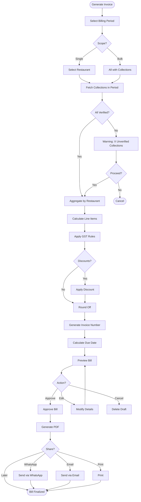
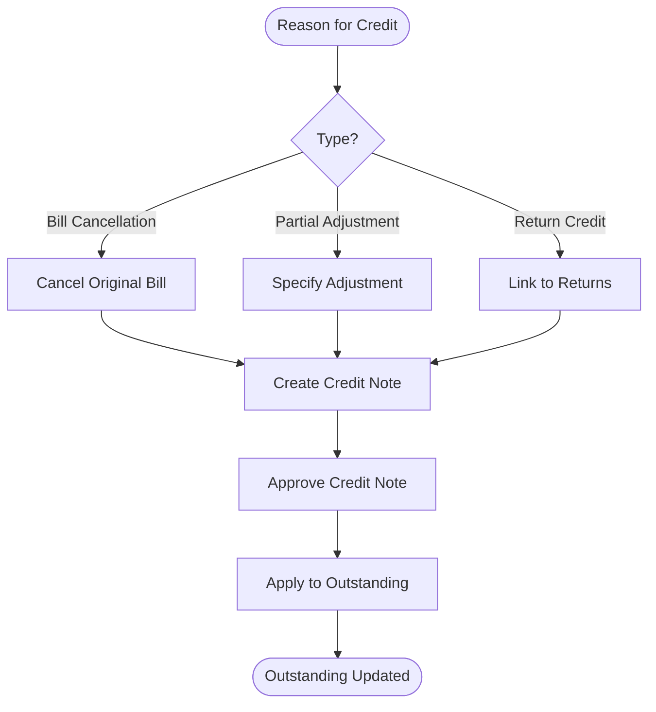
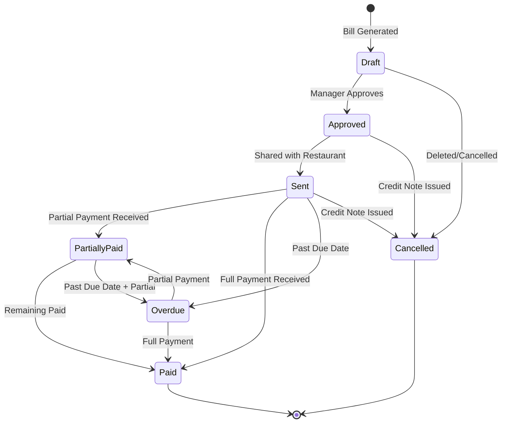

# VASUDHA OS — Billing Engine

<p align="center">
  <strong>Invoice Generation, GST Calculation & Payment Terms</strong><br/>
  <em>Complete billing specification for Indian GST-compliant invoicing</em>
</p>

---

## Table of Contents

- [Engine Overview](#engine-overview)
- [Invoice Generation Workflow](#invoice-generation-workflow)
- [GST Calculation Engine](#gst-calculation-engine)
- [Invoice Numbering System](#invoice-numbering-system)
- [Payment Terms & Credit Management](#payment-terms--credit-management)
- [Billing Cycle Management](#billing-cycle-management)
- [Bulk Billing Operations](#bulk-billing-operations)
- [Credit Notes & Adjustments](#credit-notes--adjustments)
- [PDF Invoice Generation](#pdf-invoice-generation)
- [Bill Status Management](#bill-status-management)
- [Recurring Billing (v2.0)](#recurring-billing-v20)
- [Invoice Templates](#invoice-templates)

---

## Engine Overview

The Billing Engine transforms raw collection data into professional, GST-compliant invoices. It is designed for high-volume, automated invoice generation while maintaining accuracy to the paisa.

### Key Design Decisions

| Decision | Choice | Rationale |
|----------|--------|-----------|
| Bill aggregation | Per restaurant per billing period | Matches Indian billing practices |
| Price source | Snapshotted from collection items | Ensures historical accuracy |
| Tax calculation | Real-time computation, stored on bill | Audit requirement; offline accuracy |
| Invoice format | GST-compliant as per CBIC guidelines | Legal requirement |
| Rounding | Nearest rupee, max ₹0.50 | Industry standard |
| Immutability | Approved bills are frozen | Financial audit compliance |

---

## Invoice Generation Workflow



### Aggregation Logic

```dart
/// Aggregate collection items for billing
BillData aggregateForBilling({
  required String restaurantId,
  required DateTime periodStart,
  required DateTime periodEnd,
}) {
  // 1. Get all verified collections for restaurant in period
  final collections = getVerifiedCollections(
    restaurantId: restaurantId,
    startDate: periodStart,
    endDate: periodEnd,
    excludeBilled: true,  // Skip already-billed collections
  );

  // 2. Group collection items by product
  final Map<String, AggregatedItem> itemsByProduct = {};
  
  for (final collection in collections) {
    for (final item in collection.items) {
      final existing = itemsByProduct[item.productId];
      if (existing != null) {
        existing.totalQuantity += item.netQuantity;
        existing.totalAmount += item.netAmount;
      } else {
        itemsByProduct[item.productId] = AggregatedItem(
          productId: item.productId,
          productName: item.productName,
          unit: item.unit,
          unitPrice: item.unitPrice,
          totalQuantity: item.netQuantity,
          totalAmount: item.netAmount,
          taxRate: item.product.taxRate,
          hsnCode: item.product.hsnCode,
        );
      }
    }
  }

  // 3. Return aggregated data for bill creation
  return BillData(
    restaurantId: restaurantId,
    periodStart: periodStart,
    periodEnd: periodEnd,
    items: itemsByProduct.values.toList(),
    collectionIds: collections.map((c) => c.id).toList(),
  );
}
```

---

## GST Calculation Engine

### GST Rules

| Scenario | CGST | SGST | IGST | Total Tax |
|----------|------|------|------|-----------|
| Same State (intra-state) | rate/2 | rate/2 | 0 | rate |
| Different State (inter-state) | 0 | 0 | rate | rate |

### State Detection

```dart
class GstStateDetector {
  /// Determine if transaction is intra-state or inter-state
  GstType determineGstType(Company company, Restaurant restaurant) {
    // Extract state code from GSTIN (first 2 digits)
    final companyState = _getStateCode(company.gstin);
    final restaurantState = restaurant.gstin != null
        ? _getStateCode(restaurant.gstin!)
        : company.state;  // Assume same state if no GSTIN

    if (companyState == restaurantState) {
      return GstType.intraState;  // CGST + SGST
    } else {
      return GstType.interState;  // IGST
    }
  }

  String _getStateCode(String gstin) => gstin.substring(0, 2);
}
```

### Tax Calculation per Line Item

```dart
class TaxCalculator {
  BillItemTax calculateLineItemTax({
    required double taxableValue,
    required double taxRate,
    required GstType gstType,
  }) {
    final totalTax = _roundToDecimal(taxableValue * taxRate / 100, 2);

    if (gstType == GstType.intraState) {
      final halfTax = _roundToDecimal(totalTax / 2, 2);
      // Handle odd paisa difference
      final cgst = halfTax;
      final sgst = totalTax - halfTax;  // Ensures CGST + SGST = total exactly
      return BillItemTax(cgst: cgst, sgst: sgst, igst: 0, total: totalTax);
    } else {
      return BillItemTax(cgst: 0, sgst: 0, igst: totalTax, total: totalTax);
    }
  }

  /// Round to specific decimal places using ROUND_HALF_UP
  double _roundToDecimal(double value, int places) {
    final factor = pow(10, places);
    return (value * factor).roundToDouble() / factor;
  }
}
```

### GST Summary for Filing

```dart
class GstReportGenerator {
  /// Generate GSTR-1 summary data
  Future<Gstr1Summary> generateGstr1({
    required DateTime periodStart,
    required DateTime periodEnd,
  }) async {
    // Group by: HSN Code → Tax Rate → Taxable Value, CGST, SGST, IGST
    final bills = await _billRepo.getBillsForPeriod(periodStart, periodEnd);
    
    final hsnSummary = <String, HsnEntry>{};
    
    for (final bill in bills) {
      for (final item in bill.items) {
        final key = '${item.hsnCode}_${item.taxRate}';
        final existing = hsnSummary[key];
        
        if (existing != null) {
          existing.taxableValue += item.amount;
          existing.cgstAmount += item.cgstRate * item.amount / 100;
          existing.sgstAmount += item.sgstRate * item.amount / 100;
          existing.igstAmount += item.igstRate * item.amount / 100;
          existing.totalTax += item.taxAmount;
        } else {
          hsnSummary[key] = HsnEntry(
            hsnCode: item.hsnCode ?? 'N/A',
            taxRate: item.taxRate,
            taxableValue: item.amount,
            cgstAmount: item.cgstRate * item.amount / 100,
            sgstAmount: item.sgstRate * item.amount / 100,
            igstAmount: item.igstRate * item.amount / 100,
            totalTax: item.taxAmount,
          );
        }
      }
    }
    
    return Gstr1Summary(
      period: '${_formatMonth(periodStart)} ${periodStart.year}',
      entries: hsnSummary.values.toList(),
      totalTaxableValue: hsnSummary.values.fold(0, (sum, e) => sum + e.taxableValue),
      totalCgst: hsnSummary.values.fold(0, (sum, e) => sum + e.cgstAmount),
      totalSgst: hsnSummary.values.fold(0, (sum, e) => sum + e.sgstAmount),
      totalIgst: hsnSummary.values.fold(0, (sum, e) => sum + e.igstAmount),
    );
  }
}
```

---

## Invoice Numbering System

### Format

```
{PREFIX}-{FINANCIAL_YEAR}-{SEQUENCE}

Examples:
  INV-2627-00001     (1st invoice of FY 2026-27)
  INV-2627-00002     (2nd invoice)
  INV-2627-01234     (1234th invoice)
  CN-2627-00001      (Credit note)
```

### Financial Year Calculation

```dart
String getFinancialYear(DateTime date) {
  final yearStart = date.month >= 4 ? date.year : date.year - 1;
  final yearEnd = yearStart + 1;
  return '${yearStart.toString().substring(2)}${yearEnd.toString().substring(2)}';
  // e.g., April 2026 → "2627", March 2027 → "2627"
}
```

### Numbering Rules

| Rule | Description |
|------|-------------|
| Atomic increment | Counter increments in a database transaction (no gaps) |
| No reset mid-year | Sequence continues through the financial year |
| Year rollover | Resets to 00001 on April 1st |
| Prefix configurable | Company can set custom prefix (INV, BILL, TAX) |
| Unique constraint | Database enforces uniqueness of bill_number |

---

## Payment Terms & Credit Management

### Payment Cycles

| Cycle | Description | Due Date Calculation |
|-------|-------------|---------------------|
| `weekly` | Bill due in 7 days | bill_date + 7 |
| `biweekly` | Bill due in 14 days | bill_date + 14 |
| `monthly` | Bill due in 30 days | bill_date + 30 |
| `custom` | Custom credit days | bill_date + restaurant.credit_days |

### Credit Limit Enforcement

```dart
class CreditLimitService {
  /// Check if restaurant can receive more deliveries
  Future<CreditStatus> checkCreditStatus(String restaurantId) async {
    final restaurant = await _restaurantRepo.getById(restaurantId);
    final outstanding = await _paymentRepo.getOutstanding(restaurantId);

    // Credit limit of 0 means unlimited
    if (restaurant.creditLimit == 0) {
      return CreditStatus.ok(outstanding.total);
    }

    final utilization = outstanding.total / restaurant.creditLimit;

    if (outstanding.total > restaurant.creditLimit) {
      return CreditStatus.exceeded(
        outstanding: outstanding.total,
        limit: restaurant.creditLimit,
        overBy: outstanding.total - restaurant.creditLimit,
      );
    } else if (utilization > 0.8) {
      return CreditStatus.warning(
        outstanding: outstanding.total,
        limit: restaurant.creditLimit,
        utilization: utilization,
      );
    } else {
      return CreditStatus.ok(outstanding.total);
    }
  }
}
```

---

## Billing Cycle Management

### Automated Billing Schedule

```dart
class BillingScheduleService {
  /// Determine which restaurants need billing today
  Future<List<BillingDueRestaurant>> getBillingDueToday() async {
    final today = DateTime.now();
    final restaurants = await _restaurantRepo.getAll();
    final due = <BillingDueRestaurant>[];

    for (final r in restaurants) {
      final lastBill = await _billingRepo.getLastBill(r.id);
      final isDue = _isBillingDue(r.paymentCycle, lastBill?.periodEnd, today);

      if (isDue) {
        due.add(BillingDueRestaurant(
          restaurant: r,
          suggestedPeriodStart: lastBill?.periodEnd.add(Duration(days: 1)) ?? _getDefaultStart(today, r.paymentCycle),
          suggestedPeriodEnd: today,
        ));
      }
    }

    return due;
  }
}
```

---

## Bulk Billing Operations

### Performance Requirements

| Operation | Target | Condition |
|-----------|--------|-----------|
| Aggregate collections | < 5 seconds | 500 restaurants, 15 days |
| Generate 500 bills | < 30 seconds | Including tax calculation |
| PDF generation (batch) | < 120 seconds | 500 invoices |
| Bill preview load | < 1 second | Single bill |

### Bulk Generation Algorithm

```dart
Future<BulkBillingResult> generateBulkBills({
  required DateTime periodStart,
  required DateTime periodEnd,
}) async {
  final results = BulkBillingResult();

  // 1. Get all restaurants with unbilled collections in period
  final restaurants = await _getRestaurantsWithCollections(periodStart, periodEnd);

  // 2. Process in batches of 50 (database transaction size limit)
  for (final batch in restaurants.chunks(50)) {
    await _database.transaction((txn) async {
      for (final restaurant in batch) {
        try {
          final bill = await _generateSingleBill(txn, restaurant, periodStart, periodEnd);
          results.addSuccess(bill);
        } catch (e) {
          results.addFailure(restaurant.id, e.toString());
        }
      }
    });
  }

  // 3. Emit bulk billing event
  _eventBus.emit(BulkBillsGenerated(
    billIds: results.successfulBillIds,
    count: results.successCount,
    totalValue: results.totalValue,
  ));

  return results;
}
```

---

## Credit Notes & Adjustments

### Credit Note Workflow



### Credit Note Rules

| Rule | Description |
|------|-------------|
| Numbering | Same sequence as bills with CN prefix: CN-2627-00001 |
| Immutable | Credit notes cannot be edited after approval |
| Linked | Always linked to original bill |
| Tax reversal | Credit note includes negative tax amounts |
| Outstanding | Credit note reduces restaurant outstanding |
| GST impact | Reported separately in GSTR-1 (table for credit notes) |

---

## PDF Invoice Generation

### Invoice Layout

```
┌─────────────────────────────────────────────────────────┐
│  [COMPANY LOGO]                                         │
│                                                         │
│  COMPANY NAME                           TAX INVOICE     │
│  Address Line 1                         Invoice: INV-...│
│  City, State - Pincode                  Date: DD/MM/YYYY│
│  GSTIN: XX AAAAA 0000 A 1 Z A          Due: DD/MM/YYYY │
│  Mobile: XXXXXXXXXX                                     │
├─────────────────────────────────────────────────────────┤
│  BILL TO:                                               │
│  Restaurant Name                                        │
│  Address                                                │
│  GSTIN: XX AAAAA 0000 A 1 Z A (if available)           │
│  Mobile: XXXXXXXXXX                                     │
├─────────────────────────────────────────────────────────┤
│  Billing Period: DD/MM/YYYY to DD/MM/YYYY               │
├──────┬────────────┬─────┬──────┬────────┬───────┬───────┤
│ S.No │ Description│ HSN │ Qty  │ Rate   │ Tax   │ Total │
├──────┼────────────┼─────┼──────┼────────┼───────┼───────┤
│  1   │ 20L Water  │ 2201│  150 │ ₹50.00 │₹375.00│₹7,875 │
│  2   │ 1L Milk    │ 0401│   80 │ ₹30.00 │₹120.00│₹2,520 │
├──────┴────────────┴─────┴──────┴────────┴───────┴───────┤
│                                    Subtotal: ₹11,400.00 │
│                              CGST @2.5%:      ₹247.50   │
│                              SGST @2.5%:      ₹247.50   │
│                              Round Off:          ₹0.00   │
│                              ─────────────────────────── │
│                              GRAND TOTAL:   ₹11,895.00   │
├─────────────────────────────────────────────────────────┤
│  Amount in Words: Eleven Thousand Eight Hundred and     │
│                   Ninety-Five Rupees Only                │
├─────────────────────────────────────────────────────────┤
│  Bank Details:                                          │
│  Account: XXXXXXXXXXXX                                  │
│  IFSC: XXXXXXXXXX                                       │
│  Bank: XXXX Bank, Branch                                │
│                                                         │
│  Terms & Conditions:                                    │
│  1. Payment is due within 30 days                       │
│  2. Interest @2% per month on overdue amounts           │
├─────────────────────────────────────────────────────────┤
│  For COMPANY NAME                                       │
│                                                         │
│  Authorized Signatory                                   │
└─────────────────────────────────────────────────────────┘
```

---

## Bill Status Management

### Status Lifecycle



### Status Transition Rules

| From | To | Trigger | Side Effects |
|------|-----|---------|-------------|
| Draft → Approved | Manager approval | Lock bill details; enable sharing |
| Approved → Sent | Share via WhatsApp/Email | Log delivery; timestamp |
| Sent → Partially Paid | Payment < balance | Update paid_amount |
| Sent → Paid | Payment = balance | Update status; zero balance |
| Sent → Overdue | due_date < today | Automated daily check |
| Any → Cancelled | Credit note | Create CN; reverse outstanding |

---

## Recurring Billing (v2.0)

### Planned Features

| Feature | Description |
|---------|-------------|
| Auto-generation | Bills auto-generated at end of each cycle |
| Standing orders | Restaurants with fixed daily orders auto-billed |
| Subscription billing | Monthly fixed-price service billing |
| Reminders | Automated payment reminders before due date |

---

## Invoice Templates

### Template System (v1.5)

| Template | Use Case | Customization |
|----------|----------|--------------|
| Standard | Default invoice | Logo, colors, bank details |
| Compact | WhatsApp-friendly | Simplified layout, smaller PDF |
| Detailed | For large orders | Includes daily breakdown |
| Receipt | Payment receipt | Minimal, receipt format |

---

<p align="center">
  <strong>VASUDHA OS Billing Engine</strong> — Accurate to the paisa, compliant by design. 🧾
</p>
