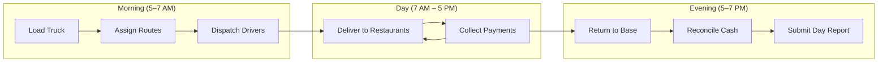
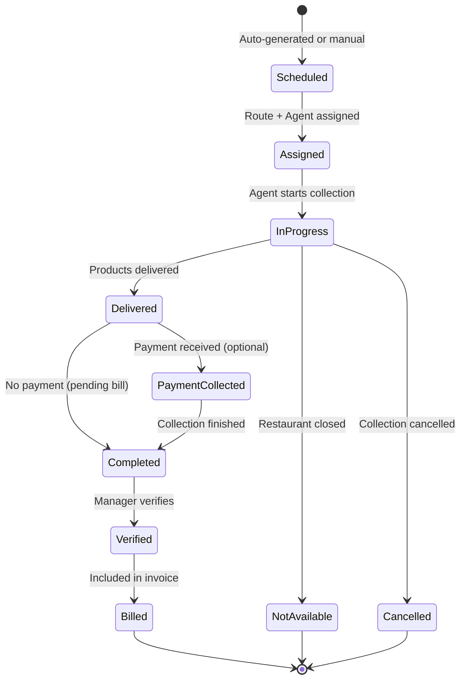
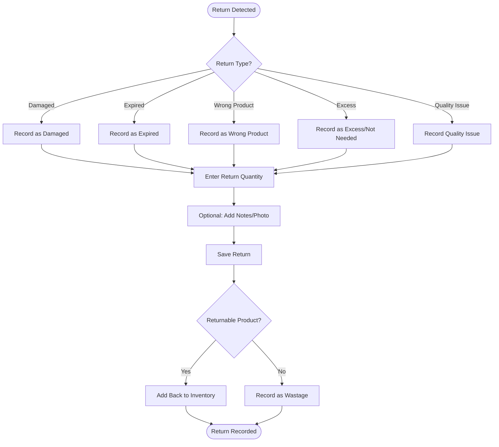
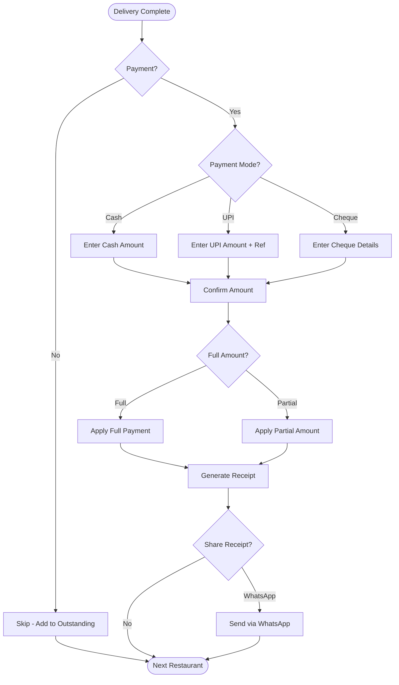

# VASUDHA OS — Collection Engine

<p align="center">
  <strong>Delivery Workflows, Route Management & Payment Collection</strong><br/>
  <em>The field operations engine that drives daily business</em>
</p>

---

## Table of Contents

- [Engine Overview](#engine-overview)
- [Daily Collection Lifecycle](#daily-collection-lifecycle)
- [Route Management](#route-management)
- [Delivery Scheduling](#delivery-scheduling)
- [Collection Entry Workflow](#collection-entry-workflow)
- [Return & Rejection Handling](#return--rejection-handling)
- [Field Payment Collection](#field-payment-collection)
- [Day-End Reconciliation](#day-end-reconciliation)
- [Collection Verification](#collection-verification)
- [Driver Assignment & Tracking](#driver-assignment--tracking)
- [Route Optimization (v3.0)](#route-optimization-v30)
- [Proof of Delivery (v2.0)](#proof-of-delivery-v20)
- [Collection Reports](#collection-reports)
- [Offline Collection Handling](#offline-collection-handling)

---

## Engine Overview

The Collection Engine manages the most critical daily operation in a distribution business — **delivering products to restaurants and collecting payments**. It coordinates drivers, routes, products, and payments in a workflow designed for speed and accuracy in the field.

### Daily Operations Flow



### Key Metrics

| Metric | Typical Range | Target |
|--------|--------------|--------|
| Restaurants per agent per day | 30–60 | 50+ |
| Time per restaurant entry | 1–5 minutes | < 30 seconds (app entry) |
| Collections per day | 100–500 | Scale to 1,000+ |
| Payment collection rate | 40–60% of deliveries | Track and improve |
| Return/rejection rate | 2–5% | Minimize |

---

## Daily Collection Lifecycle

### Lifecycle Stages



### Status Definitions

| Status | Who Sets | Description | Can Edit? |
|--------|---------|-------------|-----------|
| `scheduled` | System | Auto-generated for today | Yes |
| `assigned` | Manager | Route and agent assigned | Yes |
| `in_progress` | Agent | Agent has started | Yes |
| `completed` | Agent | Delivery finished | Manager only |
| `verified` | Manager | Verified and approved | No |
| `cancelled` | Agent/Manager | Cancelled with reason | No |
| `not_available` | Agent | Restaurant was closed | No |

---

## Route Management

### Route Structure

```
Route: "MG Road Morning"
├── Area: MG Road
├── Assigned Agent: Suresh Kumar
├── Estimated Time: 3 hours
├── Restaurants (in delivery order):
│   ├── 1. Hotel Rajdhani (Stop #1)
│   ├── 2. Sharma Restaurant (Stop #2)
│   ├── 3. Golden Palace (Stop #3)
│   ├── 4. Taj Kitchen (Stop #4)
│   └── ... (20–40 restaurants per route)
└── Products Loaded:
    ├── 20L Water Can: 200 units
    ├── 1L Milk Packet: 100 units
    └── 5L Oil Can: 50 units
```

### Route Configuration

```dart
class Route {
  final String id;
  final String name;
  final String areaId;
  final String? assignedUserId;
  final List<RouteStop> stops;        // Ordered list of restaurants
  final int estimatedTimeMinutes;
  final bool isActive;

  /// Get the delivery sequence for a restaurant
  int? getSequence(String restaurantId) {
    final index = stops.indexWhere((s) => s.restaurantId == restaurantId);
    return index >= 0 ? index + 1 : null;
  }

  /// Reorder stops
  void reorderStop(int oldIndex, int newIndex) {
    final stop = stops.removeAt(oldIndex);
    stops.insert(newIndex, stop);
  }
}
```

### Route Assignment Rules

| Rule | Description |
|------|-------------|
| One agent per route | Each route is assigned to exactly one agent |
| One route per agent per day | An agent works one route per day (configurable) |
| Route persistence | Routes persist across days; don't need daily recreation |
| Dynamic additions | Manager can add restaurants to a route during the day |
| Holiday override | Routes can be skipped for holidays/closures |

---

## Delivery Scheduling

### Auto-Scheduling Logic

```dart
class CollectionScheduler {
  /// Generate today's collection list
  Future<List<ScheduledCollection>> generateDailySchedule(DateTime date) async {
    final routes = await _routeRepo.getActiveRoutes();
    final schedule = <ScheduledCollection>[];

    for (final route in routes) {
      for (final stop in route.stops) {
        final restaurant = await _restaurantRepo.getById(stop.restaurantId);
        
        // Skip inactive/blacklisted restaurants
        if (restaurant.status != RestaurantStatus.active) continue;
        
        // Skip if already has a collection today
        final existing = await _collectionRepo.findByRestaurantAndDate(
          stop.restaurantId, date,
        );
        if (existing != null) continue;

        schedule.add(ScheduledCollection(
          restaurantId: stop.restaurantId,
          restaurantName: restaurant.name,
          routeId: route.id,
          routeName: route.name,
          assignedTo: route.assignedUserId,
          sequence: stop.sequence,
          estimatedProducts: await _predictDelivery(restaurant, date),
        ));
      }
    }

    return schedule..sort((a, b) => a.sequence.compareTo(b.sequence));
  }

  /// Predict delivery quantities based on history (simple average)
  Future<List<PredictedItem>> _predictDelivery(
    Restaurant restaurant, 
    DateTime date,
  ) async {
    // Get average quantities from last 7 deliveries
    final recentCollections = await _collectionRepo.getByRestaurant(
      restaurant.id,
      limit: 7,
    );

    final avgByProduct = <String, double>{};
    for (final coll in recentCollections) {
      for (final item in coll.items) {
        avgByProduct.update(
          item.productId,
          (val) => val + item.netQuantity / recentCollections.length,
          ifAbsent: () => item.netQuantity / recentCollections.length,
        );
      }
    }

    return avgByProduct.entries.map((e) => PredictedItem(
      productId: e.key,
      suggestedQuantity: e.value.round().toDouble(),
    )).toList();
  }
}
```

---

## Collection Entry Workflow

### Quick Entry Mode

Designed for speed — an agent at a restaurant doorway needs to record the delivery in under 30 seconds:

```
┌─────────────────────────────────────┐
│ ← Hotel Rajdhani              Done  │
├─────────────────────────────────────┤
│                                     │
│  20L Water Can                      │
│  ┌───┐  ┌────────┐  ┌───┐          │
│  │ - │  │   10   │  │ + │          │
│  └───┘  └────────┘  └───┘          │
│  [5] [10] [15] [20] [25]           │  Quick presets
│                                     │
│  1L Milk Packet                     │
│  ┌───┐  ┌────────┐  ┌───┐          │
│  │ - │  │    5   │  │ + │          │
│  └───┘  └────────┘  └───┘          │
│  [5] [10] [15] [20]                │
│                                     │
│  5L Oil Can                         │
│  ┌───┐  ┌────────┐  ┌───┐          │
│  │ - │  │    0   │  │ + │          │
│  └───┘  └────────┘  └───┘          │
│                                     │
│  ┌─────────────────────────────┐    │
│  │ 📝 Any returns? (optional)  │    │  Expandable section
│  └─────────────────────────────┘    │
│                                     │
│  ┌─────────────────────────────┐    │
│  │ 💰 Collect payment? (opt)   │    │  Expandable section
│  └─────────────────────────────┘    │
│                                     │
│  Total: ₹650                        │
│                                     │
│  ┌─────────────────────────────┐    │
│  │      Save & Next ➡️         │    │  Primary action
│  └─────────────────────────────┘    │
└─────────────────────────────────────┘
```

### Entry Optimization Features

| Feature | Implementation | Benefit |
|---------|---------------|---------|
| Pre-filled quantities | Based on last delivery average | Saves time |
| Quick-select presets | Common quantities as tappable chips | One-tap entry |
| Auto-advance | Move to next restaurant on save | Continuous flow |
| Batch mode | Enter same product for multiple restaurants | Bulk entry |
| Voice entry (v3.0) | "Das can paani, Rajdhani hotel" | Hands-free |

---

## Return & Rejection Handling

### Return Workflow



### Return Reasons

| Reason Code | Description | Restockable | Billing Impact |
|-------------|-------------|-------------|---------------|
| `damaged` | Product physically damaged | No | Deducted from bill |
| `expired` | Past expiry date | No | Deducted from bill |
| `wrong_product` | Wrong product delivered | Yes | Deducted from bill |
| `excess` | More than ordered | Yes | Deducted from bill |
| `quality` | Quality not acceptable | Conditional | Deducted from bill |
| `not_ordered` | Restaurant didn't order | Yes | Not billed |

---

## Field Payment Collection

### Payment Collection Flow



### Field Payment Rules

| Rule | Description |
|------|-------------|
| Agent records | Agent can record cash and UPI payments |
| Receipt required | Digital receipt auto-generated for every payment |
| Running total | App shows running cash total for the day |
| Mode restriction | Agents cannot record cheque/bank transfer (accountant only) |
| Advance payment | If no bill exists, payment is marked as advance |

---

## Day-End Reconciliation

### Reconciliation Workflow

```
End of Day for Agent Suresh:
├── Total Restaurants Visited: 42
├── Deliveries Completed: 38
├── Not Available: 3
├── Cancelled: 1
│
├── Delivery Value:
│   ├── 20L Water Can: 380 units × ₹50 = ₹19,000
│   ├── 1L Milk: 150 units × ₹30 = ₹4,500
│   └── Total Delivered: ₹23,500
│
├── Returns:
│   ├── Damaged: 5 cans = ₹250
│   └── Total Returns: ₹250
│
├── Net Delivery: ₹23,250
│
├── Payments Collected:
│   ├── Cash: ₹12,000
│   ├── UPI: ₹5,000
│   └── Total Collected: ₹17,000
│
├── Cash Reconciliation:
│   ├── Cash Collected: ₹12,000
│   ├── Cash Deposited: ₹12,000
│   ├── Discrepancy: ₹0 ✅
│   └── Status: Reconciled
│
└── Pending Collection: ₹6,250 (added to outstanding)
```

### Reconciliation Rules

| Rule | Description |
|------|-------------|
| Mandatory | Agent must submit day-end summary before day closes |
| Cash matching | Total cash collected must match cash deposited |
| Discrepancy threshold | Discrepancy > ₹100 requires manager explanation |
| Auto-lock | Day's collections auto-lock after submission |
| Manager review | Manager can review and approve agent summaries |

---

## Collection Verification

### Verification Process

| Step | Actor | Action |
|------|-------|--------|
| 1 | Agent | Completes all collections for the day |
| 2 | Agent | Submits day-end summary |
| 3 | Manager | Reviews collection list for accuracy |
| 4 | Manager | Spot-checks quantities with restaurant calls (optional) |
| 5 | Manager | Approves (verifies) collections |
| 6 | System | Collections become billable; locked from editing |

### Verification Rules

| Rule | Description |
|------|-------------|
| Configurable | Verification can be made optional in settings |
| Batch verify | Manager can verify all of an agent's daily collections at once |
| Selective verify | Manager can verify individual collections |
| Rejection | Manager can reject a collection (returns to agent for correction) |
| Time limit | Collections must be verified within 48 hours (configurable) |

---

## Driver Assignment & Tracking

### Assignment Model (v1.0)

```dart
class DriverAssignment {
  final String routeId;
  final String driverId;
  final DateTime date;
  final List<String> productLoads;   // Products loaded on vehicle
  final Map<String, double> loadQuantities;  // Product → Quantity loaded
  final DateTime? dispatchedAt;
  final DateTime? returnedAt;
}
```

### Loading List

When a driver is dispatched in the morning:

```
Loading List for Suresh Kumar - July 6, 2026
Route: MG Road Morning
Vehicle: RJ-14-AB-1234

Products to Load:
┌───────────────────┬─────────┬───────────────┐
│ Product           │ Unit    │ Quantity       │
├───────────────────┼─────────┼───────────────┤
│ 20L Water Can     │ can     │ 200           │
│ 1L Milk Packet    │ packet  │ 100           │
│ 5L Oil Can        │ can     │ 30            │
│ Empties to Collect│ can     │ ~150 (est)    │
└───────────────────┴─────────┴───────────────┘

Expected Deliveries: 42 restaurants
Estimated Return: 2:00 PM
```

---

## Route Optimization (v3.0)

### Planned AI-Powered Optimization

| Feature | Description | Algorithm |
|---------|-------------|-----------|
| Shortest path | Minimize total distance traveled | Modified TSP solver |
| Time windows | Respect restaurant delivery time preferences | Constrained VRP |
| Load balancing | Distribute restaurants evenly across agents | Balanced partitioning |
| Dynamic routing | Re-route based on real-time conditions | Greedy heuristic |
| Traffic awareness | Account for traffic patterns by time of day | Historical data |

### Expected Impact

| Metric | Before Optimization | After Optimization |
|--------|--------------------|--------------------|
| Total daily distance | Baseline | 20–30% reduction |
| Fuel cost | Baseline | 20–30% reduction |
| Deliveries per agent | 30–40 | 40–50 |
| Delivery time window accuracy | ~60% | ~85% |

---

## Proof of Delivery (v2.0)

### Planned Features

| Feature | Description |
|---------|-------------|
| GPS stamp | Automatic GPS coordinates at delivery location |
| Photo proof | Optional photo of delivered goods |
| Digital signature | Restaurant staff signature on device |
| Timestamp | Precise delivery timestamp |
| Geofencing | Auto-detect arrival at restaurant (100m radius) |

---

## Collection Reports

| Report | Key Metrics |
|--------|-----------|
| Daily Collection Summary | Restaurants visited, deliveries, returns, payments |
| Agent Performance | Collections per agent, time per restaurant, payment rate |
| Route Efficiency | Deliveries per route, time, cost per delivery |
| Return Analysis | Return rate by restaurant, product, reason |
| Payment Collection Rate | % of deliveries with immediate payment |
| Trend Analysis | Daily/weekly/monthly delivery volume trends |

---

## Offline Collection Handling

### Offline-First Design

The collection module is designed to work **100% offline**:

| Aspect | Implementation |
|--------|---------------|
| Data entry | All saved directly to local SQLite |
| Route data | Pre-loaded on app startup |
| Product catalog | Cached in local database |
| Restaurant data | Complete local copy |
| Payment recording | Saved locally; receipt generated offline |
| Day summary | Computed from local data |

### Sync Behavior (v2.0)

```
Morning: Sync latest route/restaurant updates (if online)
During Day: All operations saved locally
Evening: Batch sync all day's collections to cloud (if online)
Offline: Continue working; sync queue accumulates
Online: Auto-sync pending changes in background
```

---

<p align="center">
  <strong>VASUDHA OS Collection Engine</strong> — From warehouse to restaurant, every delivery tracked. 🚚
</p>
