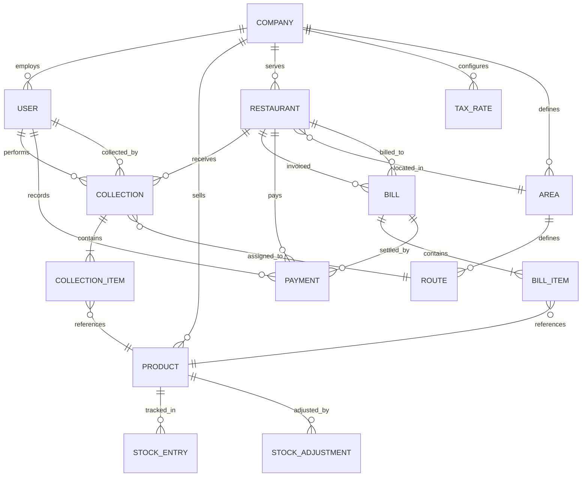

# VASUDHA OS — Data Model

<p align="center">
  <strong>Complete Entity Documentation & Relationships</strong><br/>
  <em>Every entity, field, constraint, and relationship — fully specified</em>
</p>

---

## Table of Contents

- [Data Model Overview](#data-model-overview)
- [Entity Relationship Diagram](#entity-relationship-diagram)
- [Core Entities](#core-entities)
  - [Company](#company)
  - [User](#user)
  - [Restaurant](#restaurant)
  - [Product](#product)
  - [Collection](#collection)
  - [CollectionItem](#collectionitem)
  - [Bill](#bill)
  - [BillItem](#billitem)
  - [Payment](#payment)
  - [Inventory / StockEntry](#inventory--stockentry)
  - [StockAdjustment](#stockadjustment)
- [Supporting Entities](#supporting-entities)
  - [Area / Zone](#area--zone)
  - [Route](#route)
  - [TaxRate](#taxrate)
  - [PaymentMode](#paymentmode)
- [Future Entities (v1.5+)](#future-entities-v15)
- [Audit & Metadata](#audit--metadata)
- [Enumerations](#enumerations)
- [Validation Rules](#validation-rules)
- [Indexing Strategy](#indexing-strategy)
- [Data Integrity Rules](#data-integrity-rules)
- [Naming Conventions](#naming-conventions)

---

## Data Model Overview

VASUDHA OS uses a **relational data model** optimized for SQLite with future PostgreSQL migration in mind. The model is designed around the core business workflow:

```
Company → manages → Restaurants
Restaurants → receive → Collections (deliveries)
Collections → contain → CollectionItems (product × quantity)
CollectionItems → feed into → Bills (invoices)
Bills → contain → BillItems (line items with tax)
Bills → receive → Payments
Products → tracked in → Inventory (stock entries)
```

### Design Principles

1. **Soft Deletes** — No entity is physically deleted; a `deleted_at` timestamp is set
2. **UUID Primary Keys** — All primary keys are UUIDs (offline-safe, globally unique)
3. **Audit Fields** — Every entity has `created_at`, `updated_at`, `created_by`
4. **Normalized Design** — Follow 3NF for data integrity; denormalize only for proven performance needs
5. **Immutable Financials** — Bills and payments are append-only; corrections are made via credit notes

---

## Entity Relationship Diagram



---

## Core Entities

### Company

The root entity representing the distributor business.

| Field | Type | Constraints | Description |
|-------|------|-------------|-------------|
| `id` | UUID | PK, NOT NULL | Unique identifier |
| `name` | VARCHAR(200) | NOT NULL | Company name |
| `legal_name` | VARCHAR(300) | — | Legal/registered name |
| `owner_name` | VARCHAR(150) | NOT NULL | Owner's full name |
| `mobile` | VARCHAR(15) | NOT NULL, UNIQUE | Primary contact mobile |
| `alt_mobile` | VARCHAR(15) | — | Alternate mobile number |
| `email` | VARCHAR(255) | — | Contact email |
| `address_line1` | VARCHAR(300) | NOT NULL | Street address |
| `address_line2` | VARCHAR(300) | — | Additional address info |
| `city` | VARCHAR(100) | NOT NULL | City |
| `state` | VARCHAR(100) | NOT NULL | State |
| `pincode` | VARCHAR(10) | NOT NULL | Postal code |
| `gstin` | VARCHAR(15) | UNIQUE | GST Identification Number |
| `pan` | VARCHAR(10) | — | PAN number |
| `fssai_number` | VARCHAR(20) | — | FSSAI license number |
| `logo_path` | VARCHAR(500) | — | Path to company logo image |
| `invoice_prefix` | VARCHAR(10) | NOT NULL, DEFAULT 'INV' | Invoice number prefix |
| `invoice_counter` | INTEGER | NOT NULL, DEFAULT 1 | Next invoice number |
| `financial_year_start` | INTEGER | NOT NULL, DEFAULT 4 | Financial year start month (April=4) |
| `currency` | VARCHAR(3) | NOT NULL, DEFAULT 'INR' | Currency code |
| `default_payment_cycle` | VARCHAR(20) | NOT NULL, DEFAULT 'monthly' | Default payment cycle for new restaurants |
| `created_at` | DATETIME | NOT NULL | Record creation timestamp |
| `updated_at` | DATETIME | NOT NULL | Last update timestamp |

**Relationships**:
- Has many `User` records
- Has many `Product` records
- Has many `Restaurant` records
- Has many `TaxRate` records
- Has many `Area` records

**Business Rules**:
- Only one company record per installation (multi-company is v5.0+)
- GSTIN follows format: `XX AAAAA 0000 A 1 Z A`
- PAN follows format: `AAAAA 0000 A`
- Invoice counter is atomic — always increments, never resets

---

### User

Represents a person who uses the application.

| Field | Type | Constraints | Description |
|-------|------|-------------|-------------|
| `id` | UUID | PK, NOT NULL | Unique identifier |
| `company_id` | UUID | FK → Company, NOT NULL | Parent company |
| `name` | VARCHAR(150) | NOT NULL | Full name |
| `mobile` | VARCHAR(15) | NOT NULL, UNIQUE | Mobile number (login ID) |
| `email` | VARCHAR(255) | — | Email address |
| `pin_hash` | VARCHAR(255) | NOT NULL | Hashed PIN (bcrypt) |
| `role` | VARCHAR(20) | NOT NULL | Role enum value |
| `status` | VARCHAR(20) | NOT NULL, DEFAULT 'active' | User status |
| `avatar_path` | VARCHAR(500) | — | Path to profile photo |
| `last_login_at` | DATETIME | — | Last successful login |
| `login_attempts` | INTEGER | NOT NULL, DEFAULT 0 | Failed login attempt count |
| `locked_until` | DATETIME | — | Account locked until (after max attempts) |
| `permissions` | TEXT (JSON) | — | Custom permission overrides |
| `created_at` | DATETIME | NOT NULL | Record creation timestamp |
| `updated_at` | DATETIME | NOT NULL | Last update timestamp |
| `created_by` | UUID | FK → User | User who created this record |
| `deleted_at` | DATETIME | — | Soft delete timestamp |

**Relationships**:
- Belongs to `Company`
- Has many `Collection` records (as collector)
- Has many `Payment` records (as recorder)

**Business Rules**:
- Mobile number serves as the unique login identifier
- PIN is stored as a bcrypt hash, never in plain text
- After 5 failed login attempts, account is locked for 15 minutes
- Owner role can never be deleted
- Role determines module access (see [AUTHENTICATION.md](./AUTHENTICATION.md))

---

### Restaurant

Represents a buyer/customer — a restaurant, hotel, hospital, caterer, or institutional buyer.

| Field | Type | Constraints | Description |
|-------|------|-------------|-------------|
| `id` | UUID | PK, NOT NULL | Unique identifier |
| `company_id` | UUID | FK → Company, NOT NULL | Parent company |
| `name` | VARCHAR(200) | NOT NULL | Restaurant/business name |
| `owner_name` | VARCHAR(150) | — | Owner's name |
| `contact_person` | VARCHAR(150) | — | Primary contact person |
| `mobile` | VARCHAR(15) | NOT NULL | Primary mobile number |
| `alt_mobile` | VARCHAR(15) | — | Alternate mobile |
| `email` | VARCHAR(255) | — | Email address |
| `address` | VARCHAR(500) | NOT NULL | Full delivery address |
| `landmark` | VARCHAR(200) | — | Nearby landmark |
| `area_id` | UUID | FK → Area | Delivery area/zone |
| `latitude` | DOUBLE | — | GPS latitude (future) |
| `longitude` | DOUBLE | — | GPS longitude (future) |
| `gstin` | VARCHAR(15) | — | Restaurant's GSTIN |
| `fssai_number` | VARCHAR(20) | — | Restaurant's FSSAI number |
| `payment_cycle` | VARCHAR(20) | NOT NULL, DEFAULT 'monthly' | Payment cycle |
| `credit_limit` | DECIMAL(12,2) | NOT NULL, DEFAULT 0 | Maximum credit allowed |
| `credit_days` | INTEGER | NOT NULL, DEFAULT 30 | Days before payment is due |
| `opening_balance` | DECIMAL(12,2) | NOT NULL, DEFAULT 0 | Opening outstanding balance |
| `status` | VARCHAR(20) | NOT NULL, DEFAULT 'active' | Restaurant status |
| `type` | VARCHAR(30) | NOT NULL, DEFAULT 'restaurant' | Business type |
| `priority` | VARCHAR(10) | NOT NULL, DEFAULT 'normal' | Delivery priority |
| `notes` | TEXT | — | Free-text notes |
| `tags` | TEXT (JSON) | — | Custom tags as JSON array |
| `delivery_instructions` | TEXT | — | Special delivery instructions |
| `created_at` | DATETIME | NOT NULL | Record creation timestamp |
| `updated_at` | DATETIME | NOT NULL | Last update timestamp |
| `created_by` | UUID | FK → User | User who created this record |
| `deleted_at` | DATETIME | — | Soft delete timestamp |

**Relationships**:
```
Restaurant
    │
    ├──── Area (belongs to)
    │
    ├──── Collections (has many)
    │       └──── CollectionItems (has many through)
    │
    ├──── Bills (has many)
    │       └──── BillItems (has many through)
    │
    └──── Payments (has many)
```

**Business Rules**:
- Credit limit of 0 means no credit limit (unlimited)
- Soft-deleted restaurants retain all historical data
- `opening_balance` is set once during data migration; thereafter, outstanding is computed
- Status transitions: `active` ↔ `inactive` → `suspended` → `blacklisted`
- Blacklisted restaurants cannot receive new deliveries

---

### Product

Represents a product/SKU that the company sells.

| Field | Type | Constraints | Description |
|-------|------|-------------|-------------|
| `id` | UUID | PK, NOT NULL | Unique identifier |
| `company_id` | UUID | FK → Company, NOT NULL | Parent company |
| `name` | VARCHAR(200) | NOT NULL | Product name |
| `sku` | VARCHAR(50) | UNIQUE | Stock Keeping Unit code |
| `description` | TEXT | — | Product description |
| `unit` | VARCHAR(20) | NOT NULL | Unit of measurement |
| `unit_price` | DECIMAL(12,2) | NOT NULL | Selling price per unit |
| `purchase_price` | DECIMAL(12,2) | — | Purchase/cost price |
| `tax_rate_id` | UUID | FK → TaxRate | Applicable tax rate |
| `hsn_code` | VARCHAR(8) | — | HSN/SAC code for GST |
| `category` | VARCHAR(50) | — | Product category |
| `min_stock_level` | DECIMAL(12,3) | NOT NULL, DEFAULT 0 | Reorder point |
| `max_stock_level` | DECIMAL(12,3) | — | Maximum stock level |
| `is_returnable` | BOOLEAN | NOT NULL, DEFAULT true | Whether product can be returned |
| `is_active` | BOOLEAN | NOT NULL, DEFAULT true | Whether product is active |
| `sort_order` | INTEGER | NOT NULL, DEFAULT 0 | Display sort order |
| `image_path` | VARCHAR(500) | — | Product image path |
| `created_at` | DATETIME | NOT NULL | Record creation timestamp |
| `updated_at` | DATETIME | NOT NULL | Last update timestamp |
| `deleted_at` | DATETIME | — | Soft delete timestamp |

**Business Rules**:
- Unit price must be > 0
- Purchase price should be ≤ unit price (warning, not error)
- HSN code is required if company has GSTIN
- Deactivated products cannot be used in new collections but appear in historical data
- `min_stock_level` triggers low stock alert when current stock falls below

---

### Collection

Represents a single delivery/collection event at a restaurant on a specific date.

| Field | Type | Constraints | Description |
|-------|------|-------------|-------------|
| `id` | UUID | PK, NOT NULL | Unique identifier |
| `company_id` | UUID | FK → Company, NOT NULL | Parent company |
| `restaurant_id` | UUID | FK → Restaurant, NOT NULL | Target restaurant |
| `collected_by` | UUID | FK → User, NOT NULL | Agent/driver who performed |
| `route_id` | UUID | FK → Route | Assigned route |
| `collection_date` | DATE | NOT NULL | Date of collection |
| `collection_number` | VARCHAR(30) | UNIQUE, NOT NULL | Auto-generated sequence |
| `status` | VARCHAR(20) | NOT NULL, DEFAULT 'pending' | Collection status |
| `total_amount` | DECIMAL(12,2) | NOT NULL, DEFAULT 0 | Computed total (sum of items) |
| `return_amount` | DECIMAL(12,2) | NOT NULL, DEFAULT 0 | Value of returned items |
| `net_amount` | DECIMAL(12,2) | NOT NULL, DEFAULT 0 | total_amount - return_amount |
| `notes` | TEXT | — | Collection notes |
| `started_at` | DATETIME | — | When collection started |
| `completed_at` | DATETIME | — | When collection finished |
| `verified_by` | UUID | FK → User | Manager who verified |
| `verified_at` | DATETIME | — | Verification timestamp |
| `created_at` | DATETIME | NOT NULL | Record creation timestamp |
| `updated_at` | DATETIME | NOT NULL | Last update timestamp |
| `deleted_at` | DATETIME | — | Soft delete timestamp |

**Relationships**:
```
Collection
    │
    ├──── Restaurant (belongs to)
    ├──── User (collected by)
    ├──── Route (belongs to, optional)
    └──── CollectionItems (has many)
```

**Business Rules**:
- Status workflow: `pending` → `in_progress` → `completed` → `verified`
- Only `pending` and `in_progress` collections can be edited
- `completed` collections can only be modified by a manager
- `verified` collections are immutable
- `total_amount` is auto-computed from CollectionItems
- One collection per restaurant per date per route (unique constraint)

---

### CollectionItem

Individual line items within a collection.

| Field | Type | Constraints | Description |
|-------|------|-------------|-------------|
| `id` | UUID | PK, NOT NULL | Unique identifier |
| `collection_id` | UUID | FK → Collection, NOT NULL | Parent collection |
| `product_id` | UUID | FK → Product, NOT NULL | Product delivered |
| `quantity` | DECIMAL(12,3) | NOT NULL | Quantity delivered |
| `unit_price` | DECIMAL(12,2) | NOT NULL | Price at time of delivery |
| `amount` | DECIMAL(12,2) | NOT NULL | quantity × unit_price |
| `returned_quantity` | DECIMAL(12,3) | NOT NULL, DEFAULT 0 | Quantity returned |
| `return_reason` | VARCHAR(200) | — | Reason for return |
| `net_quantity` | DECIMAL(12,3) | NOT NULL | quantity - returned_quantity |
| `net_amount` | DECIMAL(12,2) | NOT NULL | net_quantity × unit_price |
| `notes` | TEXT | — | Item-level notes |
| `created_at` | DATETIME | NOT NULL | Record creation timestamp |
| `updated_at` | DATETIME | NOT NULL | Last update timestamp |

**Business Rules**:
- `unit_price` is snapshotted from Product at time of creation (not a live reference)
- `returned_quantity` cannot exceed `quantity`
- `amount` and `net_amount` are computed fields, stored for query efficiency
- Creating a CollectionItem auto-deducts from Product inventory

---

### Bill

Represents an invoice generated for a restaurant.

| Field | Type | Constraints | Description |
|-------|------|-------------|-------------|
| `id` | UUID | PK, NOT NULL | Unique identifier |
| `company_id` | UUID | FK → Company, NOT NULL | Parent company |
| `restaurant_id` | UUID | FK → Restaurant, NOT NULL | Billed restaurant |
| `bill_number` | VARCHAR(30) | UNIQUE, NOT NULL | Invoice number (e.g., INV-2026-0001) |
| `bill_date` | DATE | NOT NULL | Invoice date |
| `due_date` | DATE | NOT NULL | Payment due date |
| `period_start` | DATE | NOT NULL | Billing period start |
| `period_end` | DATE | NOT NULL | Billing period end |
| `subtotal` | DECIMAL(12,2) | NOT NULL | Sum of items before tax |
| `tax_amount` | DECIMAL(12,2) | NOT NULL | Total tax amount |
| `cgst_amount` | DECIMAL(12,2) | NOT NULL, DEFAULT 0 | Central GST |
| `sgst_amount` | DECIMAL(12,2) | NOT NULL, DEFAULT 0 | State GST |
| `igst_amount` | DECIMAL(12,2) | NOT NULL, DEFAULT 0 | Integrated GST |
| `discount_amount` | DECIMAL(12,2) | NOT NULL, DEFAULT 0 | Discount applied |
| `round_off` | DECIMAL(12,2) | NOT NULL, DEFAULT 0 | Rounding adjustment |
| `total_amount` | DECIMAL(12,2) | NOT NULL | Final invoice amount |
| `paid_amount` | DECIMAL(12,2) | NOT NULL, DEFAULT 0 | Amount paid so far |
| `balance_amount` | DECIMAL(12,2) | NOT NULL | total_amount - paid_amount |
| `status` | VARCHAR(20) | NOT NULL, DEFAULT 'draft' | Bill status |
| `notes` | TEXT | — | Invoice notes |
| `terms` | TEXT | — | Payment terms text |
| `pdf_path` | VARCHAR(500) | — | Path to generated PDF |
| `generated_by` | UUID | FK → User, NOT NULL | User who generated |
| `approved_by` | UUID | FK → User | User who approved |
| `approved_at` | DATETIME | — | Approval timestamp |
| `created_at` | DATETIME | NOT NULL | Record creation timestamp |
| `updated_at` | DATETIME | NOT NULL | Last update timestamp |
| `deleted_at` | DATETIME | — | Soft delete timestamp |

**Relationships**:
```
Bill
    │
    ├──── Restaurant (billed to)
    ├──── BillItems (has many)
    ├──── Payments (has many)
    ├──── User (generated by)
    └──── User (approved by)
```

**Business Rules**:
- Status workflow: `draft` → `approved` → `sent` → `partially_paid` → `paid` → `overdue`
- `draft` bills can be edited/deleted
- `approved` and beyond are immutable (corrections via credit notes)
- `due_date` = `bill_date` + restaurant's `credit_days`
- `balance_amount` auto-updates when payments are recorded
- Status auto-transitions: `sent` → `overdue` when past due_date
- Status auto-transitions: `sent`/`overdue` → `partially_paid` when payment < total
- Status auto-transitions: `partially_paid` → `paid` when balance = 0
- `bill_number` follows format: `{prefix}-{FY}-{sequence}` (e.g., INV-2627-00001)

---

### BillItem

Individual line items within a bill.

| Field | Type | Constraints | Description |
|-------|------|-------------|-------------|
| `id` | UUID | PK, NOT NULL | Unique identifier |
| `bill_id` | UUID | FK → Bill, NOT NULL | Parent bill |
| `product_id` | UUID | FK → Product, NOT NULL | Product billed |
| `collection_item_id` | UUID | FK → CollectionItem | Source collection item (if auto-generated) |
| `description` | VARCHAR(300) | NOT NULL | Line item description |
| `hsn_code` | VARCHAR(8) | — | HSN/SAC code |
| `quantity` | DECIMAL(12,3) | NOT NULL | Quantity |
| `unit` | VARCHAR(20) | NOT NULL | Unit of measurement |
| `unit_price` | DECIMAL(12,2) | NOT NULL | Price per unit |
| `amount` | DECIMAL(12,2) | NOT NULL | quantity × unit_price |
| `tax_rate` | DECIMAL(5,2) | NOT NULL | Tax percentage |
| `cgst_rate` | DECIMAL(5,2) | NOT NULL, DEFAULT 0 | CGST percentage |
| `sgst_rate` | DECIMAL(5,2) | NOT NULL, DEFAULT 0 | SGST percentage |
| `igst_rate` | DECIMAL(5,2) | NOT NULL, DEFAULT 0 | IGST percentage |
| `tax_amount` | DECIMAL(12,2) | NOT NULL | Total tax on this item |
| `total_amount` | DECIMAL(12,2) | NOT NULL | amount + tax_amount |
| `created_at` | DATETIME | NOT NULL | Record creation timestamp |

**Business Rules**:
- If same-state transaction: CGST = tax_rate/2, SGST = tax_rate/2, IGST = 0
- If inter-state transaction: CGST = 0, SGST = 0, IGST = tax_rate
- `amount` = quantity × unit_price
- `tax_amount` = amount × tax_rate / 100
- `total_amount` = amount + tax_amount
- Values are snapshotted — changing product price doesn't affect existing bills

---

### Payment

Represents a payment received from a restaurant.

| Field | Type | Constraints | Description |
|-------|------|-------------|-------------|
| `id` | UUID | PK, NOT NULL | Unique identifier |
| `company_id` | UUID | FK → Company, NOT NULL | Parent company |
| `restaurant_id` | UUID | FK → Restaurant, NOT NULL | Paying restaurant |
| `bill_id` | UUID | FK → Bill | Applied against specific bill (optional) |
| `payment_number` | VARCHAR(30) | UNIQUE, NOT NULL | Receipt number |
| `payment_date` | DATE | NOT NULL | Date of payment |
| `amount` | DECIMAL(12,2) | NOT NULL | Payment amount |
| `payment_mode` | VARCHAR(20) | NOT NULL | Mode of payment |
| `reference_number` | VARCHAR(100) | — | UPI ref / cheque number / bank ref |
| `bank_name` | VARCHAR(100) | — | Bank name (for cheque/transfer) |
| `notes` | TEXT | — | Payment notes |
| `receipt_path` | VARCHAR(500) | — | Path to generated receipt PDF |
| `is_advance` | BOOLEAN | NOT NULL, DEFAULT false | Whether this is an advance payment |
| `recorded_by` | UUID | FK → User, NOT NULL | User who recorded |
| `verified_by` | UUID | FK → User | User who verified |
| `verified_at` | DATETIME | — | Verification timestamp |
| `status` | VARCHAR(20) | NOT NULL, DEFAULT 'recorded' | Payment status |
| `created_at` | DATETIME | NOT NULL | Record creation timestamp |
| `updated_at` | DATETIME | NOT NULL | Last update timestamp |
| `deleted_at` | DATETIME | — | Soft delete timestamp |

**Business Rules**:
- Payment is applied to the oldest unpaid bill first (FIFO)
- If `bill_id` is specified, payment applies to that specific bill
- If payment exceeds bill balance, excess becomes advance
- `payment_mode`: `cash`, `upi`, `bank_transfer`, `cheque`, `credit_note`
- Cheque payments have status workflow: `recorded` → `deposited` → `cleared` / `bounced`
- UPI/bank payments: `recorded` → `verified`
- Cash payments: `recorded` → `verified` (after reconciliation)
- Cancelled payments reverse the bill's `paid_amount`

---

### Inventory / StockEntry

Represents incoming stock (purchases/receipts).

| Field | Type | Constraints | Description |
|-------|------|-------------|-------------|
| `id` | UUID | PK, NOT NULL | Unique identifier |
| `company_id` | UUID | FK → Company, NOT NULL | Parent company |
| `product_id` | UUID | FK → Product, NOT NULL | Product received |
| `entry_date` | DATE | NOT NULL | Date of stock receipt |
| `entry_type` | VARCHAR(20) | NOT NULL | Type of entry |
| `quantity` | DECIMAL(12,3) | NOT NULL | Quantity received |
| `unit_cost` | DECIMAL(12,2) | — | Purchase price per unit |
| `total_cost` | DECIMAL(12,2) | — | Total purchase cost |
| `supplier_name` | VARCHAR(200) | — | Supplier/vendor name |
| `batch_number` | VARCHAR(50) | — | Batch identifier |
| `expiry_date` | DATE | — | Product expiry date |
| `invoice_number` | VARCHAR(50) | — | Supplier invoice number |
| `notes` | TEXT | — | Entry notes |
| `recorded_by` | UUID | FK → User, NOT NULL | User who recorded |
| `created_at` | DATETIME | NOT NULL | Record creation timestamp |
| `updated_at` | DATETIME | NOT NULL | Last update timestamp |
| `deleted_at` | DATETIME | — | Soft delete timestamp |

**Business Rules**:
- `entry_type`: `purchase`, `return_from_customer`, `opening_stock`, `transfer_in`
- Stock entry increases the product's current stock
- Deleting a stock entry reverses the stock increase
- Current stock = SUM(stock_entries) - SUM(collection_items.net_quantity) ± adjustments

---

### StockAdjustment

Manual adjustments to inventory (wastage, damage, counting corrections).

| Field | Type | Constraints | Description |
|-------|------|-------------|-------------|
| `id` | UUID | PK, NOT NULL | Unique identifier |
| `company_id` | UUID | FK → Company, NOT NULL | Parent company |
| `product_id` | UUID | FK → Product, NOT NULL | Product adjusted |
| `adjustment_date` | DATE | NOT NULL | Date of adjustment |
| `adjustment_type` | VARCHAR(20) | NOT NULL | Type of adjustment |
| `quantity` | DECIMAL(12,3) | NOT NULL | Adjustment quantity (positive or negative) |
| `reason` | VARCHAR(200) | NOT NULL | Reason for adjustment |
| `notes` | TEXT | — | Additional notes |
| `adjusted_by` | UUID | FK → User, NOT NULL | User who made adjustment |
| `approved_by` | UUID | FK → User | Manager who approved |
| `created_at` | DATETIME | NOT NULL | Record creation timestamp |

**Business Rules**:
- `adjustment_type`: `wastage`, `damage`, `expired`, `counting_correction`, `other`
- Negative quantity reduces stock; positive quantity increases stock
- Adjustments above a configurable threshold require manager approval
- All adjustments are logged for audit purposes

---

## Supporting Entities

### Area / Zone

| Field | Type | Constraints | Description |
|-------|------|-------------|-------------|
| `id` | UUID | PK, NOT NULL | Unique identifier |
| `company_id` | UUID | FK → Company, NOT NULL | Parent company |
| `name` | VARCHAR(100) | NOT NULL | Area/zone name |
| `description` | TEXT | — | Area description |
| `sort_order` | INTEGER | NOT NULL, DEFAULT 0 | Display order |
| `is_active` | BOOLEAN | NOT NULL, DEFAULT true | Whether area is active |
| `created_at` | DATETIME | NOT NULL | Record creation timestamp |
| `updated_at` | DATETIME | NOT NULL | Last update timestamp |

---

### Route

| Field | Type | Constraints | Description |
|-------|------|-------------|-------------|
| `id` | UUID | PK, NOT NULL | Unique identifier |
| `company_id` | UUID | FK → Company, NOT NULL | Parent company |
| `name` | VARCHAR(100) | NOT NULL | Route name |
| `area_id` | UUID | FK → Area | Associated area |
| `assigned_to` | UUID | FK → User | Default assigned agent/driver |
| `restaurant_count` | INTEGER | NOT NULL, DEFAULT 0 | Number of restaurants on route |
| `estimated_time_minutes` | INTEGER | — | Estimated completion time |
| `is_active` | BOOLEAN | NOT NULL, DEFAULT true | Whether route is active |
| `sort_order` | INTEGER | NOT NULL, DEFAULT 0 | Delivery sequence order |
| `created_at` | DATETIME | NOT NULL | Record creation timestamp |
| `updated_at` | DATETIME | NOT NULL | Last update timestamp |

---

### TaxRate

| Field | Type | Constraints | Description |
|-------|------|-------------|-------------|
| `id` | UUID | PK, NOT NULL | Unique identifier |
| `company_id` | UUID | FK → Company, NOT NULL | Parent company |
| `name` | VARCHAR(50) | NOT NULL | Tax rate name (e.g., "GST 5%") |
| `rate` | DECIMAL(5,2) | NOT NULL | Total tax percentage |
| `cgst_rate` | DECIMAL(5,2) | NOT NULL | CGST component |
| `sgst_rate` | DECIMAL(5,2) | NOT NULL | SGST component |
| `igst_rate` | DECIMAL(5,2) | NOT NULL | IGST component |
| `is_default` | BOOLEAN | NOT NULL, DEFAULT false | Default tax rate |
| `is_active` | BOOLEAN | NOT NULL, DEFAULT true | Whether rate is active |
| `effective_from` | DATE | NOT NULL | Effective date |
| `effective_to` | DATE | — | Expiry date (null = current) |
| `created_at` | DATETIME | NOT NULL | Record creation timestamp |

**Business Rules**:
- `rate` = `cgst_rate` + `sgst_rate` (for same-state) or `igst_rate` (for inter-state)
- Only one default tax rate active at a time
- Changing a tax rate creates a new record; old rate remains for historical bills

---

## Future Entities (v1.5+)

### Planned for Version 1.5

| Entity | Description | Key Fields |
|--------|-------------|------------|
| **Employee** | Employee records with HR data | name, role, mobile, salary, status, joined_at |
| **Attendance** | Daily attendance records | employee_id, date, check_in, check_out, status |
| **Leave** | Leave requests and approvals | employee_id, type, from_date, to_date, status |
| **Expense** | Business expense records | category, amount, date, vendor, receipt_path |
| **ExpenseCategory** | Expense categories | name, budget, is_active |
| **Vehicle** | Vehicle registry | registration, make, model, fuel_type, insurance |
| **FuelEntry** | Daily fuel consumption | vehicle_id, date, liters, amount, odometer |
| **MaintenanceLog** | Vehicle maintenance | vehicle_id, type, date, cost, vendor |

### Planned for Version 2.0

| Entity | Description |
|--------|-------------|
| **SyncQueue** | Pending changes for cloud synchronization |
| **SyncLog** | Synchronization history and conflict resolution |
| **Notification** | Push notification records |
| **DeviceRegistration** | Registered devices for multi-device support |
| **AuditLog** | Complete audit trail of all data changes |

### Planned for Version 3.0+

| Entity | Description |
|--------|-------------|
| **AIModel** | ML model metadata and version tracking |
| **Prediction** | AI-generated predictions and recommendations |
| **VoiceCommand** | Voice interaction logs |
| **OCRResult** | Scanned document data |

---

## Audit & Metadata

### Audit Trail Design (v2.0)

```
AuditLog
─────────
id              UUID
entity_type     VARCHAR(50)    -- 'restaurant', 'collection', 'bill', etc.
entity_id       UUID           -- ID of the modified entity
action          VARCHAR(20)    -- 'create', 'update', 'delete'
old_values      TEXT (JSON)    -- Previous values (for updates)
new_values      TEXT (JSON)    -- New values (for creates/updates)
changed_by      UUID → User    -- Who made the change
changed_at      DATETIME       -- When the change occurred
ip_address      VARCHAR(45)    -- Device IP (future)
device_info     VARCHAR(200)   -- Device model and OS version
```

### Standard Metadata Fields

Every entity includes these fields:

```
created_at      DATETIME       -- Set on INSERT, never modified
updated_at      DATETIME       -- Set on INSERT, updated on every UPDATE
created_by      UUID → User    -- Set on INSERT (optional for some entities)
deleted_at      DATETIME       -- NULL = active, NOT NULL = soft-deleted
```

---

## Enumerations

### User Roles
```
owner           Full access to everything
manager         Full access except user management and company settings
agent           Collection and payment recording
driver          Collection view and status updates
accountant      Billing, payments, and reports
viewer          Read-only access to dashboards and reports
```

### Restaurant Status
```
active          Normal operations
inactive        Temporarily paused (seasonal, renovation)
suspended       Suspended due to payment issues
blacklisted     Permanently blocked
```

### Restaurant Type
```
restaurant      Standard restaurant
hotel           Hotel/lodge
hospital        Hospital/healthcare facility
caterer         Catering business
canteen         Corporate/institutional canteen
shop            Retail shop
other           Other business type
```

### Collection Status
```
pending         Scheduled but not started
in_progress     Agent has started collection
completed       Agent marked as complete
verified        Manager verified the collection
cancelled       Collection cancelled
not_available   Restaurant was closed/unavailable
```

### Bill Status
```
draft           Generated but not finalized
approved        Finalized and ready to send
sent            Sent to restaurant
partially_paid  Some payment received
paid            Fully paid
overdue         Past due date, not fully paid
cancelled       Bill cancelled (with credit note)
```

### Payment Mode
```
cash            Cash payment
upi             UPI payment (GPay, PhonePe, etc.)
bank_transfer   NEFT/RTGS/IMPS
cheque          Bank cheque
credit_note     Credit note adjustment
other           Other payment method
```

### Payment Status
```
recorded        Payment entry created
deposited       Cheque deposited (cheque only)
cleared         Payment confirmed/cleared
bounced         Cheque bounced (cheque only)
verified        Payment verified by manager
cancelled       Payment cancelled/reversed
```

### Unit of Measurement
```
can             Water cans (typically 20L)
liter           Liters
kg              Kilograms
packet          Packets
bottle          Bottles
crate           Crates
piece           Individual pieces
```

### Stock Adjustment Type
```
wastage         Product wasted/spoiled
damage          Product damaged
expired         Product expired
counting_correction  Physical count correction
other           Other adjustment
```

---

## Validation Rules

### Mobile Number
```
Pattern:    ^[6-9]\d{9}$
Length:      10 digits
Prefix:     Must start with 6, 7, 8, or 9 (Indian mobile)
Format:     No country code stored; assumed +91
```

### Email
```
Pattern:    Standard email regex
Required:   Optional for most entities
```

### GSTIN
```
Pattern:    ^\d{2}[A-Z]{5}\d{4}[A-Z]{1}\d{1}Z[A-Z\d]{1}$
Length:     15 characters
Example:    27AAPFU0939F1ZV
```

### PIN (User Login)
```
Length:     4–6 digits
Pattern:    ^\d{4,6}$
Storage:    bcrypt hash with salt
```

### Money/Amount
```
Type:       DECIMAL(12,2)
Range:      0.00 to 9,99,99,99,999.99
Precision:  2 decimal places (paisa)
Rounding:   ROUND_HALF_UP
```

### Quantity
```
Type:       DECIMAL(12,3)
Range:      0.000 to 999,999,999.999
Precision:  3 decimal places
```

---

## Indexing Strategy

### Primary Indexes (Auto-created)

All primary keys (`id` columns) are automatically indexed.

### Critical Performance Indexes

```sql
-- Restaurant lookups
CREATE INDEX idx_restaurant_company ON restaurants(company_id, deleted_at);
CREATE INDEX idx_restaurant_area ON restaurants(area_id) WHERE deleted_at IS NULL;
CREATE INDEX idx_restaurant_status ON restaurants(status) WHERE deleted_at IS NULL;
CREATE INDEX idx_restaurant_name ON restaurants(name) WHERE deleted_at IS NULL;

-- Collection queries (most frequent)
CREATE INDEX idx_collection_date ON collections(company_id, collection_date, deleted_at);
CREATE INDEX idx_collection_restaurant ON collections(restaurant_id, collection_date);
CREATE INDEX idx_collection_agent ON collections(collected_by, collection_date);
CREATE INDEX idx_collection_status ON collections(status, collection_date);

-- Billing queries
CREATE INDEX idx_bill_restaurant ON bills(restaurant_id, bill_date);
CREATE INDEX idx_bill_date ON bills(company_id, bill_date, deleted_at);
CREATE INDEX idx_bill_status ON bills(status, due_date);
CREATE INDEX idx_bill_number ON bills(bill_number);

-- Payment queries
CREATE INDEX idx_payment_restaurant ON payments(restaurant_id, payment_date);
CREATE INDEX idx_payment_bill ON payments(bill_id);
CREATE INDEX idx_payment_date ON payments(company_id, payment_date);
CREATE INDEX idx_payment_mode ON payments(payment_mode, payment_date);

-- Inventory queries
CREATE INDEX idx_stock_product ON stock_entries(product_id, entry_date);
CREATE INDEX idx_stock_date ON stock_entries(company_id, entry_date);
```

---

## Data Integrity Rules

### Foreign Key Constraints

All foreign key relationships are enforced at the database level with `ON DELETE RESTRICT` (prevent deletion of referenced records).

### Unique Constraints

| Entity | Unique Fields | Purpose |
|--------|--------------|---------|
| Company | gstin | One company per GSTIN |
| User | mobile | One account per mobile number |
| Product | company_id + sku | Unique SKU per company |
| Collection | company_id + collection_number | Unique collection number |
| Bill | company_id + bill_number | Unique bill number |
| Payment | company_id + payment_number | Unique payment/receipt number |

### Check Constraints

```sql
-- Amount must be positive
CHECK (amount >= 0)
CHECK (quantity > 0)
CHECK (unit_price >= 0)

-- Tax rates must be valid
CHECK (tax_rate >= 0 AND tax_rate <= 100)
CHECK (cgst_rate >= 0)
CHECK (sgst_rate >= 0)
CHECK (igst_rate >= 0)

-- Date integrity
CHECK (period_end >= period_start)
CHECK (due_date >= bill_date)
```

---

## Naming Conventions

### Tables
- **Plural nouns**: `restaurants`, `collections`, `bills`, `payments`
- **Snake_case**: `collection_items`, `stock_entries`, `tax_rates`
- **Join tables**: `{table1}_{table2}` (e.g., `route_restaurants`)

### Columns
- **Snake_case**: `first_name`, `payment_date`, `unit_price`
- **Foreign keys**: `{entity}_id` (e.g., `restaurant_id`, `product_id`)
- **Booleans**: `is_{adjective}` (e.g., `is_active`, `is_returnable`)
- **Timestamps**: `{action}_at` (e.g., `created_at`, `verified_at`)
- **Status fields**: Just `status` (enum string)

### Indexes
- **Format**: `idx_{table}_{column(s)}` (e.g., `idx_collection_date`)

---

<p align="center">
  <strong>VASUDHA OS Data Model</strong> — Every entity, every field, every constraint. 📊
</p>
