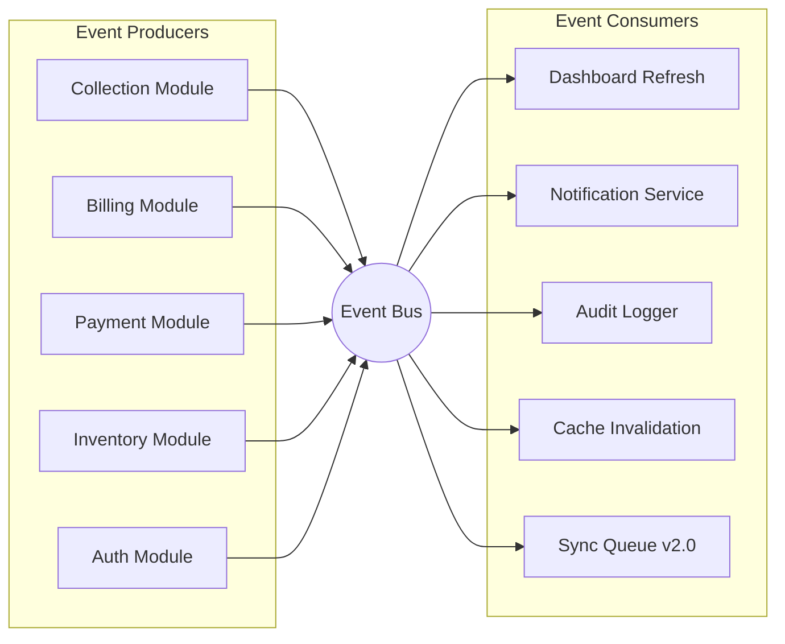
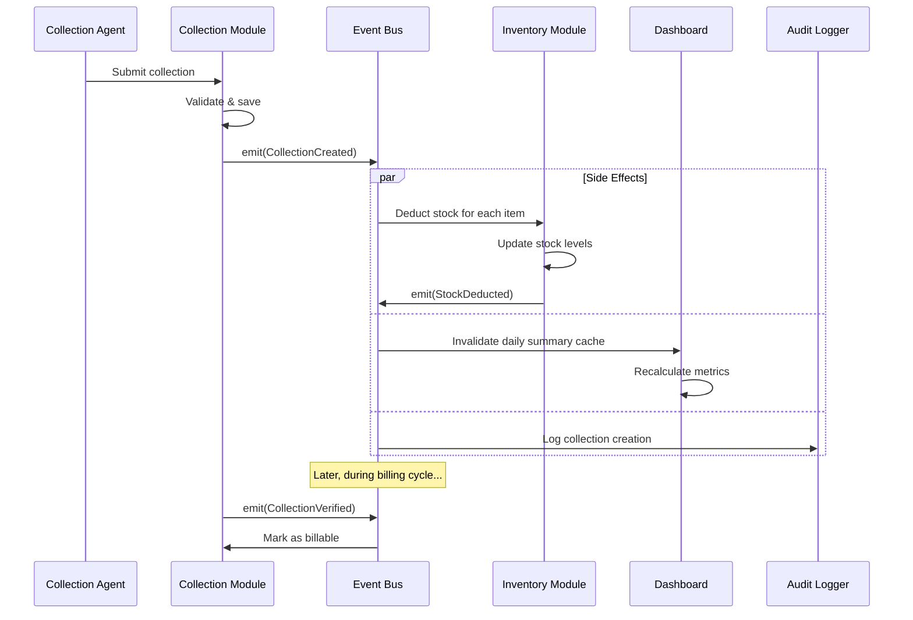
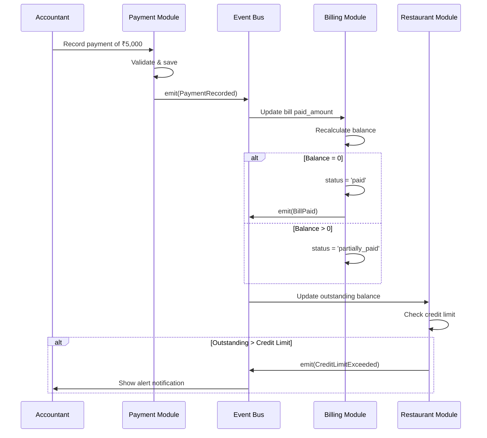
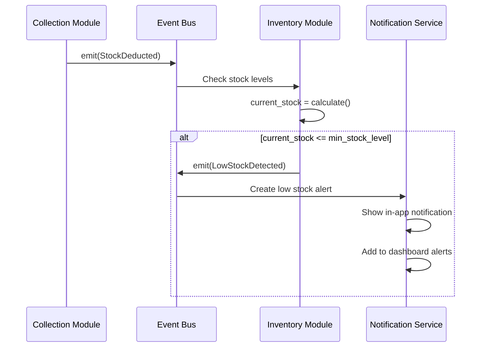
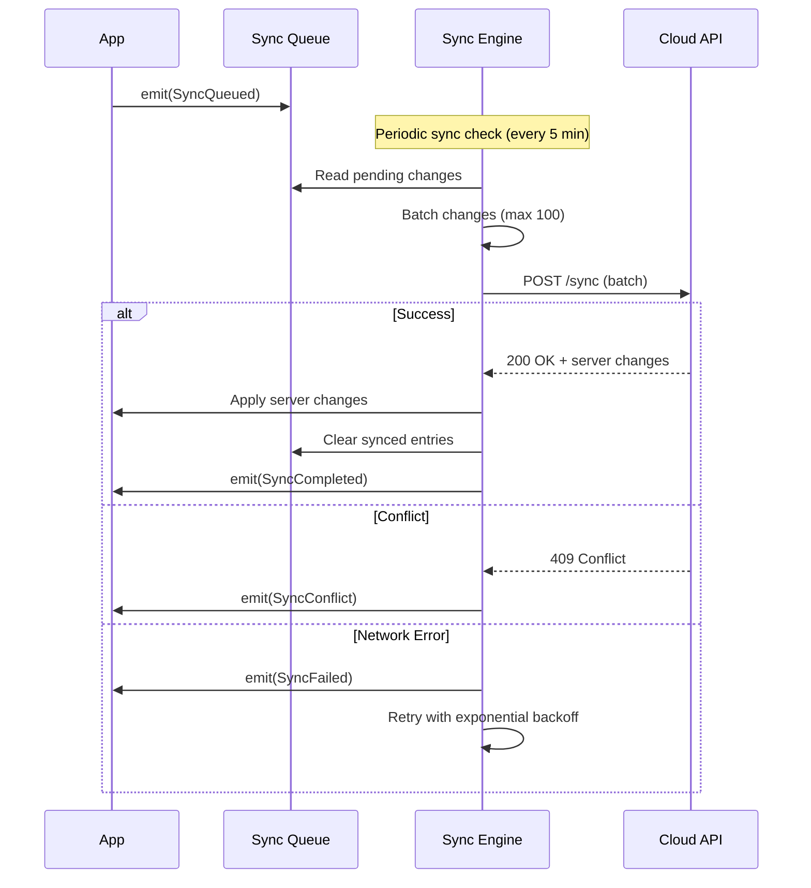

# VASUDHA OS — Event System

<p align="center">
  <strong>Application Events, Triggers & Workflows</strong><br/>
  <em>Event-driven architecture for loose coupling and audit trails</em>
</p>

---

## Table of Contents

- [Event Architecture](#event-architecture)
- [Event Bus Design](#event-bus-design)
- [Core Events](#core-events)
- [Event-Driven Workflows](#event-driven-workflows)
- [Notification Triggers](#notification-triggers)
- [Audit Trail Events](#audit-trail-events)
- [Sync Events (v2.0)](#sync-events-v20)
- [Event Processing Rules](#event-processing-rules)
- [Event Schema](#event-schema)

---

## Event Architecture

VASUDHA OS uses a lightweight **in-app event bus** to decouple modules and enable reactive workflows. Events allow one module's actions to trigger side effects in other modules without direct dependencies.



---

## Event Bus Design

### Implementation

```dart
/// Central event bus for application-wide events
class AppEventBus {
  static final AppEventBus _instance = AppEventBus._();
  factory AppEventBus() => _instance;
  AppEventBus._();

  final _controller = StreamController<AppEvent>.broadcast();

  Stream<AppEvent> get stream => _controller.stream;

  /// Listen for specific event types
  Stream<T> on<T extends AppEvent>() =>
      stream.where((event) => event is T).cast<T>();

  /// Emit an event to all listeners
  void emit(AppEvent event) {
    _controller.add(event);
  }

  void dispose() {
    _controller.close();
  }
}
```

### Event Base Class

```dart
abstract class AppEvent {
  final String eventId;       // Unique event identifier
  final DateTime timestamp;   // When the event occurred
  final String userId;        // Who triggered the event
  final String entityType;    // Type of entity affected
  final String entityId;      // ID of entity affected
  final Map<String, dynamic>? metadata;  // Additional context

  AppEvent({
    required this.userId,
    required this.entityType,
    required this.entityId,
    this.metadata,
  }) : eventId = Uuid().v4(),
       timestamp = DateTime.now();
}
```

---

## Core Events

### Collection Events

| Event | Trigger | Data | Side Effects |
|-------|---------|------|-------------|
| `CollectionCreated` | New collection saved | collection_id, restaurant_id, items, total | Deduct inventory; invalidate dashboard cache |
| `CollectionUpdated` | Collection modified | collection_id, changed_fields | Recalculate totals; update inventory |
| `CollectionCompleted` | Agent marks collection done | collection_id, completed_at | Update daily summary; notify manager |
| `CollectionVerified` | Manager verifies collection | collection_id, verified_by | Lock collection; enable billing |
| `CollectionCancelled` | Collection cancelled | collection_id, reason | Reverse inventory deduction |
| `ReturnRecorded` | Items returned by restaurant | collection_item_id, returned_qty, reason | Adjust inventory; create return note |

### Billing Events

| Event | Trigger | Data | Side Effects |
|-------|---------|------|-------------|
| `BillGenerated` | Invoice auto-generated | bill_id, restaurant_id, total, items | Update restaurant outstanding |
| `BulkBillsGenerated` | Batch billing completed | bill_ids[], count, total_value | Dashboard update; notification |
| `BillApproved` | Manager approves bill | bill_id, approved_by | Enable PDF generation; enable payment |
| `BillSent` | Bill shared with restaurant | bill_id, shared_via | Update status; log delivery |
| `BillCancelled` | Bill cancelled | bill_id, reason, credit_note_id | Create credit note; reverse outstanding |
| `BillOverdue` | Bill past due date | bill_id, days_overdue | Alert notification; update status |

### Payment Events

| Event | Trigger | Data | Side Effects |
|-------|---------|------|-------------|
| `PaymentRecorded` | Payment entered | payment_id, restaurant_id, bill_id, amount, mode | Update bill paid_amount; update outstanding |
| `PaymentVerified` | Manager verifies payment | payment_id, verified_by | Lock payment record |
| `PaymentBounced` | Cheque bounced | payment_id, reason | Reverse bill payment; alert; charge bounce fee |
| `PaymentCancelled` | Payment cancelled | payment_id, reason | Reverse bill payment; update outstanding |
| `AdvancePaymentRecorded` | Advance payment received | payment_id, restaurant_id, amount | Store as credit; apply to future bills |

### Inventory Events

| Event | Trigger | Data | Side Effects |
|-------|---------|------|-------------|
| `StockReceived` | New stock entry | stock_entry_id, product_id, quantity | Update stock level; clear low stock alert |
| `StockDeducted` | Collection creates deduction | product_id, quantity, collection_id | Update stock level; check low stock |
| `StockAdjusted` | Manual stock adjustment | adjustment_id, product_id, quantity, type | Update stock level; audit log |
| `LowStockDetected` | Stock below minimum | product_id, current_stock, min_level | Alert notification to manager/owner |
| `StockExpiring` | Stock near expiry date | stock_entry_id, product_id, expiry_date | Alert notification; suggest action |

### Authentication Events

| Event | Trigger | Data | Side Effects |
|-------|---------|------|-------------|
| `UserLoggedIn` | Successful login | user_id, device_info | Update last_login_at; reset attempts |
| `UserLoggedOut` | User logs out | user_id | Clear session |
| `LoginFailed` | Invalid PIN | user_id, attempt_count | Increment attempts; lock if max |
| `AccountLocked` | Max failed attempts | user_id, locked_until | Notify owner; log incident |
| `UserCreated` | New user added | user_id, role, created_by | Audit log |
| `UserRoleChanged` | Role modified | user_id, old_role, new_role | Update permissions; audit log |
| `PasswordChanged` | PIN updated | user_id, changed_by | Audit log; notify user |

### Restaurant Events

| Event | Trigger | Data | Side Effects |
|-------|---------|------|-------------|
| `RestaurantCreated` | New restaurant added | restaurant_id, name, area_id | Update area count |
| `RestaurantUpdated` | Restaurant details changed | restaurant_id, changed_fields | Invalidate cache |
| `RestaurantDeactivated` | Status → inactive | restaurant_id, reason | Remove from collection lists |
| `RestaurantBlacklisted` | Status → blacklisted | restaurant_id, reason | Block deliveries; alert manager |
| `CreditLimitExceeded` | Outstanding > credit limit | restaurant_id, outstanding, limit | Alert; optionally block deliveries |

---

## Event-Driven Workflows

### Collection → Billing Workflow



### Payment → Bill Status Workflow



### Low Stock Alert Workflow



---

## Notification Triggers

### In-App Notifications (v1.0)

| Trigger Event | Notification | Recipients | Priority |
|--------------|-------------|------------|----------|
| `LowStockDetected` | "⚠️ {product} stock is low ({current}/{min})" | Owner, Manager | High |
| `BillOverdue` | "🔴 Bill {number} for {restaurant} is overdue by {days} days" | Owner, Accountant | High |
| `CreditLimitExceeded` | "⚠️ {restaurant} has exceeded credit limit (₹{outstanding}/₹{limit})" | Owner, Manager | High |
| `CollectionCompleted` | "✅ Collection completed for {restaurant}" | Manager | Normal |
| `PaymentRecorded` | "💰 Payment of ₹{amount} received from {restaurant}" | Owner | Normal |
| `BulkBillsGenerated` | "📄 {count} bills generated (Total: ₹{total})" | Owner, Accountant | Normal |
| `AccountLocked` | "🔒 Account {user_name} locked after failed attempts" | Owner | High |

### Push Notifications (v2.0)

| Trigger Event | Channel | Message |
|--------------|---------|---------|
| `PaymentReminder` | Push + SMS | "Dear {restaurant}, your payment of ₹{amount} is due on {date}" |
| `BillGenerated` | Push | "New bill #{number} for ₹{amount} has been generated" |
| `DeliveryScheduled` | Push | "Your delivery is scheduled for today between {time_slot}" |
| `PaymentReceived` | Push | "Payment of ₹{amount} received. Thank you!" |
| `SyncCompleted` | Push | "Data sync completed successfully" |
| `DocumentExpiring` | Push | "Vehicle insurance for {vehicle} expires in {days} days" |

---

## Audit Trail Events

### Audited Operations

Every data modification is logged to the audit trail:

| Entity | Audited Operations | Logged Fields |
|--------|-------------------|---------------|
| Company | Update | All changed fields |
| User | Create, Update, Delete, Login, Lock | Role changes, status changes |
| Restaurant | Create, Update, Delete, Status Change | Name, status, credit limit |
| Collection | Create, Update, Status Change, Delete | Status, amount, items |
| Bill | Create, Approve, Cancel, Delete | Status, amounts |
| Payment | Create, Verify, Bounce, Cancel, Delete | Amount, status, mode |
| Stock Entry | Create, Delete | Product, quantity |
| Stock Adjustment | Create | Product, quantity, reason |

### Audit Log Format

```dart
class AuditEvent extends AppEvent {
  final String action;         // 'create', 'update', 'delete', 'status_change'
  final Map<String, dynamic>? oldValues;   // Previous state (for updates)
  final Map<String, dynamic>? newValues;   // New state
  final String? reason;         // Reason for change (if applicable)
}
```

### Audit Log Storage

```sql
INSERT INTO audit_log (id, entity_type, entity_id, action, old_values, new_values, changed_by, changed_at)
VALUES (?, ?, ?, ?, ?, ?, ?, datetime('now'));
```

---

## Sync Events (v2.0)

### Sync Queue Events

| Event | Description | Data |
|-------|------------|------|
| `SyncQueued` | Change added to sync queue | entity_type, entity_id, operation |
| `SyncStarted` | Sync process initiated | queue_size, timestamp |
| `SyncProgress` | Batch synced successfully | synced_count, remaining_count |
| `SyncCompleted` | All changes synced | total_synced, duration |
| `SyncFailed` | Sync encountered error | error_message, failed_records |
| `SyncConflict` | Conflicting changes detected | entity_type, entity_id, local_vs_remote |
| `SyncResolved` | Conflict resolved | resolution_strategy, resolved_by |

### Sync Queue Processing



---

## Event Processing Rules

### Ordering

1. Events are processed in **emission order** (FIFO)
2. Side effects within a transaction must complete before the event is emitted
3. Event handlers must be **idempotent** — processing the same event twice should produce the same result

### Error Handling

1. Event handler failures must **not** roll back the original operation
2. Failed handlers are logged and retried (max 3 times)
3. Critical events (financial) have dead-letter queue for manual review

### Performance

1. Event handlers execute **asynchronously** — don't block the UI thread
2. Heavy computations (report recalculation) are debounced (max once per 5 seconds)
3. Dashboard refresh is throttled during bulk operations (e.g., bulk billing)

---

## Event Schema

### Event Naming Convention

```
{Entity}{Action}    →  RestaurantCreated, PaymentRecorded, BillOverdue
{Entity}{Action}ed  →  Past tense for completed actions
{Entity}{Action}ing →  Present tense for in-progress (rare)
```

### Event Metadata Standards

Every event includes:

| Field | Type | Required | Description |
|-------|------|----------|-------------|
| `event_id` | UUID | Yes | Unique event identifier |
| `event_type` | String | Yes | Event class name |
| `timestamp` | DateTime | Yes | When the event occurred |
| `user_id` | UUID | Yes | Who triggered it |
| `entity_type` | String | Yes | Type of entity (restaurant, bill, etc.) |
| `entity_id` | UUID | Yes | ID of the affected entity |
| `company_id` | UUID | Yes | Company context |
| `metadata` | Map | No | Additional event-specific data |

---

<p align="center">
  <strong>VASUDHA OS Event System</strong> — Reactive, auditable, and loosely coupled. ⚡
</p>
