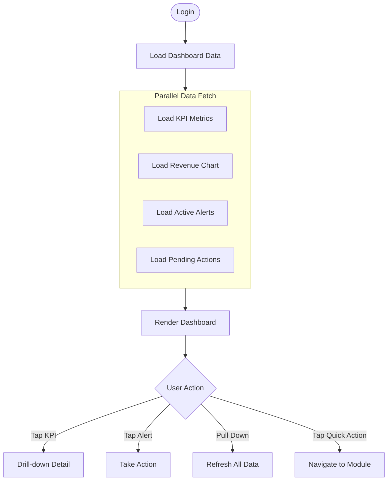
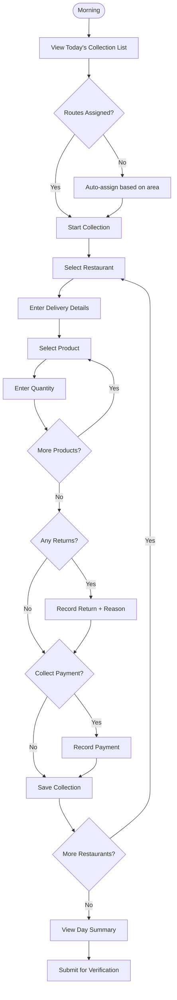
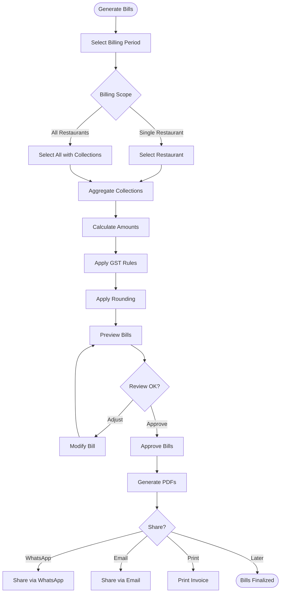

# VASUDHA OS — Feature Specifications

<p align="center">
  <strong>Every Feature, Fully Documented</strong><br/>
  <em>Purpose, workflows, business rules, validations, and edge cases</em>
</p>

---

## Table of Contents

- [Feature Documentation Standard](#feature-documentation-standard)
- [Dashboard Feature](#dashboard-feature)
- [Restaurant Management](#restaurant-management)
- [Collection Module](#collection-module)
- [Inventory Management](#inventory-management)
- [Billing Engine](#billing-engine)
- [Payment & Collection](#payment--collection)
- [Reports & Analytics](#reports--analytics)
- [Settings & Configuration](#settings--configuration)
- [Search & Filter (Global)](#search--filter-global)
- [Backup & Restore](#backup--restore)

---

## Feature Documentation Standard

Each feature follows this documentation template:

```
Feature Name
├── Purpose
├── Workflow
├── Business Rules
├── Validations
├── UI Components
├── Database Impact
├── Reports Impact
├── Permissions
├── Edge Cases
└── Future Improvements
```

---

## Dashboard Feature

### Purpose
The dashboard provides a real-time, at-a-glance view of the business's daily operations and financial health. It is the first screen every user sees after login and serves as the command center for daily decision-making.

### Workflow



### Business Rules

| Rule | Description |
|------|-------------|
| Data freshness | All metrics computed from local SQLite; always current |
| KPI calculations | Revenue = SUM(collections.net_amount) for period |
| Outstanding | SUM(bills.balance_amount) where status NOT IN (draft, cancelled) |
| Collection progress | completed / total for today, shown as percentage |
| Overdue bills | Bills where status IN (sent, partially_paid) AND due_date < today |
| Low stock | Products where current_stock < min_stock_level |

### KPI Cards

| KPI | Formula | Display |
|-----|---------|---------|
| **Today's Collection** | SUM(collections.net_amount) WHERE date = today | ₹XX,XXX |
| **Total Outstanding** | SUM(bills.balance_amount) active bills | ₹XX,XX,XXX |
| **Pending Collections** | COUNT(collections) WHERE status = pending AND date = today | XX restaurants |
| **This Month Revenue** | SUM(collections.net_amount) WHERE month = current | ₹XX,XX,XXX |

### UI Components

- **KPI Grid** — 2×2 grid of KPI cards with icons and trend arrows
- **Revenue Chart** — 7-day line chart (default) with 30-day toggle
- **Outstanding Aging** — Horizontal stacked bar (current / 1-15 / 16-30 / 30-60 / 60+)
- **Quick Actions** — Row of action buttons (Start Collection, Create Bill, Record Payment)
- **Alert List** — Scrollable list of active alerts (overdue, low stock, pending verification)
- **Collection Progress** — Circular progress indicator for today

### Permissions

| Role | Access Level |
|------|-------------|
| Owner | Full dashboard — all KPIs, all data |
| Manager | Full dashboard — all KPIs, all data |
| Accountant | Financial KPIs only — revenue, outstanding, aging |
| Agent | Collection KPIs only — today's list, progress |
| Driver | Today's delivery list only |
| Viewer | Read-only view of all KPIs |

### Edge Cases

- **No data yet** — First-time users see welcome state with "Get Started" CTA
- **No collections today** — Show "No deliveries scheduled" with option to create
- **All bills paid** — Show celebration state: "🎉 All clear!"
- **Midnight rollover** — Dashboard auto-refreshes at midnight for new day

---

## Restaurant Management

### Purpose

Manage the complete lifecycle of buyer relationships — from onboarding to payment tracking. Every restaurant is a business customer that receives deliveries and generates billing.

### Workflow

**Adding a Restaurant**:
1. User taps ➕ or "Add Restaurant"
2. Enter required fields: Name, Mobile
3. Optionally: Owner, Address, Area, Payment Terms
4. Save → restaurant appears in list
5. System generates default credit terms

**Restaurant Profile**:
- **Overview tab**: Contact details, address, status, notes
- **Collections tab**: Complete delivery history
- **Billing tab**: All invoices, outstanding balance
- **Payments tab**: Payment history, aging analysis
- **Activity tab**: Audit log of all changes

### Business Rules

| Rule | Description |
|------|-------------|
| Unique mobile | No two restaurants can have the same mobile number |
| Credit limit | Default is 0 (unlimited); owner can set per restaurant |
| Credit days | Default 30; determines bill due dates |
| Soft delete | Deleted restaurants retain all historical data |
| Status transitions | active ↔ inactive → suspended → blacklisted |
| Blacklisted | Cannot receive new deliveries; displayed with ⛔ badge |
| Opening balance | Set once during migration; immutable after first bill |

### Validations

| Field | Validation | Error Message |
|-------|-----------|---------------|
| Name | Required, 2–200 chars | "Restaurant name is required" |
| Mobile | Required, 10 digits, starts 6-9 | "Enter a valid 10-digit mobile number" |
| Email | Optional, valid email format | "Enter a valid email address" |
| GSTIN | Optional, 15-char format | "Enter a valid GSTIN" |
| Credit limit | ≥ 0 | "Credit limit cannot be negative" |
| Credit days | 0–365 | "Credit days must be between 0 and 365" |
| Address | Required, 5–500 chars | "Delivery address is required" |

### Edge Cases

- **Duplicate restaurant** — Warn if name + area combination exists; allow override
- **Restaurant with outstanding** — Cannot be deleted; must settle first or write-off
- **Area deleted** — Restaurants in that area become "Unassigned"
- **Import duplicates** — Skip if mobile exists; merge if name similar

---

## Collection Module

### Purpose

Track every delivery made to every restaurant, every day. The collection module is the **core workflow** — it drives inventory, billing, payments, and reporting.

### Workflow

**Daily Collection Flow**:



### Business Rules

| Rule | Description |
|------|-------------|
| One per restaurant per day | Only one active collection per restaurant per date (unless cancelled) |
| Status workflow | pending → in_progress → completed → verified (no skipping) |
| Immutable after verification | Verified collections cannot be modified |
| Auto inventory deduction | Saving collection auto-deducts product quantities from stock |
| Return limits | Returned quantity cannot exceed delivered quantity |
| Agent assignment | Only the assigned agent can modify their own collections |
| Manager override | Managers can edit any agent's collection before verification |
| Zero-quantity restriction | Cannot save a collection with 0 total quantity |
| Price snapshot | Unit price is captured from product at time of entry |

### Validations

| Field | Validation | Error Message |
|-------|-----------|---------------|
| Restaurant | Required, must be active | "Select an active restaurant" |
| Date | Required, cannot be future | "Collection date cannot be in the future" |
| Product | Required, must be active | "Select an active product" |
| Quantity | Required, > 0 | "Quantity must be greater than zero" |
| Return quantity | ≤ delivered quantity | "Return quantity cannot exceed delivered quantity" |
| Return reason | Required if return qty > 0 | "Please provide a reason for return" |

### UI Components

- **Collection List Screen** — Today's restaurants with status badges, swipe to complete
- **Collection Entry Screen** — Product selector + quantity input + return section
- **Day Summary Screen** — Totals, restaurant count, returns, pending amounts
- **Quick Entry Mode** — Streamlined single-product entry for high-volume agents

### Database Impact

| Table | Operation | Trigger |
|-------|-----------|---------|
| `collections` | INSERT | New collection created |
| `collection_items` | INSERT | Items added to collection |
| Stock (computed) | DEDUCT | Collection items saved |
| `collections` | UPDATE | Status changes, edits |
| Stock (computed) | RESTORE | Collection cancelled |

### Edge Cases

- **Restaurant closed** — Mark as "Not Available"; skip to next
- **Partial delivery** — Record actual quantity; note discrepancy
- **Price changed mid-day** — Use price at time of first entry for consistency
- **Phone battery dies** — SQLite transaction ensures partial saves don't corrupt data
- **Duplicate entry** — Warn if collection already exists for this restaurant today

---

## Inventory Management

### Purpose

Track all product stock levels in real-time, manage incoming purchases, monitor wastage, and alert on low stock situations.

### Workflow

**Stock Receipt Flow**: Purchase → Record Entry → Stock Increases → Update Dashboard

**Stock Deduction Flow**: Collection Saved → Auto-Deduct → Update Stock Level → Check Alerts

### Business Rules

| Rule | Description |
|------|-------------|
| Current stock formula | SUM(stock_entries) - SUM(collection_items.net_qty) ± SUM(adjustments) |
| Never negative | Stock cannot go below 0; warn if collection would make it negative |
| Low stock threshold | Configurable per product via `min_stock_level` |
| FIFO tracking | Stock entries tracked by date for FIFO cost calculation |
| Expiry tracking | Products with expiry dates trigger alerts before expiry |
| Wastage recording | All wastage must have a reason; tracked separately from regular use |
| Adjustment approval | Adjustments above configurable threshold require manager approval |

### Validations

| Field | Validation | Error Message |
|-------|-----------|---------------|
| Product | Required, must exist | "Select a valid product" |
| Quantity | Required, > 0 | "Quantity must be greater than zero" |
| Entry date | Required, ≤ today | "Stock entry date cannot be in the future" |
| Adjustment reason | Required for adjustments | "Please provide a reason for stock adjustment" |
| Adjustment quantity | Can be negative | "Adjustment quantity can reduce stock" |

### Edge Cases

- **Negative stock attempt** — Show warning, allow override with confirmation
- **Bulk stock entry** — Support multi-product entry for receiving shipments
- **Stock discrepancy** — End-of-day physical count vs. system count → create adjustment

---

## Billing Engine

### Purpose

Generate accurate, GST-compliant invoices from collection data. The billing engine aggregates deliveries over a billing period and produces professional invoices.

### Workflow



### Business Rules

| Rule | Description |
|------|-------------|
| Billing period | Configurable: weekly, biweekly, monthly, custom |
| Auto-aggregation | System sums all verified collections in the billing period |
| GST calculation | Same-state: CGST + SGST; Inter-state: IGST |
| Invoice numbering | Auto-increment: {prefix}-{FY}-{sequence} |
| Draft → Approved | Only approved bills can be shared/sent |
| Immutable after approval | Approved bills cannot be edited; use credit notes |
| Round-off | Amounts rounded to nearest rupee (configurable) |
| Due date | Automatically set: bill_date + restaurant's credit_days |
| No empty bills | Skip restaurants with zero collections in the period |
| Credit note | Cancelling a bill creates a corresponding credit note |

### GST Calculation Rules

```
For each bill item:
  taxable_value = net_quantity × unit_price
  
  If same-state (company.state == restaurant.state):
    cgst = taxable_value × (tax_rate / 2) / 100
    sgst = taxable_value × (tax_rate / 2) / 100
    igst = 0
  
  If inter-state:
    cgst = 0
    sgst = 0
    igst = taxable_value × tax_rate / 100
  
  total_tax = cgst + sgst + igst
  line_total = taxable_value + total_tax

Bill totals:
  subtotal = SUM(all line taxable_values)
  total_tax = SUM(all line taxes)
  discount = manual_discount (if any)
  round_off = ROUND(subtotal + total_tax - discount) - (subtotal + total_tax - discount)
  grand_total = subtotal + total_tax - discount + round_off
```

### Edge Cases

- **Restaurant with zero collections** — Skip during bulk billing
- **Collections not verified** — Warning: "X collections pending verification"
- **Mid-period price change** — Use price at time of each collection (snapshotted)
- **GST rate change** — Items before change use old rate; items after use new rate
- **Duplicate billing attempt** — Warn if billing period overlaps with existing bills

---

## Payment & Collection

### Purpose

Record every payment received from restaurants, track outstanding balances, manage aging analysis, and enable financial reconciliation.

### Business Rules

| Rule | Description |
|------|-------------|
| FIFO application | Payments apply to oldest unpaid bill first (unless specified) |
| Partial payments | Supported — bill remains partially_paid until fully settled |
| Advance payments | Excess payment stored as advance; auto-applied to next bill |
| Payment modes | Cash, UPI, bank transfer, cheque, credit note, other |
| Cheque lifecycle | Recorded → Deposited → Cleared / Bounced |
| Bounced cheque | Reverses payment; adds bounce charges; alerts owner |
| Receipt generation | Auto-generated for every payment; shareable via WhatsApp |
| Reconciliation | Daily cash reconciliation: field collections vs. bank deposits |

### Aging Analysis

| Bucket | Definition | Color |
|--------|-----------|-------|
| Current | Not yet due | Green |
| 1–15 days | 1–15 days past due | Yellow |
| 16–30 days | 16–30 days past due | Orange |
| 31–60 days | 31–60 days past due | Red |
| 60+ days | Over 60 days past due | Dark Red |

### Edge Cases

- **Payment without bill** — Treat as advance payment against future bills
- **Overpayment** — Store as advance credit; show positive balance
- **Bounced cheque for fully paid bill** — Revert bill to "partially_paid" or "sent"
- **Multiple payments same day** — All recorded individually; total updates correctly
- **Cash discrepancy** — Agent reports ₹50K collected; ₹48K deposited → flag ₹2K variance

---

## Reports & Analytics

### Purpose

Provide actionable business intelligence through standardized reports. Every report is designed to answer specific business questions.

### Report Catalog

| Report | Question Answered | Data Source |
|--------|------------------|-------------|
| Daily Collection | "How much did we deliver today?" | collections, collection_items |
| Outstanding Report | "Who owes us money and how much?" | bills, payments |
| Aging Analysis | "How old are our receivables?" | bills (by due_date) |
| Sales Report | "What products are selling the most?" | collection_items |
| GST Summary | "What do we owe the government?" | bill_items |
| Payment Report | "How much cash vs. digital did we collect?" | payments |
| Agent Performance | "Which agents are most efficient?" | collections (by agent) |
| Area Performance | "Which areas are most profitable?" | collections + restaurants |
| Inventory Report | "What's our current stock position?" | stock_entries + adjustments |
| Wastage Report | "How much stock are we losing?" | stock_adjustments |

### Edge Cases

- **No data for period** — Show empty state: "No data found for this period"
- **Very large date range** — Warn if > 1 year; may take longer to generate
- **Export while generating** — Queue export; notify when ready
- **Currency formatting** — Indian numbering system (lakhs, crores)

---

## Settings & Configuration

### Purpose

System configuration and administration. Divided into sections based on role access.

### Settings Sections

| Section | Access | Contents |
|---------|--------|----------|
| Company Profile | Owner only | Name, address, GSTIN, logo, invoice prefix |
| Tax Rates | Owner, Manager | GST rate configuration, HSN codes |
| Product Catalog | Owner, Manager | Product CRUD, pricing, units |
| User Management | Owner only | Create/edit users, assign roles, reset PINs |
| Areas & Routes | Owner, Manager | Define areas, create routes, assign agents |
| Backup & Restore | Owner, Manager | Manual backup, auto-backup settings, restore |
| App Preferences | All users | Theme, language, date format |
| About | All users | App version, licenses, support contact |

---

## Search & Filter (Global)

### Purpose

Enable quick discovery of any entity across the application.

### Search Behavior

| Feature | Implementation |
|---------|---------------|
| Debounce | 300ms delay before executing search |
| Minimum chars | 2 characters minimum to trigger search |
| Scope | Current module (restaurants, collections, bills) |
| Fields searched | Name, mobile, bill number, address (module-dependent) |
| Results display | Instant list with highlighted matching text |
| No results | "No results for '{query}'. Try different keywords." |
| Recent searches | Last 10 searches saved locally |

### Filter Options by Module

| Module | Available Filters |
|--------|------------------|
| Restaurants | Status, Area, Type, Credit Status |
| Collections | Date, Agent, Status, Area |
| Bills | Date Range, Status, Restaurant |
| Payments | Date Range, Mode, Status |
| Inventory | Category, Stock Level, Status |

---

## Backup & Restore

### Purpose

Protect against data loss through local backups. Critical for an offline-first app where the device is the only data store (until v2.0 cloud sync).

### Backup Types

| Type | Trigger | Contents | Location |
|------|---------|----------|----------|
| Auto Backup | Daily (app startup) | Full SQLite database | App documents directory |
| Manual Backup | User-triggered | Full SQLite database | User-selected location |
| Pre-Migration | Before DB upgrade | Full SQLite database | App documents directory |
| Export | User-triggered | CSV/JSON of specific data | User-selected location |

### Business Rules

| Rule | Description |
|------|-------------|
| Auto-backup retention | Keep last 30 daily backups |
| Backup naming | `vasudha_backup_YYYY-MM-DD_HH-mm.db` |
| Restore confirmation | Require PIN + confirmation dialog + "type RESTORE to confirm" |
| Restore behavior | Full database replacement; current data is overwritten |
| Pre-restore backup | Auto-create backup of current data before restoring |
| Backup encryption | Backup inherits SQLCipher encryption from source database |

---

<p align="center">
  <strong>VASUDHA OS Features</strong> — Every feature designed for real-world operations. 🔧
</p>
