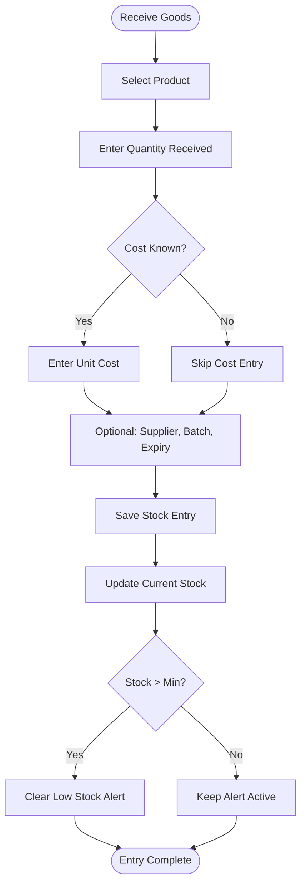
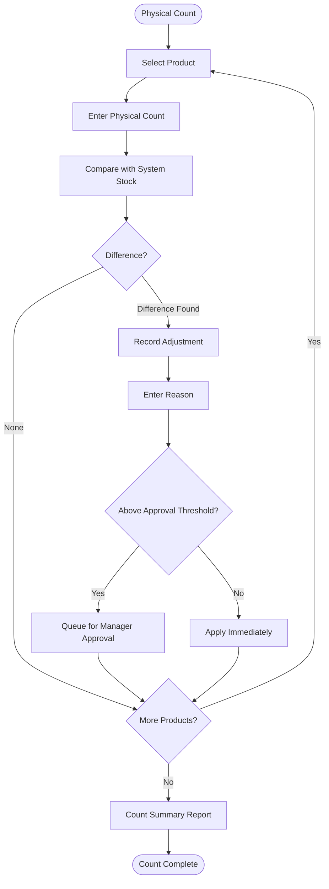

# VASUDHA OS — Inventory Engine

<p align="center">
  <strong>Stock Tracking, FIFO, Wastage & Multi-Warehouse</strong><br/>
  <em>Complete inventory management specification for perishable supply chains</em>
</p>

---

## Table of Contents

- [Engine Overview](#engine-overview)
- [Stock Level Calculation](#stock-level-calculation)
- [Stock Entry Workflows](#stock-entry-workflows)
- [Stock Deduction Logic](#stock-deduction-logic)
- [FIFO Cost Tracking](#fifo-cost-tracking)
- [Reorder Point Management](#reorder-point-management)
- [Wastage & Expiry Management](#wastage--expiry-management)
- [Stock Adjustment Procedures](#stock-adjustment-procedures)
- [Batch Tracking](#batch-tracking)
- [Multi-Warehouse Support (v4.0)](#multi-warehouse-support-v40)
- [IoT Integration (v4.0)](#iot-integration-v40)
- [Inventory Reports](#inventory-reports)
- [Performance Optimization](#performance-optimization)

---

## Engine Overview

The Inventory Engine is the backbone of physical goods management in VASUDHA OS. It tracks every unit of product — from purchase receipt through warehouse storage to delivery at a restaurant's doorstep.

### Key Design Decisions

| Decision | Choice | Rationale |
|----------|--------|-----------|
| Stock calculation | Computed (not stored) | Avoids drift between stored value and actual movements |
| Cost method | FIFO (First In, First Out) | Matches physical reality for perishable goods |
| Negative stock | Allowed with warning | Operational reality: sometimes delivery precedes recording |
| Unit precision | 3 decimal places | Supports fractional units (liters, kg) |
| Adjustment workflow | Optional approval | Configurable threshold for manager approval |

### Stock Equation

```
Current Stock = Opening Stock
              + Purchases (stock_entries WHERE type = 'purchase')
              + Customer Returns (stock_entries WHERE type = 'return_from_customer')
              + Transfer In (stock_entries WHERE type = 'transfer_in')
              - Deliveries (SUM of collection_items.net_quantity for non-cancelled)
              + Adjustments (stock_adjustments.quantity — can be positive or negative)
```

---

## Stock Level Calculation

### Real-Time Stock Query

```sql
SELECT
    p.id AS product_id,
    p.name,
    p.unit,
    p.min_stock_level,
    
    -- Stock In
    COALESCE((
        SELECT SUM(se.quantity)
        FROM stock_entries se
        WHERE se.product_id = p.id AND se.deleted_at IS NULL
    ), 0) AS total_in,
    
    -- Stock Out (deliveries)
    COALESCE((
        SELECT SUM(ci.net_quantity)
        FROM collection_items ci
        INNER JOIN collections c ON ci.collection_id = c.id
        WHERE ci.product_id = p.id
          AND c.status NOT IN ('cancelled')
          AND c.deleted_at IS NULL
    ), 0) AS total_out,
    
    -- Adjustments (can be positive or negative)
    COALESCE((
        SELECT SUM(sa.quantity)
        FROM stock_adjustments sa
        WHERE sa.product_id = p.id
    ), 0) AS total_adjusted,
    
    -- Current Stock
    (COALESCE(stock_in, 0) - COALESCE(stock_out, 0) + COALESCE(adjustments, 0)) AS current_stock

FROM products p
WHERE p.deleted_at IS NULL AND p.is_active = 1;
```

### Optimized Stock Calculation

For performance, maintain a **materialized stock view** that updates on every stock-affecting operation:

```dart
class StockLevelCache {
  final Map<String, double> _cache = {};

  /// Get current stock (from cache or compute)
  Future<double> getCurrentStock(String productId) async {
    if (_cache.containsKey(productId)) {
      return _cache[productId]!;
    }
    final computed = await _computeFromDatabase(productId);
    _cache[productId] = computed;
    return computed;
  }

  /// Invalidate cache when stock changes
  void invalidate(String productId) {
    _cache.remove(productId);
  }

  /// Invalidate all cached stock levels
  void invalidateAll() {
    _cache.clear();
  }
}
```

---

## Stock Entry Workflows

### Purchase Receipt Flow



### Entry Types and Their Impact

| Entry Type | Stock Impact | Requires Cost | Typical Source |
|-----------|-------------|--------------|---------------|
| `purchase` | ➕ Increase | Recommended | Supplier delivery |
| `return_from_customer` | ➕ Increase | No (use original cost) | Restaurant return |
| `opening_stock` | ➕ Increase | Optional | Initial data entry |
| `transfer_in` | ➕ Increase | No | Warehouse transfer (v4.0) |

---

## Stock Deduction Logic

### Automatic Deduction on Collection

When a collection agent records a delivery:

```dart
Future<void> deductStockForCollection(Collection collection) async {
  await database.transaction((txn) async {
    for (final item in collection.items) {
      final currentStock = await _getCurrentStock(txn, item.productId);
      final deductionQty = item.netQuantity;  // quantity - returned

      if (currentStock < deductionQty) {
        // Log warning but allow (operational reality)
        _logWarning('Stock going negative for ${item.productId}');
      }

      // Stock deduction happens implicitly through the collection_items
      // Current stock is always COMPUTED, not STORED
    }
  });
}
```

### Deduction Rules

| Rule | Description |
|------|-------------|
| Atomic deduction | All items in a collection deduct atomically (all or nothing) |
| Return credit | Returned items are not deducted (net_quantity = quantity - returned) |
| Cancel reversal | Cancelling a collection restores all deducted stock |
| Edit handling | Editing a collection recalculates deduction (delta applied) |
| Negative allowed | System warns but allows; field reality may precede recording |

---

## FIFO Cost Tracking

### FIFO (First In, First Out)

For cost calculations and inventory valuation, VASUDHA OS tracks cost in FIFO order:

```
Stock Entries (chronological):
  Batch 1: 100 units @ ₹45  (Jan 1)
  Batch 2: 150 units @ ₹48  (Jan 15)
  Batch 3: 200 units @ ₹50  (Feb 1)

After delivering 180 units:
  Consumed from Batch 1: 100 units @ ₹45 = ₹4,500
  Consumed from Batch 2:  80 units @ ₹48 = ₹3,840
  Cost of Goods Sold: ₹8,340

Remaining Stock:
  Batch 2:  70 units @ ₹48 = ₹3,360
  Batch 3: 200 units @ ₹50 = ₹10,000
  Total Stock Value: ₹13,360
```

### FIFO Cost Calculation

```dart
class FifoCostCalculator {
  /// Calculate cost of goods sold for a quantity
  FifoResult calculateCost(List<StockBatch> batches, double quantityNeeded) {
    double totalCost = 0;
    double remaining = quantityNeeded;
    final consumedBatches = <ConsumedBatch>[];

    for (final batch in batches) {  // Sorted by entry_date ASC
      if (remaining <= 0) break;

      final consumeQty = min(remaining, batch.remainingQuantity);
      totalCost += consumeQty * batch.unitCost;
      remaining -= consumeQty;

      consumedBatches.add(ConsumedBatch(
        batchId: batch.id,
        quantity: consumeQty,
        unitCost: batch.unitCost,
        cost: consumeQty * batch.unitCost,
      ));
    }

    return FifoResult(
      totalCost: totalCost,
      averageCost: totalCost / quantityNeeded,
      consumedBatches: consumedBatches,
    );
  }
}
```

---

## Reorder Point Management

### Reorder Point Logic

```dart
class ReorderPointService {
  /// Check all products and generate low stock alerts
  Future<List<LowStockAlert>> checkLowStock() async {
    final alerts = <LowStockAlert>[];

    final products = await _productRepo.getAll();
    for (final product in products) {
      final currentStock = await _inventoryRepo.getCurrentStock(product.id);

      if (currentStock <= product.minStockLevel) {
        alerts.add(LowStockAlert(
          product: product,
          currentStock: currentStock,
          minStockLevel: product.minStockLevel,
          suggestedReorder: _calculateReorderQuantity(product, currentStock),
          urgency: _calculateUrgency(currentStock, product.minStockLevel),
        ));
      }
    }

    return alerts..sort((a, b) => a.urgency.index.compareTo(b.urgency.index));
  }

  /// Calculate suggested reorder quantity
  double _calculateReorderQuantity(Product product, double currentStock) {
    // Reorder to max_stock_level if configured
    if (product.maxStockLevel != null) {
      return product.maxStockLevel! - currentStock;
    }
    // Otherwise, reorder 2x the minimum
    return (product.minStockLevel * 2) - currentStock;
  }

  /// Determine urgency level
  StockUrgency _calculateUrgency(double current, double minimum) {
    final ratio = current / minimum;
    if (ratio <= 0) return StockUrgency.critical;    // Out of stock
    if (ratio <= 0.25) return StockUrgency.high;      // < 25% of minimum
    if (ratio <= 0.5) return StockUrgency.medium;     // < 50% of minimum
    return StockUrgency.low;                           // Approaching minimum
  }
}
```

### Alert Display

| Urgency | Color | Icon | Display |
|---------|-------|------|---------|
| Critical (out of stock) | Red | 🔴 | "OUT OF STOCK — Order immediately" |
| High (< 25% min) | Orange | 🟠 | "Very low stock — Order soon" |
| Medium (< 50% min) | Yellow | 🟡 | "Stock running low" |
| Low (at minimum) | Blue | 🔵 | "Approaching reorder point" |

---

## Wastage & Expiry Management

### Wastage Recording

```dart
class WastageService {
  /// Record stock wastage
  Future<Result<StockAdjustment, Failure>> recordWastage({
    required String productId,
    required double quantity,
    required WastageReason reason,
    String? notes,
  }) async {
    // Create negative stock adjustment
    return _adjustmentRepo.create(StockAdjustment(
      productId: productId,
      adjustmentType: AdjustmentType.wastage,
      quantity: -quantity,  // Negative to reduce stock
      reason: reason.description,
      notes: notes,
    ));
  }
}

enum WastageReason {
  spoiled('Product spoiled/expired'),
  damaged('Product damaged during storage/transport'),
  leaked('Container leaked'),
  contaminated('Product contaminated'),
  overProduced('Excess production'),
  other('Other reason');

  final String description;
  const WastageReason(this.description);
}
```

### Expiry Tracking

```dart
class ExpiryTrackingService {
  /// Get products expiring within N days
  Future<List<ExpiringStock>> getExpiringProducts({int daysAhead = 7}) async {
    final cutoffDate = DateTime.now().add(Duration(days: daysAhead));

    // Query stock entries with expiry_date <= cutoffDate
    return _stockEntryRepo.getExpiring(cutoffDate);
  }

  /// Daily expiry check (runs on app startup)
  Future<void> checkExpiries() async {
    final expiringSoon = await getExpiringProducts(daysAhead: 3);
    final expired = await getExpiringProducts(daysAhead: 0);

    for (final item in expired) {
      await _notificationService.notify(
        type: NotificationType.inventory,
        title: '🔴 ${item.productName} has expired',
        body: 'Batch ${item.batchNumber} expired on ${item.expiryDate}. '
              '${item.remainingQuantity} ${item.unit} remaining.',
        priority: NotificationPriority.high,
      );
    }

    for (final item in expiringSoon) {
      await _notificationService.notify(
        type: NotificationType.inventory,
        title: '⚠️ ${item.productName} expiring soon',
        body: 'Batch ${item.batchNumber} expires on ${item.expiryDate}. '
              '${item.remainingQuantity} ${item.unit} remaining.',
        priority: NotificationPriority.medium,
      );
    }
  }
}
```

---

## Stock Adjustment Procedures

### Adjustment Types

| Type | Direction | Requires Approval | Use Case |
|------|-----------|------------------|----------|
| `wastage` | Decrease (−) | Above threshold | Spoiled, leaked, damaged |
| `damage` | Decrease (−) | Above threshold | Transport/handling damage |
| `expired` | Decrease (−) | No | Past expiry date |
| `counting_correction` | Either (±) | Above threshold | Physical count mismatch |
| `other` | Either (±) | Always | Special circumstances |

### Physical Stock Count Process



---

## Batch Tracking

### Batch Information

| Field | Description | Required |
|-------|-------------|----------|
| `batch_number` | Supplier batch identifier | Optional (v1.0), Required (v4.0) |
| `entry_date` | Date received | Required |
| `expiry_date` | Product expiry date | Optional |
| `supplier_name` | Supplier who provided the batch | Optional |
| `unit_cost` | Cost per unit for this batch | Optional |
| `quantity` | Quantity received in this batch | Required |

### Batch Traceability (v4.0)

In future versions, full traceability will be possible:

```
Batch #B20260706-001 (20L Water Can)
  ├── Received: Jul 6, 2026 from ABC Suppliers
  ├── Quantity: 500 cans @ ₹45 each
  ├── Delivered to:
  │   ├── Hotel Rajdhani: 50 cans (Jul 7)
  │   ├── Sharma Restaurant: 30 cans (Jul 7)
  │   └── ... (traceability across all deliveries)
  ├── Wastage: 5 cans (damaged in transit)
  ├── Remaining: 415 cans
  └── Expiry: Aug 6, 2026
```

---

## Multi-Warehouse Support (v4.0)

### Planned Architecture

```
Warehouse A (Main)
    ├── Zone A1: Packaged Water
    ├── Zone A2: Dairy Products (cold storage)
    └── Zone A3: Edible Oils

Warehouse B (Satellite)
    ├── Zone B1: Packaged Water
    └── Zone B2: Mixed Products
```

### Inter-Warehouse Transfer

```
Transfer Request
    ├── Source: Warehouse A, Zone A1
    ├── Destination: Warehouse B, Zone B1
    ├── Product: 20L Water Can
    ├── Quantity: 200 units
    ├── Status: Requested → Approved → In Transit → Received
    └── Tracking: Transfer #TRF-20260706-001
```

---

## IoT Integration (v4.0)

### Smart Tank Monitoring

```
Water Tank #T001 (Main Warehouse)
    ├── Capacity: 10,000 liters
    ├── Current Level: 6,500 liters (65%)
    ├── Sensor: Ultrasonic level sensor
    ├── Last Reading: 2026-07-06 17:30:00
    ├── Daily Usage: ~2,000 liters
    ├── Estimated Empty: 3.25 days
    └── Auto-Reorder Trigger: 20% (2,000 liters)
```

### Temperature Monitoring (Dairy/Perishables)

```
Cold Storage #CS001
    ├── Set Temperature: 4°C
    ├── Current Temperature: 4.2°C
    ├── Status: ✅ Normal
    ├── Alert Threshold: > 8°C
    └── Breach History: None in last 30 days
```

---

## Inventory Reports

### Available Reports

| Report | Key Metrics | Filters |
|--------|-----------|---------|
| **Current Stock** | Product name, current qty, min level, status | Category, status |
| **Stock Movement** | Date, type, qty in, qty out, balance | Product, date range |
| **Stock Valuation** | Product, qty, FIFO cost, total value | Category |
| **Wastage Report** | Product, qty wasted, reason, cost impact | Date range, reason |
| **Expiry Report** | Product, batch, expiry date, remaining qty | Days ahead |
| **Low Stock** | Product, current, minimum, shortage | Urgency |
| **Purchase History** | Date, supplier, product, qty, cost | Date range, supplier |

---

## Performance Optimization

### Stock Calculation Optimization

| Strategy | Implementation | Impact |
|----------|---------------|--------|
| Cache stock levels | In-memory cache, invalidated on changes | Instant stock display |
| Indexed queries | Indexes on product_id + date columns | < 100ms for queries |
| Batch operations | Bulk insert for multi-product stock entries | < 500ms for 50 products |
| Lazy computation | Only compute stock for visible products | Reduced DB load |
| Pre-aggregation | Daily stock snapshot for historical queries | Fast historical reports |

---

<p align="center">
  <strong>VASUDHA OS Inventory Engine</strong> — Every unit tracked, every movement recorded. 📦
</p>
