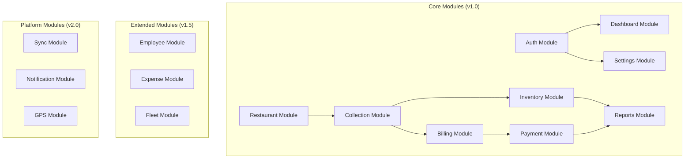

# VASUDHA OS — Module Architecture

<p align="center">
  <strong>Every Module, In Depth</strong><br/>
  <em>Architecture, responsibilities, and inter-module relationships</em>
</p>

---

## Table of Contents

- [Module Overview](#module-overview)
- [Module Architecture Standard](#module-architecture-standard)
- [Dashboard Module](#dashboard-module)
- [Restaurant Module](#restaurant-module)
- [Collection Module](#collection-module)
- [Inventory Module](#inventory-module)
- [Billing Module](#billing-module)
- [Payment Module](#payment-module)
- [Reports Module](#reports-module)
- [Settings Module](#settings-module)
- [User Management Module](#user-management-module)
- [Notification Module](#notification-module)
- [Purchase Module](#purchase-module)
- [Buyers Module](#buyers-module)
- [Sales Module](#sales-module)
- [Inter-Module Dependencies](#inter-module-dependencies)

---

## Module Overview

VASUDHA OS is organized into **independent, loosely-coupled modules**, each responsible for a specific business domain. Modules communicate through shared domain entities and an event bus — never through direct UI widget dependencies.



---

## Module Architecture Standard

Every module follows the Clean Architecture pattern:

```
module_name/
├── domain/
│   ├── entities/           # Business objects
│   ├── repositories/       # Interface contracts
│   ├── usecases/           # Business logic operations
│   └── validators/         # Input validation rules
├── data/
│   ├── models/             # Database DTOs
│   ├── datasources/        # Supabase API / offline cache data access
│   ├── mappers/            # Model ↔ Entity conversion
│   └── repositories/       # Interface implementations
└── presentation/
    ├── screens/            # UI screens
    ├── widgets/            # Module-specific widgets
    └── providers/          # State management
```

### Module Boundaries

| Rule | Description |
|------|-------------|
| **No cross-module widget imports** | Module A's widgets never import Module B's widgets |
| **Shared entities are in `core/`** | Entities used by multiple modules live in `lib/domain/entities/` |
| **Cross-module communication** | Only through use cases, events, or shared repositories |
| **Independent testing** | Each module can be unit-tested in isolation |
| **Feature flags** | Each module can be enabled/disabled independently |

---

## Dashboard Module

### Responsibilities

- Aggregate and display KPIs from all operational modules
- Provide quick navigation to common actions
- Surface alerts and notifications
- Show business health trends

### Internal Architecture

```
dashboard/
├── domain/
│   ├── entities/
│   │   ├── daily_summary.dart      # Today's operational summary
│   │   ├── kpi_data.dart           # Individual KPI metric
│   │   ├── revenue_trend.dart      # Historical revenue data points
│   │   └── alert_item.dart         # Active alert/notification
│   ├── usecases/
│   │   ├── get_daily_summary.dart  # Aggregate today's metrics
│   │   ├── get_revenue_trend.dart  # Get 7/30 day revenue chart data
│   │   ├── get_outstanding_summary.dart  # Aging breakdown
│   │   ├── get_active_alerts.dart  # Low stock, overdue, pending
│   │   └── get_collection_progress.dart  # Today's completion %
│   └── repositories/
│       └── dashboard_repository.dart
├── data/
│   ├── datasources/
│   │   └── dashboard_remote_ds.dart  # Supabase client query aggregations
│   └── repositories/
│       └── dashboard_repository_impl.dart
└── presentation/
    ├── screens/
    │   └── dashboard_screen.dart
    ├── widgets/
    │   ├── kpi_card.dart            # Individual KPI display
    │   ├── kpi_grid.dart            # 2x2 KPI layout
    │   ├── revenue_chart.dart       # Line chart widget
    │   ├── outstanding_bar.dart     # Aging horizontal bar
    │   ├── quick_actions.dart       # Action button row
    │   ├── alert_list.dart          # Active alerts list
    │   └── collection_progress.dart # Circular progress
    └── providers/
        └── dashboard_provider.dart  # State management
```

### Dependencies

| Depends On | For |
|-----------|-----|
| Collection Module | Today's collection summary, progress |
| Billing Module | Outstanding amounts, overdue bills |
| Payment Module | Today's payment collections |
| Inventory Module | Low stock alerts |
| Restaurant Module | Restaurant counts, area breakdown |

### Key Screens

| Screen | Path | Description |
|--------|------|-------------|
| Main Dashboard | `/dashboard` | Primary view with all KPIs and charts |
| KPI Detail | `/dashboard/kpi/:type` | Drill-down for specific KPI |
| Alert Detail | `/dashboard/alerts` | Full alert list with actions |

---

## Restaurant Module

### Responsibilities

- CRUD operations for restaurant/buyer records
- Area and zone management
- Credit limit and payment term configuration
- Restaurant profile with complete history

### Internal Architecture

```
restaurants/
├── domain/
│   ├── entities/
│   │   ├── restaurant.dart
│   │   ├── area.dart
│   │   └── restaurant_stats.dart    # Computed stats
│   ├── usecases/
│   │   ├── create_restaurant.dart
│   │   ├── update_restaurant.dart
│   │   ├── delete_restaurant.dart
│   │   ├── get_restaurants.dart
│   │   ├── search_restaurants.dart
│   │   ├── get_restaurant_stats.dart
│   │   ├── manage_areas.dart
│   │   └── change_restaurant_status.dart
│   ├── validators/
│   │   ├── restaurant_validator.dart
│   │   └── area_validator.dart
│   └── repositories/
│       ├── restaurant_repository.dart
│       └── area_repository.dart
├── data/ ...
└── presentation/
    ├── screens/
    │   ├── restaurant_list_screen.dart
    │   ├── restaurant_detail_screen.dart
    │   ├── restaurant_form_screen.dart
    │   └── area_management_screen.dart
    ├── widgets/
    │   ├── restaurant_card.dart
    │   ├── restaurant_search_bar.dart
    │   ├── restaurant_filter_chips.dart
    │   ├── status_badge.dart
    │   └── outstanding_indicator.dart
    └── providers/
        ├── restaurant_list_provider.dart
        ├── restaurant_detail_provider.dart
        └── restaurant_form_provider.dart
```

### Key Screens

| Screen | Path | Description |
|--------|------|-------------|
| Restaurant List | `/restaurants` | Searchable, filterable list |
| Restaurant Detail | `/restaurants/:id` | Full profile with tabs |
| Add Restaurant | `/restaurants/new` | Creation form |
| Edit Restaurant | `/restaurants/:id/edit` | Edit form |
| Area Management | `/restaurants/areas` | Manage delivery areas |

### Events Emitted

| Event | When | Consumers |
|-------|------|-----------|
| `RestaurantCreated` | New restaurant saved | Dashboard (count update) |
| `RestaurantUpdated` | Restaurant details modified | Collection (name/address update) |
| `RestaurantDeactivated` | Status changed to inactive | Collection (remove from lists) |
| `CreditLimitExceeded` | Outstanding > credit limit | Dashboard (alert) |

---

## Collection Module

### Responsibilities

- Manage daily delivery/collection workflows
- Record deliveries with product × quantity breakdowns
- Track collection status through lifecycle
- Handle returns and rejections
- Provide collection summaries and reports

### Key Screens

| Screen | Path | Description |
|--------|------|-------------|
| Today's Collections | `/collection` | List for assigned route |
| Collection Entry | `/collection/new?restaurant=:id` | Delivery data entry |
| Collection Detail | `/collection/:id` | View completed collection |
| Day Summary | `/collection/summary?date=:date` | End-of-day overview |
| Collection History | `/collection/history` | Past collections search |

### Use Cases

| Use Case | Input | Output | Side Effects |
|----------|-------|--------|-------------|
| `GetDailyCollections` | date, agentId | List<Collection> | — |
| `CreateCollection` | CollectionData | Collection | Deduct inventory |
| `UpdateCollectionStatus` | collectionId, status | Collection | Emit status event |
| `CompleteCollection` | collectionId | Collection | Emit completion event |
| `GetCollectionSummary` | dateRange, filters | Summary | — |
| `CancelCollection` | collectionId, reason | void | Restore inventory |

---

## Inventory Module

### Responsibilities

- Track current stock levels for all products
- Record incoming stock (purchases, returns, adjustments)
- Manage product catalog (CRUD)
- Alert on low stock and expiring products
- Provide stock valuation and movement reports

### Key Screens

| Screen | Path | Description |
|--------|------|-------------|
| Stock Overview | `/inventory` | Current stock levels |
| Product List | `/inventory/products` | Product catalog |
| Add Stock | `/inventory/stock/add` | Record incoming stock |
| Stock Adjustment | `/inventory/adjust` | Manual adjustments |
| Product Detail | `/inventory/products/:id` | Product history + stats |
| Low Stock Alerts | `/inventory/alerts` | Products below minimum |

---

## Billing Module

### Responsibilities

- Generate invoices from collection data
- Calculate GST (CGST/SGST/IGST)
- Manage bill lifecycle (draft → approved → sent → paid)
- Generate PDF invoices
- Track bill status and outstanding amounts

### Key Screens

| Screen | Path | Description |
|--------|------|-------------|
| Bill List | `/billing` | All bills with filters |
| Generate Bills | `/billing/generate` | Bulk bill generation wizard |
| Bill Detail | `/billing/:id` | Single bill view |
| Bill PDF | `/billing/:id/pdf` | PDF preview + share |
| GST Summary | `/billing/gst` | Tax summary for filing |

---

## Payment Module

### Responsibilities

- Record payments from restaurants
- Apply payments to bills (FIFO or specific)
- Manage payment lifecycle (recorded → verified)
- Generate receipts
- Track outstanding and aging analysis
- Cash reconciliation

### Key Screens

| Screen | Path | Description |
|--------|------|-------------|
| Payment List | `/payments` | Payment history with filters |
| Record Payment | `/payments/new?restaurant=:id` | Payment entry form |
| Payment Detail | `/payments/:id` | Receipt view |
| Outstanding Report | `/payments/outstanding` | All outstanding balances |
| Aging Analysis | `/payments/aging` | Aging breakdown by restaurant |
| Cash Reconciliation | `/payments/reconcile` | Daily cash matching |

---

## Reports Module

### Responsibilities

- Generate standardized business reports
- Support date range filtering and grouping
- Export reports to PDF and CSV
- Provide data visualization (charts, tables)
- Schedule report generation (future)

### Key Screens

| Screen | Path | Description |
|--------|------|-------------|
| Report Hub | `/reports` | Report type selection grid |
| Report Viewer | `/reports/:type` | Interactive report view |
| Export | `/reports/:type/export` | Export to PDF/CSV |

### Report Types

| Report | Code | Group By Options | Export Formats |
|--------|------|-----------------|----------------|
| Daily Collection | `daily-collection` | Agent, Area, Restaurant | PDF, CSV |
| Outstanding | `outstanding` | Restaurant, Area, Aging | PDF, CSV |
| Sales | `sales` | Product, Restaurant, Area, Period | PDF, CSV |
| GST | `gst` | HSN Code, Tax Rate | PDF, CSV |
| Payment | `payment` | Mode, Restaurant, Agent | PDF, CSV |
| Inventory | `inventory` | Product, Category | PDF, CSV |
| Agent Performance | `agent-performance` | Agent | PDF |
| Area Analysis | `area-analysis` | Area | PDF, CSV |
| Wastage | `wastage` | Product, Reason, Period | PDF, CSV |
| Profit & Loss | `pnl` | Period | PDF |

---

## Settings Module

### Responsibilities

- Company profile management
- Tax and pricing configuration
- User account management
- App preferences (theme, language)
- Backup and restore operations
- Data management and maintenance

### Key Screens

| Screen | Path | Description |
|--------|------|-------------|
| Settings Hub | `/settings` | Settings category grid |
| Company Profile | `/settings/company` | Company details form |
| Tax Rates | `/settings/tax` | Tax rate management |
| User Management | `/settings/users` | User CRUD + roles |
| Backup & Restore | `/settings/backup` | Backup management |
| App Preferences | `/settings/preferences` | Theme, language, format |
| About | `/settings/about` | Version, licenses, support |

---

## User Management Module

### Responsibilities

- Create and manage user accounts
- Assign roles and permissions
- Reset user PINs
- Lock and unlock accounts
- Track login activity

### Key Screens

| Screen | Path | Description |
|--------|------|-------------|
| User List | `/settings/users` | All users with roles |
| Add User | `/settings/users/new` | Create user form |
| Edit User | `/settings/users/:id/edit` | Modify user details |
| User Activity | `/settings/users/:id/activity` | Login history, actions |

---

## Notification Module

### Responsibilities

- Generate and display in-app notifications
- Manage notification preferences
- Queue push notifications (v2.0)
- Track notification read/dismiss status

### Notification Categories

| Category | Icon | Examples |
|----------|------|----------|
| **Financial** | 💰 | Payment received, bill overdue, credit limit exceeded |
| **Operational** | 🚚 | Collection completed, delivery assigned |
| **Inventory** | 📦 | Low stock, stock expiring, purchase received |
| **Security** | 🔒 | Account locked, new login, PIN changed |
| **System** | ⚙️ | Backup completed, app update available |

---

## Purchase Module

### Responsibilities (v1.5)

- Record purchase orders from suppliers
- Track supplier relationships
- Manage incoming goods receipt
- Match purchases with inventory entries
- Track purchase invoices for expense accounting

---

## Buyers Module

### Responsibilities

- Alias module for Restaurant management
- In future versions, "Buyers" expands beyond restaurants to include hospitals, caterers, institutional buyers
- Currently implemented as part of the Restaurant Module
- Will become independent in v2.0 with distinct buyer types

---

## Sales Module

### Responsibilities

- Aggregate view of all revenue-generating activities
- Sales analytics and trends
- Product-level sales analysis
- Seasonal pattern detection
- Revenue forecasting (v3.0, AI-powered)

---

## Inter-Module Dependencies

### Dependency Matrix

| Module → Depends On | Auth | Restaurant | Collection | Inventory | Billing | Payment | Reports |
|---------------------|:----:|:----------:|:----------:|:---------:|:-------:|:-------:|:-------:|
| **Dashboard** | ✅ | ✅ | ✅ | ✅ | ✅ | ✅ | ✅ |
| **Restaurant** | ✅ | — | ❌ | ❌ | ❌ | ❌ | ❌ |
| **Collection** | ✅ | ✅ | — | ✅ | ❌ | ❌ | ❌ |
| **Inventory** | ✅ | ❌ | ❌ | — | ❌ | ❌ | ❌ |
| **Billing** | ✅ | ✅ | ✅ | ❌ | — | ❌ | ❌ |
| **Payment** | ✅ | ✅ | ❌ | ❌ | ✅ | — | ❌ |
| **Reports** | ✅ | ✅ | ✅ | ✅ | ✅ | ✅ | — |
| **Settings** | ✅ | ❌ | ❌ | ❌ | ❌ | ❌ | ❌ |

### Dependency Direction

```
Auth → (used by all modules)
Restaurant → Collection → Inventory
                       → Billing → Payment
All modules → Reports (read-only data access)
All modules → Dashboard (KPI aggregation)
```

### Communication Patterns

| Pattern | Usage | Example |
|---------|-------|---------|
| **Direct Use Case Call** | When Module A needs Module B's data | Collection calls InventoryRepository.deductStock() |
| **Event Bus** | When Module A's action triggers Module B's side effect | CollectionCreated → Dashboard refresh |
| **Shared Entity** | When modules operate on the same business concept | Restaurant entity used by Collection, Billing, Payment |

---

<p align="center">
  <strong>VASUDHA OS Modules</strong> — Independent, cohesive, and well-connected. 🧩
</p>
