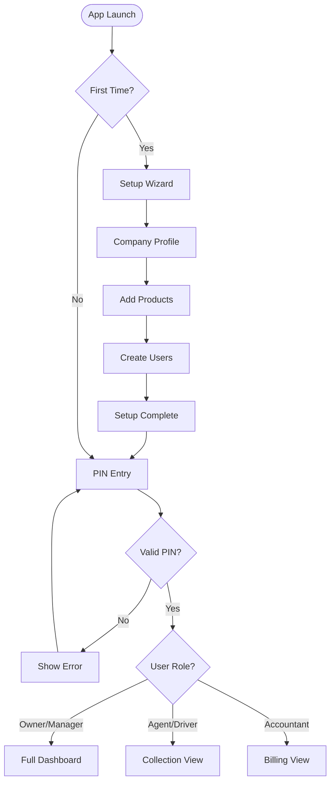
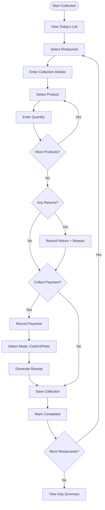
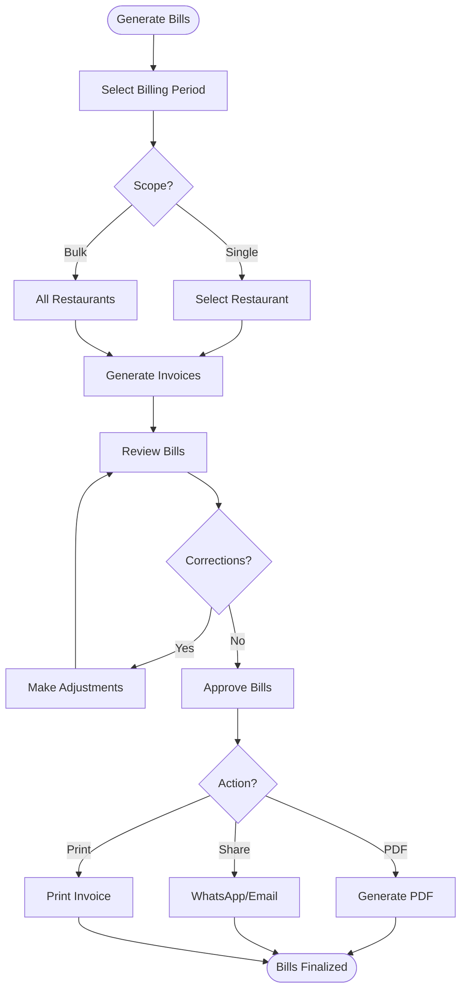

# VASUDHA OS — Minimum Viable Product (MVP)

<p align="center">
  <strong>Version 1.0 MVP Specification</strong><br/>
  <em>The smallest product that delivers the largest value</em>
</p>

---

## Table of Contents

- [MVP Philosophy](#mvp-philosophy)
- [Core User Journeys](#core-user-journeys)
- [MVP Feature Scope](#mvp-feature-scope)
- [Out of MVP Scope](#out-of-mvp-scope)
- [Acceptance Criteria](#acceptance-criteria)
- [User Flow Diagrams](#user-flow-diagrams)
- [Data Requirements](#data-requirements)
- [Performance Requirements](#performance-requirements)
- [Launch Checklist](#launch-checklist)
- [Success Metrics](#success-metrics)
- [Pilot Program](#pilot-program)
- [Feedback Collection Plan](#feedback-collection-plan)

---

## MVP Philosophy

### What MVP Means for VASUDHA OS

The MVP is not a "demo" or "prototype." It is a **fully functional, production-ready product** that a real distributor can use every day to run their core operations — replacing their paper registers, WhatsApp coordination, and manual billing entirely.

### MVP Guiding Principles

1. **Replace, don't supplement** — The MVP must be good enough that users stop using paper entirely
2. **Complete workflows only** — Don't build half a workflow; either the full journey works or it's not in the MVP
3. **Zero internet dependency** — Every MVP feature must work 100% offline
4. **Data integrity above all** — Financial data must be perfectly accurate; no "close enough"
5. **Speed over polish** — Functional UX over beautiful UX (beauty comes in v1.1)

### The MVP Question

> **Can a water distributor with 200 restaurants use VASUDHA OS as their only operational tool for a full month — tracking all deliveries, generating all bills, recording all payments, and producing all required reports?**

If the answer is **YES**, the MVP is ready.

---

## Core User Journeys

### Journey 1: Morning Setup (Business Owner / Manager)

```
Owner opens app (PIN login)
    │
    ├── Views Dashboard
    │   ├── Yesterday's collection summary
    │   ├── Today's pending collections
    │   ├── Outstanding payments overview
    │   └── Low stock alerts
    │
    ├── Reviews daily collection schedule
    │   ├── Assigns routes to collection agents
    │   └── Notes any special instructions
    │
    └── Checks inventory levels
        ├── Reviews current stock
        └── Records any new stock received
```

**Time to Complete**: < 5 minutes
**Key Requirement**: Dashboard must show all critical metrics at a glance without scrolling

---

### Journey 2: Daily Collection (Collection Agent / Driver)

```
Agent opens app → Sees today's collection list
    │
    ├── For each restaurant:
    │   ├── Navigate to restaurant (sees address + notes)
    │   ├── Record items delivered (product × quantity)
    │   ├── Record items returned (if any, with reason)
    │   ├── Record payment collected (if applicable)
    │   │   ├── Cash amount
    │   │   ├── UPI reference number
    │   │   └── Generate receipt
    │   └── Mark collection as completed
    │
    ├── Handles exceptions:
    │   ├── Restaurant closed → Mark as "Not Available"
    │   ├── Delivery rejected → Record rejection reason
    │   └── Partial delivery → Record actual vs. planned
    │
    └── End of day:
        ├── Views day summary (total delivered, collected, pending)
        ├── Reconciles cash collected
        └── Submits end-of-day report
```

**Time per Restaurant**: < 30 seconds (entry) + travel time
**Key Requirement**: One-handed operation; minimal taps; works without internet

---

### Journey 3: Billing Cycle (Accountant / Owner)

```
Accountant opens Billing module
    │
    ├── Select billing period (e.g., "July 1–15")
    │
    ├── System auto-generates bills:
    │   ├── Aggregates all collections for each restaurant
    │   ├── Applies product prices
    │   ├── Calculates GST (CGST + SGST or IGST)
    │   ├── Deducts any returns/credits
    │   └── Generates invoice with unique number
    │
    ├── Review bills:
    │   ├── Verify amounts for accuracy
    │   ├── Apply any manual adjustments
    │   └── Approve bills
    │
    ├── Share bills:
    │   ├── Generate PDF invoices
    │   ├── Share via WhatsApp/Email
    │   └── Print (if printer available)
    │
    └── Track bill status:
        ├── Mark as Sent
        ├── Record payments against bills
        └── Follow up on overdue bills
```

**Time for 200 Restaurant Bills**: < 15 minutes (bulk generation + review)
**Key Requirement**: Bulk operations; accuracy to the paisa; GST compliance

---

### Journey 4: Payment Recording (Collection Agent / Accountant)

```
Agent/Accountant records a payment:
    │
    ├── Select restaurant
    ├── View outstanding bills
    ├── Enter payment:
    │   ├── Amount received
    │   ├── Payment mode (Cash/UPI/Bank/Cheque)
    │   ├── Reference number (for UPI/cheque)
    │   └── Date of payment
    │
    ├── System auto-applies payment:
    │   ├── Applies to oldest bill first (FIFO)
    │   ├── Handles partial payments
    │   ├── Handles excess payments (advance)
    │   └── Updates outstanding balance
    │
    └── Generate receipt
        ├── Digital receipt stored in app
        └── Share via WhatsApp (optional)
```

**Time per Payment**: < 15 seconds
**Key Requirement**: Accurate outstanding calculation; support for partial payments

---

### Journey 5: Reporting (Owner / Accountant)

```
Owner opens Reports:
    │
    ├── Daily Reports:
    │   ├── Today's collection summary
    │   ├── Cash vs. digital collection breakdown
    │   └── Pending deliveries/collections
    │
    ├── Weekly/Monthly Reports:
    │   ├── Revenue by product/restaurant/area
    │   ├── Outstanding aging analysis
    │   ├── Inventory movement and wastage
    │   ├── Payment collection trends
    │   └── GST summary for filing
    │
    ├── Custom Date Range:
    │   ├── Select start and end dates
    │   ├── Filter by area/restaurant/agent
    │   └── Export to PDF/CSV
    │
    └── Share Reports:
        ├── WhatsApp
        ├── Email
        └── Print
```

**Key Requirement**: All reports generate in < 3 seconds; accurate financial calculations

---

## MVP Feature Scope

### ✅ In Scope

| # | Feature | Module | Priority | Complexity |
|---|---------|--------|----------|------------|
| 1 | PIN-based authentication | Auth | P0 | Low |
| 2 | User roles (Owner, Manager, Agent, Accountant) | Auth | P0 | Medium |
| 3 | Permission-based access control | Auth | P0 | Medium |
| 4 | First-time setup wizard | Auth | P0 | Medium |
| 5 | Dashboard with daily KPIs | Dashboard | P0 | Medium |
| 6 | Revenue trend chart (7/30 days) | Dashboard | P0 | Medium |
| 7 | Outstanding summary with aging | Dashboard | P0 | Medium |
| 8 | Quick action buttons | Dashboard | P0 | Low |
| 9 | Restaurant CRUD | Restaurants | P0 | Medium |
| 10 | Restaurant search & filter | Restaurants | P0 | Medium |
| 11 | Restaurant profile with history | Restaurants | P0 | Medium |
| 12 | Payment terms & credit limits | Restaurants | P0 | Medium |
| 13 | Daily collection list (auto-generated) | Collection | P0 | High |
| 14 | Collection entry (product × quantity) | Collection | P0 | Medium |
| 15 | Return/rejection recording | Collection | P0 | Medium |
| 16 | Collection status workflow | Collection | P0 | Medium |
| 17 | Product catalog management | Inventory | P0 | Medium |
| 18 | Stock entry (incoming goods) | Inventory | P0 | Medium |
| 19 | Auto stock deduction on delivery | Inventory | P0 | Medium |
| 20 | Current stock view | Inventory | P0 | Low |
| 21 | Low stock alerts | Inventory | P1 | Medium |
| 22 | Invoice auto-generation from collections | Billing | P0 | High |
| 23 | GST calculation (CGST/SGST/IGST) | Billing | P0 | High |
| 24 | Bulk bill generation | Billing | P0 | High |
| 25 | Bill status tracking | Billing | P0 | Medium |
| 26 | PDF invoice generation | Billing | P0 | High |
| 27 | Payment recording (multi-mode) | Payments | P0 | Medium |
| 28 | Outstanding tracking per restaurant | Payments | P0 | High |
| 29 | Aging analysis (0–15, 15–30, 30–60, 60+) | Payments | P0 | Medium |
| 30 | Digital receipt generation | Payments | P0 | Medium |
| 31 | Daily collection report | Reports | P0 | Medium |
| 32 | Outstanding/aging report | Reports | P0 | Medium |
| 33 | Sales report (by product/restaurant/area) | Reports | P0 | Medium |
| 34 | GST report (GSTR-1 / GSTR-3B format) | Reports | P0 | High |
| 35 | Export to PDF/CSV | Reports | P0 | Medium |
| 36 | Company profile setup | Settings | P0 | Low |
| 37 | Tax rate configuration | Settings | P0 | Low |
| 38 | User management | Settings | P0 | Medium |
| 39 | Local backup & restore | Settings | P0 | Medium |

---

## Out of MVP Scope

### ❌ Explicitly Excluded from v1.0

| Feature | Reason | Planned For |
|---------|--------|-------------|
| Cloud sync | Adds complexity; offline-first is sufficient for MVP | v2.0 |
| Push notifications | Requires cloud infrastructure | v2.0 |
| GPS tracking | Not essential for core operations | v2.0 |
| Employee management | HR is secondary to core operations | v1.5 |
| Expense management | Not critical for delivery operations MVP | v1.5 |
| AI features | Requires data accumulation first | v3.0 |
| OCR scanning | Enhancement, not core | v3.0 |
| Voice assistant | Enhancement, not core | v3.0 |
| Multi-language UI | English + Hindi basic only in MVP | v2.0 |
| Biometric auth | PIN is sufficient for MVP | v1.1 |
| Restaurant portal | Requires cloud infrastructure | v5.0 |
| Dark mode | UX polish, not core | v1.1 |
| Custom report builder | Fixed reports sufficient for MVP | v2.0 |
| Barcode/QR scanning | Not essential for current workflows | v2.0 |

---

## Acceptance Criteria

### System-Wide Criteria

| # | Criterion | Measurement |
|---|-----------|-------------|
| AC-01 | App works 100% offline | All features function without internet |
| AC-02 | App starts in < 3 seconds | Cold start on mid-range Android device |
| AC-03 | No data loss under any condition | Kill app mid-transaction; data preserved |
| AC-04 | Supports 5,000+ restaurants | No performance degradation |
| AC-05 | Supports 1 year of transaction data | Reports generate in < 5 seconds |
| AC-06 | Financial calculations are exact | Zero rounding errors in billing/GST |
| AC-07 | Works on Android 8.0+ | Minimum API level 26 |
| AC-08 | App size < 50 MB | APK size for download |
| AC-09 | Battery usage < 5%/hour | During active use |
| AC-10 | All user data encrypted at rest | SQLite encryption |

### Per-Module Criteria

#### Authentication
- [ ] New user can complete setup in < 5 minutes
- [ ] PIN login succeeds in < 2 seconds
- [ ] Invalid PIN shows error without revealing user info
- [ ] Auto-lock after 5 minutes of inactivity
- [ ] Password reset flow works for owner role

#### Dashboard
- [ ] Loads in < 1 second
- [ ] All numbers match underlying transaction data exactly
- [ ] Charts render smoothly with animations
- [ ] Quick actions navigate to correct screens

#### Restaurants
- [ ] CRUD operations complete in < 500ms
- [ ] Search returns results in < 200ms for 5,000 records
- [ ] Soft delete preserves historical data
- [ ] Restaurant profile shows complete history

#### Collection
- [ ] Single collection entry completes in < 30 seconds (user time)
- [ ] Daily list generates in < 500ms for 500+ restaurants
- [ ] Offline collection entry works for entire day
- [ ] End-of-day summary totals match individual entries

#### Billing
- [ ] Bulk billing for 500 restaurants completes in < 30 seconds
- [ ] GST calculation matches manual verification to the paisa
- [ ] PDF generation completes in < 5 seconds per invoice
- [ ] Invoice numbers follow configurable sequence

#### Payments
- [ ] Payment entry to receipt in < 10 seconds
- [ ] Outstanding balance always consistent
- [ ] Aging buckets update on every payment
- [ ] Partial payment handling is correct

#### Reports
- [ ] All reports generate in < 3 seconds for 6 months data
- [ ] Report totals match source data exactly
- [ ] PDF/CSV export works offline
- [ ] Date range filtering works correctly

---

## User Flow Diagrams

### App Launch Flow



### Collection Workflow



### Billing Workflow



---

## Data Requirements

### Seed Data for MVP

The following data must be configurable during first-time setup:

| Data Type | Minimum Required | Example |
|-----------|-----------------|---------|
| Company Profile | 1 | Name, address, GSTIN, logo |
| Products | 1–10 | 20L Water Can, 1L Milk Packet, 5L Oil Can |
| Tax Rates | 1–5 | 5% GST, 12% GST, 18% GST |
| Users | 1 | Owner (created during setup) |
| Restaurants | 0 | Added after setup |

### Data Volume Assumptions for MVP

| Entity | Expected Volume (per business) | Storage Estimate |
|--------|-------------------------------|-----------------|
| Restaurants | 100–500 | ~100 KB |
| Collections (daily) | 100–500 records/day | ~50 KB/day |
| Bills (monthly) | 100–500 invoices/month | ~200 KB/month |
| Payments | 200–1000/month | ~100 KB/month |
| Products | 5–50 SKUs | ~10 KB |
| **Total (1 year)** | — | **~200–500 MB** |

---

## Performance Requirements

| Metric | Target | Measurement Conditions |
|--------|--------|----------------------|
| Cold start time | < 3 seconds | Mid-range Android (4GB RAM, Snapdragon 665) |
| Warm start time | < 1 second | App resumed from background |
| Screen transition | < 300ms | Navigation between modules |
| List scrolling | 60 FPS | Lists with 500+ items |
| Search latency | < 200ms | Full-text search across 5,000 records |
| Bulk bill generation | < 30 seconds | 500 invoices in one batch |
| Report generation | < 3 seconds | 6 months of data, all restaurants |
| PDF generation | < 5 seconds | Single invoice with company branding |
| Database query | < 100ms | Complex aggregation queries |
| Backup creation | < 60 seconds | Full database backup to file |
| Storage usage | < 500 MB | 1 year of full operational data |
| Memory usage | < 200 MB | Active RAM during normal operation |
| Battery drain | < 5%/hour | Active use without GPS |

---

## Launch Checklist

### Pre-Launch (Development Complete)

- [ ] All MVP features implemented and tested
- [ ] Unit test coverage > 80%
- [ ] Integration tests pass for all user journeys
- [ ] Performance benchmarks met on target devices
- [ ] Security audit completed (data encryption, input validation)
- [ ] Error handling covers all known edge cases
- [ ] Backup/restore tested with real-world data volumes
- [ ] APK size < 50 MB
- [ ] Tested on 5+ Android devices (various manufacturers/versions)

### Pilot Launch

- [ ] 5–10 pilot users identified and onboarded
- [ ] Pilot users trained on core workflows (< 1 hour training)
- [ ] Feedback collection mechanism in place (in-app + WhatsApp group)
- [ ] Support channel established (phone + WhatsApp)
- [ ] Seed data loaded for pilot users
- [ ] Crash reporting enabled (Firebase Crashlytics or equivalent)
- [ ] Analytics tracking enabled for feature usage

### General Availability

- [ ] Pilot feedback addressed (critical bugs fixed)
- [ ] Onboarding tutorial/walkthrough added
- [ ] Help documentation accessible within app
- [ ] Play Store listing prepared (screenshots, description, keywords)
- [ ] Privacy policy and terms of service drafted
- [ ] Support documentation created
- [ ] Pricing model validated with pilot users

---

## Success Metrics

### Primary Metrics (Must Achieve)

| Metric | Target | Measurement |
|--------|--------|-------------|
| Daily Active Usage | > 80% of onboarded users | Users who open app daily |
| Task Completion Rate | > 95% | Collections entered / deliveries made |
| Data Entry Reduction | > 50% time savings | Compared to paper-based workflow |
| Financial Accuracy | 100% | Bill totals match manual calculations |
| User Retention (30-day) | > 70% | Users still active after 30 days |

### Secondary Metrics (Should Achieve)

| Metric | Target | Measurement |
|--------|--------|-------------|
| App Crash Rate | < 0.5% | Crashes per session |
| Average Session Length | > 10 minutes | Time spent in app per session |
| Feature Adoption | > 60% | Users using billing + collection + payments |
| NPS Score | > 40 | Net Promoter Score from pilot users |
| Support Tickets | < 5/week | After initial 2-week onboarding period |

---

## Pilot Program

### Phase 1: Internal Testing (2 Weeks)

- Team members simulate real distributor workflows
- Load test with 500 restaurants and 6 months of synthetic data
- Identify UX friction points and performance bottlenecks
- Fix all critical and major bugs

### Phase 2: Friendly Users (4 Weeks)

- Onboard 3–5 known distributors in pilot city
- Shadow their daily operations for the first week
- Collect daily feedback via WhatsApp group
- Weekly check-in calls to review pain points
- Iterate on UX based on observations

### Phase 3: Expanded Pilot (8 Weeks)

- Expand to 10–25 distributors
- Reduce support touchpoints; measure self-service capability
- Monitor engagement metrics and feature adoption
- A/B test onboarding flows
- Collect case studies and testimonials

### Pilot Selection Criteria

| Criterion | Requirement |
|-----------|-------------|
| Business type | Water, dairy, or oil distribution |
| Restaurant count | 50–300 restaurants |
| Team size | 3–15 people (at least 1 collection agent) |
| Smartphone access | Android 8.0+ with minimum 3GB RAM |
| Willingness | Committed to daily app usage for pilot duration |
| Location | Pilot city with support access |
| Current process | Primarily paper/manual (not already using ERP) |

---

## Feedback Collection Plan

### In-App Feedback

- **Rating prompt** after first week (1–5 stars + optional comment)
- **Feature request button** accessible from settings
- **Bug report** with auto-attached device info and screenshot capability

### External Channels

- **WhatsApp group** for pilot users (real-time support and feedback)
- **Weekly survey** (Google Forms) covering:
  - What features did you use this week?
  - What was frustrating?
  - What's missing?
  - Would you recommend this to another distributor?
- **Monthly video call** with pilot cohort for in-depth feedback

### Feedback Prioritization

```
Critical:    Data loss, incorrect calculations, app crashes → Fix within 24 hours
Major:       Workflow blockers, confusing UX → Fix within 1 week
Minor:       UI polish, nice-to-haves → Backlog for next sprint
Enhancement: New feature requests → Evaluate for v1.1 or v1.5
```

---

<p align="center">
  <strong>VASUDHA OS MVP</strong> — The foundation upon which everything else is built. 🏗️
</p>
