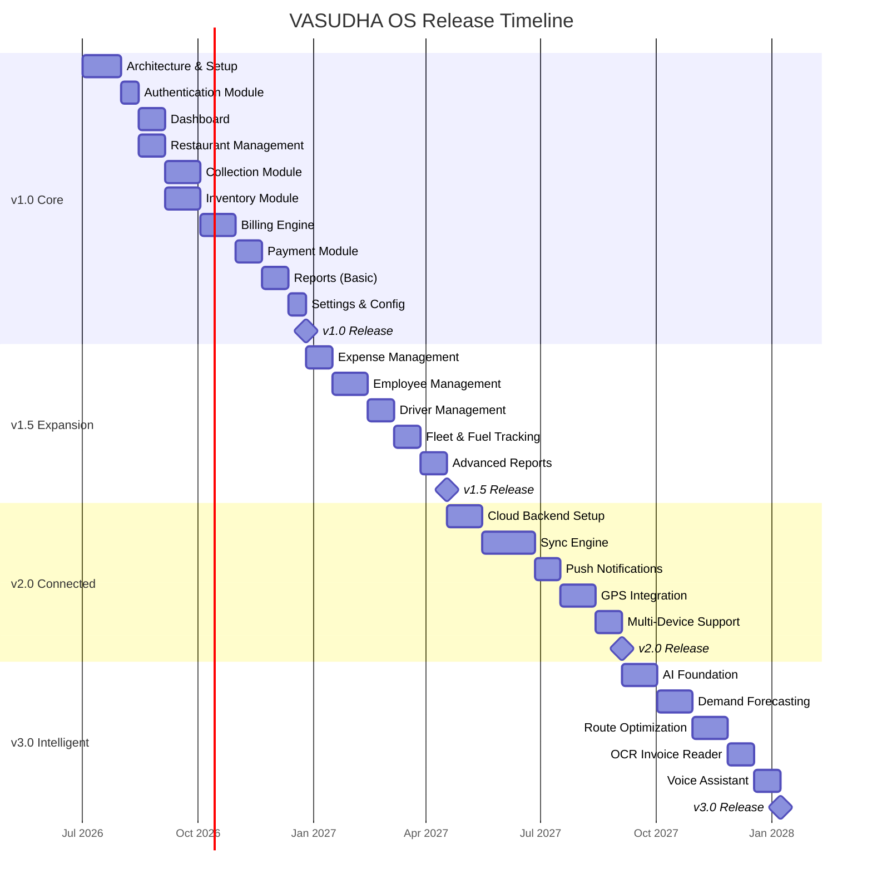
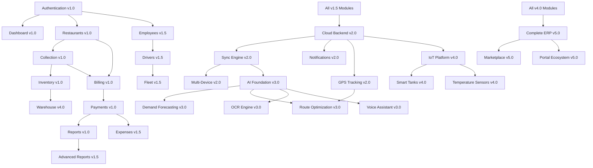

# VASUDHA OS — Product Roadmap

<p align="center">
  <strong>From MVP to Industry Operating System</strong><br/>
  <em>A phased roadmap for building India's definitive supply chain ERP</em>
</p>

---

## Table of Contents

- [Roadmap Philosophy](#roadmap-philosophy)
- [Release Timeline Overview](#release-timeline-overview)
- [Version 1.0 — Core Foundation](#version-10--core-foundation)
- [Version 1.5 — Operational Expansion](#version-15--operational-expansion)
- [Version 2.0 — Connected Platform](#version-20--connected-platform)
- [Version 3.0 — Intelligent Platform](#version-30--intelligent-platform)
- [Version 4.0 — IoT & Warehouse Platform](#version-40--iot--warehouse-platform)
- [Version 5.0 — Complete ERP & Marketplace](#version-50--complete-erp--marketplace)
- [Feature Prioritization Matrix](#feature-prioritization-matrix)
- [Dependency Graph](#dependency-graph)
- [Risk Factors](#risk-factors)
- [Success Metrics by Version](#success-metrics-by-version)

---

## Roadmap Philosophy

### Guiding Principles

1. **Ship value early, iterate fast** — Each version must deliver tangible, measurable value to users
2. **Depth before breadth** — Perfect core workflows before adding new modules
3. **Offline-first always** — Every feature must work offline; cloud is an enhancement, not a requirement
4. **Data accumulation** — Each version generates data that fuels intelligence in later versions
5. **Backward compatibility** — Upgrades must never break existing workflows or lose data

### Versioning Strategy

```
MAJOR.MINOR.PATCH
  │     │     │
  │     │     └── Bug fixes, performance improvements
  │     └──────── New features within the same architectural phase
  └────────────── Architectural phase change (e.g., offline → cloud, cloud → AI)
```

---

## Release Timeline Overview



---

## Version 1.0 — Core Foundation

**Codename**: *PRITHVI* (पृथ्वी — Earth/Foundation)
**Target**: Q4 2026
**Theme**: Core offline ERP that replaces paper registers

### Overview

Version 1.0 establishes the foundational ERP capabilities that every distribution business needs from day one. The focus is on **replacing paper-based workflows** with a digital system that works entirely offline.

### Module Breakdown

#### 1.0.1 — Authentication & User Management

| Feature | Priority | Complexity | Description |
|---------|----------|------------|-------------|
| PIN-based Login | P0 | Low | 4–6 digit PIN authentication |
| User Roles | P0 | Medium | Owner, Manager, Agent, Driver, Accountant |
| Permission Matrix | P0 | Medium | Role-based access to modules and actions |
| Biometric Auth | P1 | Low | Fingerprint/Face ID for quick access |
| Session Management | P0 | Medium | Auto-lock, session timeout, multi-device conflict |
| First-Time Setup | P0 | Medium | Guided onboarding wizard for new installations |

**Acceptance Criteria**:
- [ ] User can register and set up company profile in < 5 minutes
- [ ] Login via PIN completes in < 2 seconds
- [ ] Role-based permissions prevent unauthorized access to sensitive data
- [ ] Session auto-locks after 5 minutes of inactivity

---

#### 1.0.2 — Dashboard

| Feature | Priority | Complexity | Description |
|---------|----------|------------|-------------|
| Daily Summary Card | P0 | Medium | Today's collections, deliveries, pending payments |
| Revenue Chart | P0 | Medium | Weekly/monthly revenue trend chart |
| Outstanding Summary | P0 | Medium | Total outstanding, aging breakdown |
| Quick Actions | P0 | Low | Start collection, create bill, add payment |
| Alerts & Notifications | P1 | Medium | Overdue payments, low stock, pending tasks |
| Collection Progress | P0 | Medium | Today's collection progress bar |
| Top Pending Restaurants | P1 | Low | List of restaurants with highest pending amounts |

**Acceptance Criteria**:
- [ ] Dashboard loads in < 1 second from local database
- [ ] All KPI cards reflect real-time local data
- [ ] Quick actions navigate to correct modules with pre-filled context
- [ ] Charts render smoothly with 12 months of data

---

#### 1.0.3 — Restaurant Management

| Feature | Priority | Complexity | Description |
|---------|----------|------------|-------------|
| Restaurant CRUD | P0 | Medium | Create, read, update, soft-delete restaurants |
| Contact Details | P0 | Low | Name, owner, mobile, email, address, area |
| Payment Terms | P0 | Medium | Payment cycle (weekly/biweekly/monthly), credit limit |
| Restaurant Profile | P0 | Medium | Complete profile with history, balance, last order |
| Area/Zone Management | P1 | Medium | Group restaurants by delivery area/zone |
| Search & Filter | P0 | Medium | Search by name, area, status; filter by payment status |
| Import from Contacts | P2 | Medium | Import restaurant data from phone contacts |
| Restaurant Status | P0 | Low | Active, inactive, suspended, blacklisted |
| Notes & Tags | P1 | Low | Free-text notes and custom tags per restaurant |

**Acceptance Criteria**:
- [ ] Can manage 1,000+ restaurants without performance degradation
- [ ] Search returns results in < 200ms
- [ ] Restaurant profile shows complete transaction history
- [ ] Soft-delete preserves historical data for reporting

---

#### 1.0.4 — Collection Module

| Feature | Priority | Complexity | Description |
|---------|----------|------------|-------------|
| Daily Collection List | P0 | High | Auto-generated list of today's scheduled collections |
| Collection Entry | P0 | Medium | Record quantity delivered per product per restaurant |
| Collection Status | P0 | Low | Pending → In Progress → Completed → Verified |
| Route Assignment | P1 | Medium | Assign collection routes to agents/drivers |
| Return/Rejection | P0 | Medium | Record rejected/returned items with reasons |
| Collection Summary | P0 | Medium | End-of-day summary with totals and discrepancies |
| Historical Collections | P0 | Medium | View past collections by date, restaurant, agent |
| Bulk Collection Entry | P1 | High | Enter collections for multiple restaurants quickly |

**Acceptance Criteria**:
- [ ] Collection entry for a single restaurant completes in < 30 seconds
- [ ] Daily list generates in < 500ms for 500+ restaurants
- [ ] Supports offline collection entry for full day without sync
- [ ] Collection summary matches individual entries exactly

---

#### 1.0.5 — Inventory Management

| Feature | Priority | Complexity | Description |
|---------|----------|------------|-------------|
| Product Catalog | P0 | Medium | Product master with SKU, unit, price, tax |
| Stock Entry | P0 | Medium | Record incoming stock (purchases) |
| Stock Deduction | P0 | Medium | Auto-deduct on delivery/collection |
| Current Stock View | P0 | Low | Real-time stock levels for all products |
| Low Stock Alerts | P1 | Medium | Configurable reorder point alerts |
| Stock Adjustment | P0 | Medium | Manual adjustments with reason codes |
| Stock History | P0 | Medium | Complete stock movement history |
| Wastage Tracking | P1 | Medium | Record and track wastage/expired stock |

**Acceptance Criteria**:
- [ ] Stock levels update in real-time with collection/delivery entries
- [ ] Low stock alerts trigger at configurable thresholds
- [ ] Stock history provides complete audit trail
- [ ] Supports 100+ product SKUs without performance issues

---

#### 1.0.6 — Billing Engine

| Feature | Priority | Complexity | Description |
|---------|----------|------------|-------------|
| Invoice Generation | P0 | High | Auto-generate invoices from collections |
| GST Calculation | P0 | High | CGST, SGST, IGST auto-calculation |
| Invoice Templates | P1 | Medium | Customizable invoice templates |
| Bulk Billing | P0 | High | Generate bills for multiple restaurants at once |
| Bill Status | P0 | Low | Draft → Sent → Paid → Partially Paid → Overdue |
| Credit Notes | P1 | Medium | Issue credit notes for returns/adjustments |
| Bill History | P0 | Medium | Complete billing history per restaurant |
| PDF Generation | P0 | High | Generate PDF invoices for sharing |

**Acceptance Criteria**:
- [ ] Bulk billing for 500 restaurants completes in < 30 seconds
- [ ] GST calculations match manual verification to the paisa
- [ ] PDF invoices render correctly with company branding
- [ ] Bill status workflow prevents invalid state transitions

---

#### 1.0.7 — Payment & Collection

| Feature | Priority | Complexity | Description |
|---------|----------|------------|-------------|
| Payment Recording | P0 | Medium | Record payments against specific bills |
| Multi-Mode Payment | P0 | Medium | Cash, UPI, bank transfer, cheque, credit |
| Receipt Generation | P0 | Medium | Digital receipt for every payment |
| Outstanding Tracking | P0 | High | Real-time outstanding balance per restaurant |
| Aging Analysis | P0 | High | 0–15, 15–30, 30–60, 60+ day buckets |
| Partial Payments | P0 | Medium | Support partial payment against bills |
| Advance Payments | P1 | Medium | Record and apply advance payments |
| Payment Reconciliation | P0 | High | Reconcile collections with bank deposits |

**Acceptance Criteria**:
- [ ] Payment recording to receipt generation in < 10 seconds
- [ ] Outstanding calculation is always consistent with payment records
- [ ] Aging analysis updates instantly on new payments
- [ ] Reconciliation identifies discrepancies automatically

---

#### 1.0.8 — Reports & Analytics (Basic)

| Report | Priority | Description |
|--------|----------|-------------|
| Daily Collection Report | P0 | Collections by agent, area, restaurant |
| Outstanding Report | P0 | Total outstanding by restaurant with aging |
| Sales Report | P0 | Revenue by product, restaurant, period |
| Inventory Report | P0 | Current stock, stock movement, low stock |
| Payment Report | P0 | Payments received by mode, date, restaurant |
| GST Report | P0 | GST summary for filing (GSTR-1, GSTR-3B) |
| Agent Performance | P1 | Collection efficiency by agent |
| Area-wise Report | P1 | Business metrics grouped by delivery area |

**Acceptance Criteria**:
- [ ] All reports generate in < 3 seconds for 6 months of data
- [ ] Reports support date range filtering
- [ ] Export to PDF and Excel/CSV
- [ ] Reports data matches transaction records exactly

---

#### 1.0.9 — Settings & Configuration

| Feature | Priority | Description |
|---------|----------|-------------|
| Company Profile | P0 | Company name, logo, address, GSTIN |
| Tax Configuration | P0 | GST rates, HSN codes, tax categories |
| Product Setup | P0 | Product catalog management |
| User Management | P0 | Add/edit users, assign roles |
| Backup & Restore | P0 | Local backup to device storage |
| App Preferences | P1 | Theme, language, date format, currency |
| Data Reset | P0 | Factory reset with confirmation |
| About & Licenses | P0 | App version, licenses, credits |

---

## Version 1.5 — Operational Expansion

**Codename**: *VAYU* (वायु — Wind/Expansion)
**Target**: Q1 2027
**Theme**: Expand operational coverage to full business operations

### Module Breakdown

#### 1.5.1 — Expense Management

| Feature | Description |
|---------|-------------|
| Expense Categories | Fuel, vehicle maintenance, salary, rent, utilities, misc |
| Expense Entry | Amount, date, category, vendor, receipt photo |
| Recurring Expenses | Monthly/weekly auto-created expense entries |
| Expense Reports | Category-wise, monthly, vendor-wise expense analysis |
| Budget Tracking | Set monthly budgets; track actuals vs. budget |
| Expense Approval | Manager approval workflow for large expenses |

---

#### 1.5.2 — Employee Management

| Feature | Description |
|---------|-------------|
| Employee Directory | Complete employee database with roles, contact, documents |
| Attendance Tracking | Daily check-in/check-out with location (optional) |
| Leave Management | Leave requests, approvals, balance tracking |
| Salary Structure | Basic + DA + HRA + incentives; configurable per employee |
| Payroll Processing | Monthly salary calculation, deductions, payslips |
| Performance Metrics | KPIs per role (collections, deliveries, etc.) |
| Document Storage | Aadhaar, PAN, license copies stored securely |

---

#### 1.5.3 — Driver & Vehicle Management

| Feature | Description |
|---------|-------------|
| Driver Profiles | License, vehicle assignment, route assignment, performance |
| Vehicle Registry | Vehicle details, insurance, PUC, fitness certificate |
| Fuel Tracking | Daily fuel entries, mileage calculation, cost analysis |
| Maintenance Log | Scheduled maintenance, repair history, cost tracking |
| Trip Log | Daily trip records with distance, time, deliveries |
| Vehicle Documents | Insurance renewal alerts, PUC expiry reminders |

---

#### 1.5.4 — Advanced Reports

| Report | Description |
|--------|-------------|
| Profit & Loss Statement | Revenue - COGS - Operating Expenses |
| Cash Flow Report | Cash inflows vs. outflows by period |
| Employee Productivity | Deliveries per driver, collections per agent |
| Route Efficiency | Cost per delivery by route/area |
| Customer Profitability | Revenue and margin per restaurant |
| Inventory Valuation | Stock value by FIFO/weighted average |
| Expense Analysis | Trend analysis, budget variance, category breakdown |
| Driver Performance | Deliveries, fuel efficiency, on-time percentage |

---

## Version 2.0 — Connected Platform

**Codename**: *AGNI* (अग्नि — Fire/Energy)
**Target**: Q3 2027
**Theme**: Cloud connectivity, real-time sync, multi-device support

### Module Breakdown

#### 2.0.1 — Cloud Backend

| Component | Technology | Description |
|-----------|-----------|-------------|
| Cloud Database | PostgreSQL (Supabase) or Firestore | Centralized cloud database |
| Authentication Service | Firebase Auth / Custom JWT | Cloud-based auth with SSO support |
| File Storage | Cloud Storage (S3/GCS) | Invoice PDFs, photos, documents |
| API Gateway | REST + WebSocket | Real-time data sync endpoints |
| Background Jobs | Cloud Functions / Workers | Scheduled reports, notifications |

---

#### 2.0.2 — Sync Engine

| Feature | Description |
|---------|-------------|
| Bidirectional Sync | Local ↔ Cloud real-time synchronization |
| Conflict Resolution | Last-write-wins with manual resolution for conflicts |
| Delta Sync | Only sync changed records, not full database |
| Sync Queue | Queue changes during offline; batch sync when connected |
| Sync Status | Visual indicator showing sync status and last sync time |
| Selective Sync | Choose which modules/date ranges to sync |
| Bandwidth Optimization | Compress sync payloads; prioritize critical data |

---

#### 2.0.3 — Notifications & Alerts

| Notification Type | Channel | Description |
|-------------------|---------|-------------|
| Payment Reminder | Push + SMS | Automated reminders for overdue payments |
| Low Stock Alert | Push | Stock below reorder point |
| Collection Due | Push | Today's collection schedule reminder |
| Bill Generated | Push + Email | New invoice notification to restaurants |
| Payment Received | Push | Confirmation of payment recorded |
| Sync Complete | Push | Background sync completion notification |
| Document Expiry | Push | Vehicle/employee document expiry alerts |

---

#### 2.0.4 — GPS & Location

| Feature | Description |
|---------|-------------|
| Live Driver Tracking | Real-time GPS location of delivery vehicles |
| Geofenced Deliveries | Auto-detect arrival at restaurant location |
| Route Visualization | Map view of planned vs. actual delivery routes |
| Distance Calculation | Accurate distance tracking for fuel accounting |
| Delivery Proof | GPS stamp + timestamp for proof of delivery |

---

#### 2.0.5 — Multi-Device Support

| Feature | Description |
|---------|-------------|
| Tablet Support | Optimized layout for tablet-based office use |
| Web Dashboard | Read-only web dashboard for business owners |
| Multi-User Simultaneous | Multiple users accessing same data in real-time |
| Device Management | Register/deregister devices, remote wipe |

---

## Version 3.0 — Intelligent Platform

**Codename**: *BUDDHI* (बुद्धि — Intelligence/Wisdom)
**Target**: Q2 2028
**Theme**: AI-powered intelligence across all operations

### Module Breakdown

#### 3.0.1 — AI Foundation

| Component | Description |
|-----------|-------------|
| ML Pipeline | On-device TFLite models + cloud-based training |
| Feature Store | Precomputed features from transaction data |
| Model Registry | Version-controlled model deployment |
| A/B Testing | Compare AI recommendations vs. manual decisions |
| Feedback Loop | User corrections improve model accuracy |

---

#### 3.0.2 — Demand Forecasting

| Feature | Description |
|---------|-------------|
| Restaurant-level Forecast | Predict daily demand per restaurant per product |
| Seasonal Adjustments | Account for festivals, weather, events |
| New Restaurant Ramp-up | Predict demand curve for newly onboarded restaurants |
| Aggregate Planning | Warehouse-level demand aggregation |
| Accuracy Tracking | MAE/MAPE tracking with continuous improvement |

---

#### 3.0.3 — Route Optimization

| Feature | Description |
|---------|-------------|
| Optimal Route Planning | Minimize total distance/time for daily deliveries |
| Dynamic Re-routing | Adjust routes based on real-time traffic and priorities |
| Load Optimization | Optimize truck loading sequence for delivery order |
| Multi-Vehicle Routing | VRP solver for multi-truck fleet optimization |
| Cost Estimation | Predict fuel cost for planned routes |

---

#### 3.0.4 — OCR & Document Intelligence

| Feature | Description |
|---------|-------------|
| Invoice Scanning | Photograph invoices; auto-extract line items |
| Receipt Scanning | Scan expense receipts; auto-categorize |
| Cheque Reader | Read cheque details (amount, date, bank) from photo |
| Business Card Scanner | Extract restaurant contact details from cards |
| Document Digitization | Convert paper records to structured data |

---

#### 3.0.5 — Voice Assistant

| Feature | Description |
|---------|-------------|
| Hindi Voice Commands | "Aaj ki collection dikhao" / "Sharma ji ka bill banao" |
| Voice Data Entry | Dictate collection entries while driving |
| Voice Reports | "Pichle hafte ki sale kitni thi?" |
| Multi-Language | Hindi, English, Marathi, Tamil, Telugu support |
| Offline Voice | Basic voice commands work offline |

---

## Version 4.0 — IoT & Warehouse Platform

**Codename**: *AKASH* (आकाश — Sky/Limitless)
**Target**: Q4 2028
**Theme**: Physical world integration through IoT and warehouse management

### Module Breakdown

#### 4.0.1 — Warehouse Management

| Feature | Description |
|---------|-------------|
| Multi-Warehouse | Manage inventory across multiple warehouse locations |
| Warehouse Layout | Zone/rack/shelf-based location tracking |
| Loading Bay Management | Truck loading/unloading workflows |
| Cross-Docking | Direct transfer from receiving to dispatch |
| Batch Tracking | Track product batches through the supply chain |
| Warehouse Dashboard | Real-time warehouse operations visibility |

---

#### 4.0.2 — IoT Integration

| Device Type | Use Case | Description |
|-------------|----------|-------------|
| Smart Water Tanks | Level Monitoring | Ultrasonic sensors for real-time water level |
| Temperature Sensors | Cold Chain | Monitor dairy/perishable storage temperature |
| Weight Sensors | Inventory Accuracy | Automatic stock counting by weight |
| GPS Trackers | Fleet Management | Always-on vehicle location tracking |
| Flow Meters | Dispensing Accuracy | Measure exact water/liquid dispensed |

---

#### 4.0.3 — Automated Alerts

| Alert Type | Trigger | Action |
|------------|---------|--------|
| Tank Low | Water level < threshold | Auto-notify dispatch for refill |
| Temperature Breach | Temperature outside range | Alert warehouse manager + log incident |
| Unauthorized Movement | Vehicle moves outside hours | Alert fleet manager |
| Maintenance Due | Mileage/time threshold reached | Schedule maintenance reminder |
| Inventory Discrepancy | Sensor reading ≠ system record | Flag for manual verification |

---

## Version 5.0 — Complete ERP & Marketplace

**Codename**: *SAMPOORNA* (सम्पूर्ण — Complete/Whole)
**Target**: 2029
**Theme**: Full enterprise platform with marketplace and ecosystem

### Module Breakdown

#### 5.0.1 — Complete ERP Modules

| Module | Description |
|--------|-------------|
| **CRM** | Lead management, customer lifecycle, campaign tracking |
| **HR & Payroll** | Full HR suite — recruitment, onboarding, payroll, compliance |
| **Accounting** | Double-entry accounting, chart of accounts, bank reconciliation |
| **GST & Tax** | Automated GST return filing (GSTR-1, GSTR-3B, GSTR-9) |
| **Procurement** | Purchase orders, vendor management, price comparison |
| **Quality Control** | Quality check workflows, FSSAI compliance tracking |

---

#### 5.0.2 — Portal Ecosystem

| Portal | Users | Description |
|--------|-------|-------------|
| **Vendor Portal** | Suppliers | Receive POs, submit invoices, track payments |
| **Restaurant Portal** | Buyers | Place orders, view invoices, make payments |
| **Driver App** | Drivers | Dedicated driver app with delivery workflow |
| **Owner Dashboard** | Business Owners | Web-based executive dashboard |
| **Admin Console** | System Admins | Platform administration and configuration |

---

#### 5.0.3 — Marketplace

| Feature | Description |
|---------|-------------|
| Product Marketplace | Distributors can browse and order from suppliers |
| Service Marketplace | Find logistics, maintenance, and support services |
| Price Discovery | Market price benchmarking for products |
| Bulk Bidding | Suppliers bid on large distribution contracts |
| Rating & Reviews | Reputation system for buyers and suppliers |

---

## Feature Prioritization Matrix

### MoSCoW Framework

| Priority | Version | Features |
|----------|---------|----------|
| **Must Have** | v1.0 | Auth, Dashboard, Restaurants, Collection, Inventory, Billing, Payments, Basic Reports, Settings |
| **Should Have** | v1.5 | Expenses, Employees, Drivers, Fleet, Advanced Reports |
| **Could Have** | v2.0 | Cloud Sync, Notifications, GPS, Multi-Device |
| **Won't Have (Yet)** | v3.0+ | AI, OCR, Voice, IoT, Marketplace, Full ERP |

### Impact vs. Effort Matrix

```
                    High Impact
                        │
    ┌───────────────────┼───────────────────┐
    │                   │                   │
    │   QUICK WINS      │   STRATEGIC       │
    │   - PIN Auth      │   - Collection    │
    │   - Dashboard     │   - Billing       │
    │   - Payments      │   - Inventory     │
    │                   │   - Cloud Sync    │
    │                   │                   │
Low ├───────────────────┼───────────────────┤ High
Eff │                   │                   │ Effort
    │   FILL-INS        │   LONG-TERM       │
    │   - Notes/Tags    │   - AI Engine     │
    │   - Import        │   - IoT           │
    │   - Themes        │   - Marketplace   │
    │                   │   - Voice         │
    │                   │                   │
    └───────────────────┼───────────────────┘
                        │
                    Low Impact
```

---

## Dependency Graph



---

## Risk Factors

### Technical Risks

| Risk | Impact | Probability | Mitigation |
|------|--------|-------------|------------|
| SQLite performance at scale | High | Medium | Benchmark early; optimize queries; plan migration path |
| Offline-to-cloud sync conflicts | High | High | Design conflict resolution strategy upfront |
| Flutter framework breaking changes | Medium | Low | Pin versions; test upgrades in staging |
| AI model accuracy insufficient | Medium | Medium | Start with rule-based logic; graduate to ML |
| IoT device reliability in field | High | High | Build redundancy; offline fallback for all IoT |

### Business Risks

| Risk | Impact | Probability | Mitigation |
|------|--------|-------------|------------|
| Low user adoption | Critical | Medium | Design for minimal training; pilot with friendly users |
| Competitor launches similar product | High | Medium | Speed to market; deep domain expertise moat |
| Regulatory changes (GST rules) | Medium | Medium | Modular tax engine; rapid update capability |
| Scaling beyond single developer | High | High | Clean architecture; comprehensive documentation |
| Revenue model viability | Critical | Medium | Validate willingness to pay early in pilot |

---

## Success Metrics by Version

### Version 1.0

| Metric | Target |
|--------|--------|
| Pilot users onboarded | 10–25 businesses |
| Daily active usage rate | > 80% |
| Average session length | > 15 minutes |
| Data entry time reduction | 50% vs. manual |
| User satisfaction (NPS) | > 40 |
| Critical bugs | < 5 open |
| App crash rate | < 0.5% |

### Version 1.5

| Metric | Target |
|--------|--------|
| Active users | 50–100 businesses |
| Feature adoption (new modules) | > 60% |
| Revenue leakage reduction | 50% improvement |
| Employee productivity improvement | 20% |

### Version 2.0

| Metric | Target |
|--------|--------|
| Cloud-connected users | > 70% of active users |
| Sync reliability | > 99.5% |
| Multi-device adoption | > 30% |
| Notification engagement | > 40% open rate |

### Version 3.0

| Metric | Target |
|--------|--------|
| AI recommendation acceptance | > 60% |
| Demand forecast accuracy | MAE < 10% |
| Route optimization savings | > 20% fuel cost reduction |
| OCR accuracy | > 90% field extraction |

---

<p align="center">
  <strong>VASUDHA OS Roadmap</strong> — Building India's supply chain future, one version at a time. 🚀
</p>
