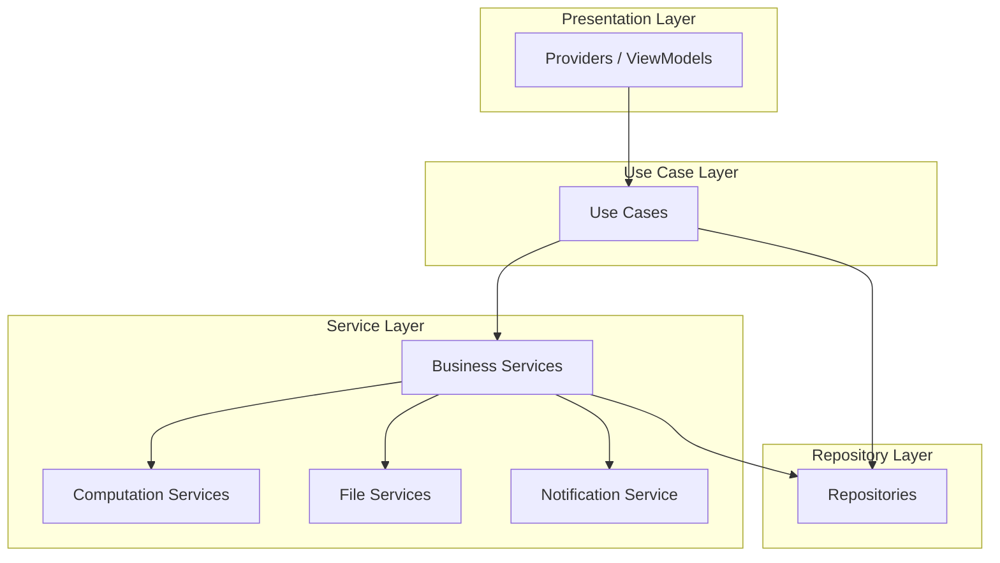

# VASUDHA OS — Service Layer

<p align="center">
  <strong>Business Logic, Data, and Background Services</strong><br/>
  <em>The engine room that powers every operation</em>
</p>

---

## Table of Contents

- [Service Architecture](#service-architecture)
- [Business Logic Services](#business-logic-services)
- [Data Services](#data-services)
- [Computation Services](#computation-services)
- [Report Generation Services](#report-generation-services)
- [File Services](#file-services)
- [Sync Services (v2.0)](#sync-services-v20)
- [Notification Service](#notification-service)
- [Background Task Services](#background-task-services)
- [Service Registration](#service-registration)

---

## Service Architecture

Services are **stateless, injectable classes** that encapsulate complex operations spanning multiple repositories or requiring coordination between modules.



### When to Use a Service vs. a Use Case

| Use Case | Service |
|----------|---------|
| Single-entity operations | Multi-entity coordination |
| Simple CRUD + validation | Complex business workflows |
| One repository interaction | Multiple repository interactions |
| No external side effects | File generation, notifications, sync |
| Can be tested with one mock | Requires multiple mocks |

---

## Business Logic Services

### BillingService

Coordinates the complete billing workflow across collections, tax calculations, and PDF generation.

```dart
@lazySingleton
class BillingService {
  final CollectionRepository _collectionRepo;
  final BillingRepository _billingRepo;
  final RestaurantRepository _restaurantRepo;
  final TaxCalculationService _taxService;
  final PdfGenerationService _pdfService;
  final AppEventBus _eventBus;

  /// Generate bills for all restaurants in a billing period
  Future<Result<BillingResult, Failure>> generateBulkBills({
    required DateTime periodStart,
    required DateTime periodEnd,
  }) async {
    // 1. Get all restaurants with collections in period
    // 2. Aggregate collection items per restaurant
    // 3. Calculate tax for each line item
    // 4. Create bill records with items
    // 5. Emit BulkBillsGenerated event
    // 6. Return summary
  }

  /// Apply a payment to outstanding bills (FIFO)
  Future<Result<PaymentApplication, Failure>> applyPayment({
    required String restaurantId,
    required double amount,
    String? specificBillId,
  }) async {
    // 1. Get outstanding bills sorted by due_date (FIFO)
    // 2. Apply payment to oldest bill first
    // 3. Handle partial payments
    // 4. Handle excess as advance
    // 5. Update bill statuses
    // 6. Return application details
  }
}
```

### CollectionService

Coordinates collection workflows with inventory management.

```dart
@lazySingleton
class CollectionService {
  final CollectionRepository _collectionRepo;
  final InventoryService _inventoryService;
  final RestaurantRepository _restaurantRepo;
  final AppEventBus _eventBus;

  /// Create a collection and handle all side effects
  Future<Result<Collection, Failure>> processCollection({
    required String restaurantId,
    required DateTime date,
    required List<CollectionItemData> items,
    String? notes,
  }) async {
    // 1. Validate restaurant is active
    // 2. Check for duplicate collection
    // 3. Validate stock availability for all items
    // 4. Begin transaction
    // 5. Create collection record
    // 6. Create collection items
    // 7. Deduct inventory for each item
    // 8. Commit transaction
    // 9. Emit CollectionCreated event
  }
}
```

### ReconciliationService

Handles financial reconciliation between collections, bills, and payments.

```dart
@lazySingleton
class ReconciliationService {
  /// Reconcile daily cash collections
  Future<Result<ReconciliationReport, Failure>> reconcileDay({
    required DateTime date,
    required double depositedAmount,
  }) async {
    // 1. Sum all cash payments recorded for the day
    // 2. Compare with deposited amount
    // 3. Identify discrepancy (if any)
    // 4. Generate reconciliation report
  }

  /// Calculate restaurant outstanding balance
  Future<Result<OutstandingBalance, Failure>> calculateOutstanding({
    required String restaurantId,
  }) async {
    // opening_balance + total_billed - total_paid = outstanding
  }
}
```

---

## Data Services

### SupabaseService

Central Supabase client helper.

```dart
@singleton
class SupabaseService {
  SupabaseClient? _client;

  SupabaseClient get client {
    _client ??= Supabase.instance.client;
    return _client!;
  }
}
```

### CacheSyncService

Cache management and offline sync queue services.

```dart
@lazySingleton
class CacheSyncService {
  Future<void> queueWrite(SyncRequest request) async { /* ... */ }
  Future<void> executeBackgroundSync() async { /* ... */ }
  Future<SyncStatus> getSyncStatus() async { /* ... */ }
}
```

### DataExportService

Export data in standard formats.

```dart
@lazySingleton
class DataExportService {
  /// Export restaurants to CSV
  Future<String> exportRestaurantsCsv() async { /* ... */ }

  /// Export collections for a date range
  Future<String> exportCollectionsCsv(DateTime start, DateTime end) async { /* ... */ }

  /// Export bills for a date range
  Future<String> exportBillsCsv(DateTime start, DateTime end) async { /* ... */ }

  /// Export all data as JSON (for portability)
  Future<String> exportAllDataJson() async { /* ... */ }
}
```

---

## Computation Services

### TaxCalculationService

GST calculation engine.

```dart
@lazySingleton
class TaxCalculationService {
  /// Calculate GST for a line item
  TaxBreakdown calculateTax({
    required double taxableValue,
    required double taxRate,
    required bool isSameState,
  }) {
    if (isSameState) {
      return TaxBreakdown(
        cgst: _round(taxableValue * (taxRate / 2) / 100),
        sgst: _round(taxableValue * (taxRate / 2) / 100),
        igst: 0,
        total: _round(taxableValue * taxRate / 100),
      );
    } else {
      return TaxBreakdown(
        cgst: 0,
        sgst: 0,
        igst: _round(taxableValue * taxRate / 100),
        total: _round(taxableValue * taxRate / 100),
      );
    }
  }

  /// Round to 2 decimal places (ROUND_HALF_UP)
  double _round(double value) {
    return (value * 100).roundToDouble() / 100;
  }
}
```

### InvoiceNumberService

Sequential invoice number generation.

```dart
@lazySingleton
class InvoiceNumberService {
  /// Generate next invoice number
  /// Format: INV-2627-00001 (prefix-financialYear-sequence)
  Future<String> nextInvoiceNumber(String companyId) async {
    // 1. Read current counter from company record
    // 2. Increment atomically
    // 3. Format with prefix and financial year
    // 4. Return formatted number
  }

  /// Generate next collection number
  /// Format: COL-20260706-001 (COL-date-sequence)
  Future<String> nextCollectionNumber(String companyId, DateTime date) async {
    // ...
  }

  /// Generate next payment receipt number
  /// Format: RCP-2627-00001
  Future<String> nextPaymentNumber(String companyId) async {
    // ...
  }
}
```

### AgingCalculationService

Outstanding aging analysis.

```dart
@lazySingleton
class AgingCalculationService {
  /// Calculate aging buckets for a restaurant
  AgingBreakdown calculateAging(List<Bill> unpaidBills) {
    final now = DateTime.now();
    double current = 0, bucket1_15 = 0, bucket16_30 = 0, bucket31_60 = 0, bucket60Plus = 0;

    for (final bill in unpaidBills) {
      final daysOverdue = now.difference(bill.dueDate).inDays;
      final balance = bill.balanceAmount;

      if (daysOverdue <= 0) current += balance;
      else if (daysOverdue <= 15) bucket1_15 += balance;
      else if (daysOverdue <= 30) bucket16_30 += balance;
      else if (daysOverdue <= 60) bucket31_60 += balance;
      else bucket60Plus += balance;
    }

    return AgingBreakdown(
      current: current,
      overdue1to15: bucket1_15,
      overdue16to30: bucket16_30,
      overdue31to60: bucket31_60,
      overdue60Plus: bucket60Plus,
      total: current + bucket1_15 + bucket16_30 + bucket31_60 + bucket60Plus,
    );
  }
}
```

---

## Report Generation Services

### ReportService

Centralized report generation and formatting.

```dart
@lazySingleton
class ReportService {
  final DatabaseService _db;
  final PdfGenerationService _pdfService;
  final CsvExportService _csvService;

  /// Generate a report by type
  Future<Result<ReportData, Failure>> generateReport({
    required ReportType type,
    required DateTime startDate,
    required DateTime endDate,
    Map<String, dynamic>? filters,
  }) async {
    return switch (type) {
      ReportType.dailyCollection => _generateDailyCollectionReport(startDate, endDate, filters),
      ReportType.outstanding => _generateOutstandingReport(filters),
      ReportType.aging => _generateAgingReport(filters),
      ReportType.sales => _generateSalesReport(startDate, endDate, filters),
      ReportType.gst => _generateGstReport(startDate, endDate),
      ReportType.payment => _generatePaymentReport(startDate, endDate, filters),
      ReportType.inventory => _generateInventoryReport(),
      ReportType.agentPerformance => _generateAgentPerformanceReport(startDate, endDate, filters),
      _ => Result.failure(ValidationFailure('Unknown report type')),
    };
  }

  /// Export report to PDF
  Future<Result<String, Failure>> exportToPdf(ReportData data) async { /* ... */ }

  /// Export report to CSV
  Future<Result<String, Failure>> exportToCsv(ReportData data) async { /* ... */ }
}
```

---

## File Services

### PdfGenerationService

Generate PDF documents for invoices, receipts, and reports.

```dart
@lazySingleton
class PdfGenerationService {
  /// Generate invoice PDF
  Future<String> generateInvoicePdf(Bill bill, Company company) async {
    final pdf = pw.Document();

    pdf.addPage(
      pw.MultiPage(
        pageFormat: PdfPageFormat.a4,
        build: (context) => [
          _buildHeader(company),
          _buildInvoiceInfo(bill),
          _buildItemsTable(bill.items),
          _buildTotals(bill),
          _buildFooter(company),
        ],
      ),
    );

    final path = await _savePdf(pdf, 'invoice_${bill.billNumber}');
    return path;
  }

  /// Generate payment receipt PDF
  Future<String> generateReceiptPdf(Payment payment, Company company) async { /* ... */ }

  /// Generate report PDF
  Future<String> generateReportPdf(ReportData report, Company company) async { /* ... */ }
}
```

### ShareService

Share files and data via external apps.

```dart
@lazySingleton
class ShareService {
  /// Share a file via system share dialog
  Future<void> shareFile(String filePath, {String? subject}) async {
    await Share.shareXFiles(
      [XFile(filePath)],
      subject: subject,
    );
  }

  /// Share text (for simple receipt sharing via WhatsApp)
  Future<void> shareText(String text, {String? subject}) async {
    await Share.share(text, subject: subject);
  }
}
```

---

## Sync Services (v2.0)

### SyncService

Bidirectional data synchronization with cloud backend.

```dart
@lazySingleton
class SyncService {
  /// Full sync cycle
  Future<SyncResult> syncAll() async {
    // 1. Read all pending changes from sync_queue
    // 2. Batch changes (max 100 per request)
    // 3. Send to cloud API
    // 4. Apply server-side changes locally
    // 5. Handle conflicts
    // 6. Clear synced entries from queue
    // 7. Return sync summary
  }

  /// Queue a change for future sync
  Future<void> queueChange(SyncEntry entry) async {
    // Insert into sync_queue table
  }

  /// Resolve a sync conflict
  Future<void> resolveConflict(SyncConflict conflict, ConflictResolution resolution) async {
    // Apply user's resolution choice
  }
}
```

---

## Notification Service

### NotificationService

In-app notification management.

```dart
@lazySingleton
class NotificationService {
  /// Create an in-app notification
  Future<void> notify({
    required NotificationType type,
    required String title,
    required String body,
    NotificationPriority priority = NotificationPriority.normal,
    Map<String, dynamic>? data,
  }) async {
    // Store notification in local database
    // Show in notification center
    // If priority == high, show banner notification
  }

  /// Get unread notification count
  Future<int> getUnreadCount() async { /* ... */ }

  /// Mark notification as read
  Future<void> markRead(String notificationId) async { /* ... */ }

  /// Get all notifications (paginated)
  Future<List<AppNotification>> getNotifications({int page = 1}) async { /* ... */ }

  /// Clear all notifications
  Future<void> clearAll() async { /* ... */ }
}
```

---

## Background Task Services

### BackgroundTaskRunner

Execute heavy operations without blocking the UI.

```dart
@lazySingleton
class BackgroundTaskRunner {
  /// Run a computation in a background isolate
  Future<T> runInBackground<T>(Future<T> Function() task) async {
    return compute((_) => task(), null);
  }

  /// Schedule a periodic task
  void schedulePeriodicTask({
    required String taskId,
    required Duration interval,
    required Future<void> Function() task,
  }) {
    // Register periodic task
  }

  /// Tasks that run on app startup
  Future<void> runStartupTasks() async {
    await Future.wait([
      _autoBackupIfNeeded(),
      _checkOverdueBills(),
      _checkLowStock(),
      _cleanupOldBackups(),
    ]);
  }
}
```

---

## Service Registration

### Dependency Injection Registration

```dart
@module
abstract class ServiceModule {
  @lazySingleton
  BillingService billingService(
    CollectionRepository collectionRepo,
    BillingRepository billingRepo,
    RestaurantRepository restaurantRepo,
    TaxCalculationService taxService,
    PdfGenerationService pdfService,
    AppEventBus eventBus,
  ) => BillingService(collectionRepo, billingRepo, restaurantRepo, taxService, pdfService, eventBus);

  @lazySingleton
  CollectionService collectionService(
    CollectionRepository collectionRepo,
    InventoryService inventoryService,
    RestaurantRepository restaurantRepo,
    AppEventBus eventBus,
  ) => CollectionService(collectionRepo, inventoryService, restaurantRepo, eventBus);

  @lazySingleton
  TaxCalculationService taxCalculationService() => TaxCalculationService();

  @lazySingleton
  InvoiceNumberService invoiceNumberService(SupabaseService db) => InvoiceNumberService(db);

  @lazySingleton
  CacheSyncService cacheSyncService() => CacheSyncService();

  @lazySingleton
  NotificationService notificationService(SupabaseService db) => NotificationService(db);

  @lazySingleton
  ReportService reportService(
    SupabaseService db,
    PdfGenerationService pdfService,
    CsvExportService csvService,
  ) => ReportService(db, pdfService, csvService);
}
```

---

<p align="center">
  <strong>VASUDHA OS Services</strong> — The engine behind every operation. ⚙️
</p>
