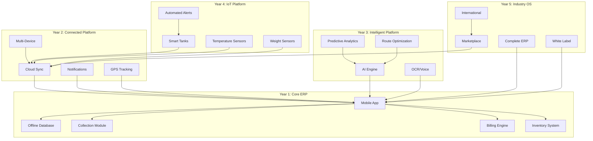

# VASUDHA OS — Product Vision

<p align="center">
  <em>"Digitizing India's essential commodity distribution — one delivery at a time."</em>
</p>

---

## Table of Contents

- [Vision Statement](#vision-statement)
- [Mission Statement](#mission-statement)
- [Core Values](#core-values)
- [Market Analysis](#market-analysis)
- [Competitive Landscape](#competitive-landscape)
- [Value Proposition](#value-proposition)
- [Target Users](#target-users)
- [User Personas](#user-personas)
- [Growth Strategy](#growth-strategy)
- [Impact Goals](#impact-goals)
- [Sustainability Mission](#sustainability-mission)
- [Long-Term Platform Vision](#long-term-platform-vision)

---

## Vision Statement

> **To become India's definitive operating system for essential commodity distribution — enabling every water, dairy, and oil distributor to operate with the efficiency, visibility, and intelligence of a Fortune 500 supply chain.**

VASUDHA OS envisions a future where:

- Every delivery is tracked, every payment is recorded, and every route is optimized
- Small and medium distributors have access to enterprise-grade tools at accessible price points
- AI-driven insights transform reactive operations into proactive, predictive businesses
- The entire supply chain — from warehouse to restaurant kitchen — is connected, visible, and intelligent

---

## Mission Statement

> **To build an offline-first, mobile-native ERP platform that eliminates operational chaos in India's essential commodity supply chains — reducing revenue leakage, minimizing wastage, and empowering field teams with intuitive digital tools.**

### Mission Pillars

1. **Accessibility** — Technology that works for field workers with varying digital literacy levels
2. **Reliability** — Offline-first architecture that never fails, even in connectivity dead zones
3. **Intelligence** — AI-powered insights that grow smarter with every transaction
4. **Scalability** — From a single truck to a multi-city fleet, without changing platforms
5. **Sustainability** — Reducing wastage, optimizing routes, and minimizing environmental impact

---

## Core Values

### 🌍 Ground-Level First (Vasudha)
We build for the field worker, the driver, the collection agent — not just the back-office manager. Every feature must work reliably in the most challenging real-world conditions.

### 🔌 Offline by Default
Internet is a luxury in many operational areas. VASUDHA OS must work perfectly offline and sync intelligently when connected. No feature should require always-on connectivity.

### 🧠 Simple Outside, Powerful Inside
The interface should be as simple as a WhatsApp chat. The engine underneath should be as powerful as SAP. Complexity is hidden; simplicity is presented.

### 📊 Data as a First-Class Citizen
Every interaction generates data. Every data point has value. We collect, structure, and surface insights from operational data that would otherwise be lost in paper registers.

### 🤝 Built with the Industry
We don't build in isolation. Every feature is validated with real distributors, real drivers, and real restaurants. Domain expertise shapes product decisions.

### 🔒 Trust through Transparency
Financial data is sacred. Every transaction is auditable. Every change is logged. Users must trust the system completely to adopt it.

---

## Market Analysis

### Industry Overview

India's food and beverage distribution sector presents a massive, underserved market:

| Segment | Market Size (Annual) | Growth Rate | Digital Penetration |
|---------|---------------------|-------------|-------------------|
| Packaged Water | ₹25,000+ Cr | 15–20% CAGR | < 5% |
| Dairy Distribution | ₹8,00,000+ Cr | 10–12% CAGR | < 8% |
| Edible Oil Distribution | ₹2,50,000+ Cr | 8–10% CAGR | < 3% |
| Institutional Food Supply | ₹5,00,000+ Cr | 12–15% CAGR | < 5% |

### Key Market Characteristics

1. **Highly Fragmented** — Millions of small and medium distributors, most operating informally
2. **Cash-Heavy Operations** — 60–70% of transactions are still cash-based
3. **Low Digital Adoption** — Most operations rely on paper registers and manual tracking
4. **High Operational Complexity** — Perishable goods, daily deliveries, complex payment cycles
5. **Rapid Smartphone Penetration** — 800M+ smartphone users; even field workers carry smartphones
6. **Government Push for Digitization** — GST mandates, Digital India initiatives, UPI adoption

### Market Opportunity

```
Total Addressable Market (TAM):
  ~2.5 million distribution businesses across India
  Average annual spend on operations management: ₹2–5 Lakhs
  TAM = ₹50,000 Cr – ₹1,25,000 Cr

Serviceable Addressable Market (SAM):
  ~500,000 businesses in target segments (water, dairy, oil)
  SAM = ₹10,000 Cr – ₹25,000 Cr

Serviceable Obtainable Market (SOM) — Year 1–3:
  ~5,000–10,000 businesses
  SOM = ₹50 Cr – ₹200 Cr
```

---

## Competitive Landscape

### Direct Competitors

| Competitor | Strengths | Weaknesses | VASUDHA OS Advantage |
|-----------|-----------|------------|---------------------|
| **Tally Prime** | Market leader in accounting; trusted brand | No field operations; desktop-only; no offline mobile | Mobile-native; field operations focus; offline-first |
| **Vyapar** | Simple invoicing; good mobile UX | Limited to billing; no route/delivery management | Full supply chain ERP; delivery + collection + inventory |
| **Khatabook** | Credit/ledger tracking; massive user base | No inventory; no delivery; no operations | Complete operations platform beyond ledger |
| **ERPNext** | Open source; feature-rich; customizable | Complex setup; requires technical team; web-first | Zero-config; mobile-native; no technical team needed |
| **Odoo** | Comprehensive ERP; modular | Expensive; steep learning curve; cloud-dependent | Affordable; simple UX; offline-first |
| **SAP Business One** | Enterprise-grade; global standard | Extremely expensive; overkill for SMBs | Purpose-built for Indian SMB distribution |

### Indirect Competitors

| Category | Examples | Gap VASUDHA OS Fills |
|----------|----------|---------------------|
| WhatsApp Groups | Ubiquitous for coordination | No structure, no tracking, no analytics |
| Paper Registers | Universal in small businesses | No search, no reports, data loss risk |
| Custom Excel Sheets | Common for billing | No mobile, no real-time, error-prone |
| Generic CRMs | Salesforce, Zoho | Not designed for physical distribution |

### Competitive Moat

1. **Domain Specificity** — Purpose-built for essential commodity distribution (not a generic tool adapted)
2. **Offline-First Architecture** — True offline capability, not just "offline mode" as an afterthought
3. **Field-Worker UX** — Designed for users with limited digital literacy; minimal training required
4. **Indian Market Fit** — GST, UPI, Hindi/regional language support, Indian payment cycles
5. **Data Network Effects** — More usage → better AI predictions → more value → stronger retention

---

## Value Proposition

### For Business Owners

```
Before VASUDHA OS                     After VASUDHA OS
─────────────────                     ────────────────
❌ Revenue leakage (8–15%)            ✅ Near-zero leakage (< 1%)
❌ Manual data entry (2–3 hrs/day)    ✅ Automated entry (< 30 min/day)
❌ Delayed reports (days/weeks)       ✅ Real-time dashboards
❌ Cash tracking chaos                ✅ Complete payment reconciliation
❌ Inventory guesswork                ✅ Precise stock tracking + alerts
❌ Scaling bottleneck at 150 orders   ✅ Scale to 1,000+ orders seamlessly
❌ GST compliance headaches           ✅ Automated GST calculation + reports
```

### For Field Teams (Drivers/Collection Agents)

```
Before VASUDHA OS                     After VASUDHA OS
─────────────────                     ────────────────
❌ Paper delivery sheets              ✅ Digital delivery list on phone
❌ Manual route planning              ✅ Optimized routes (future)
❌ Cash receipt confusion             ✅ Digital receipts + payment tracking
❌ Calling office for updates         ✅ Real-time sync (when connected)
❌ No proof of delivery               ✅ Photo/signature proof (future)
```

### For Restaurant/Buyer Partners

```
Before VASUDHA OS                     After VASUDHA OS
─────────────────                     ────────────────
❌ Invoice disputes                   ✅ Digital invoices with history
❌ Inconsistent delivery times        ✅ Scheduled, trackable deliveries
❌ Manual reordering                  ✅ Auto-reorder suggestions (future)
❌ Payment disputes                   ✅ Clear payment history + receipts
```

---

## Target Users

### Primary Users

| User Type | Description | Key Needs |
|-----------|-------------|-----------|
| **Business Owner** | Distributor/company owner managing operations | Revenue visibility, growth analytics, compliance |
| **Operations Manager** | Day-to-day operations coordinator | Scheduling, dispatch, inventory management |
| **Collection Agent** | Field worker collecting payments | Route info, payment recording, receipt generation |
| **Delivery Driver** | Executes deliveries to restaurants | Delivery list, navigation, proof of delivery |
| **Accountant/Billing** | Manages invoices and financial records | Billing, GST, reconciliation, reports |

### Secondary Users

| User Type | Description | Key Needs |
|-----------|-------------|-----------|
| **Restaurant Owner** | Receives deliveries and makes payments | Order history, payment status, invoices |
| **Warehouse Manager** | Manages stock and loading | Inventory levels, loading lists, expiry tracking |
| **Regional Manager** | Oversees multi-location operations | Cross-location analytics, performance comparison |

---

## User Personas

### Persona 1: Rajesh — The Distributor Owner

```
Name:        Rajesh Sharma
Age:         42
Location:    Jaipur, Rajasthan
Business:    "Sharma Water Supply" — distributes packaged water to 250+ restaurants
Team Size:   12 (5 drivers, 3 loaders, 2 collection agents, 1 accountant, 1 supervisor)
Tech Level:  Moderate — uses WhatsApp, Paytm, basic smartphone apps
Pain Points: Can't track daily collections accurately; loses ₹50K–1L/month to leakage
Goal:        "I want to see my full business picture on my phone — what went out,
             what came back, what was collected, what's pending."
```

### Persona 2: Suresh — The Collection Agent

```
Name:        Suresh Kumar
Age:         28
Location:    South Delhi
Role:        Collection agent for a dairy distributor
Daily Work:  Visits 30–40 restaurants to collect payments
Tech Level:  Basic — comfortable with WhatsApp and phone calls
Pain Points: Carries ₹2–5 Lakhs cash daily; no proper tracking; disputes with restaurants
Goal:        "Give me a simple list of where to go and what to collect. Let me mark
             it done with one tap."
```

### Persona 3: Priya — The Accountant

```
Name:        Priya Verma
Age:         35
Location:    Mumbai, Maharashtra
Role:        Accountant for an edible oil distributor
Daily Work:  Reconciles collections, generates invoices, files GST returns
Tech Level:  High — proficient in Tally, Excel, and basic software
Pain Points: Spends 2–3 hours daily reconciling paper receipts; GST filing is a nightmare
Goal:        "I need accurate, auto-generated invoices with GST breakdowns.
             And I need to reconcile collections without chasing 10 people."
```

### Persona 4: Amit — The Driver

```
Name:        Amit Yadav
Age:         24
Location:    Pune, Maharashtra
Role:        Delivery driver for a water distribution company
Daily Work:  Delivers to 50–60 locations, loads truck at warehouse at 4 AM
Tech Level:  Basic — uses phone for calls and WhatsApp
Pain Points: Gets a paper list every morning; no route guidance; wastes time finding addresses
Goal:        "Just tell me where to go next and what to deliver. That's it."
```

---

## Growth Strategy

### Phase 1: Foundation (Year 1)
**Strategy**: Depth over breadth — dominate one city, one segment

- Launch in **one pilot city** (e.g., Jaipur, Pune, or a Tier-2 city)
- Focus on **water distribution** as the initial segment
- Onboard **50–100 distributor businesses** through direct sales
- Achieve **product-market fit** with high daily active usage
- Build **case studies** and ROI documentation from pilot users

### Phase 2: Expansion (Year 2)
**Strategy**: Expand segments and geographies

- Add **dairy and oil distribution** segments
- Expand to **5–10 cities** across multiple states
- Launch **cloud sync** for multi-device and multi-location operations
- Introduce **freemium model** — free for small operators, premium for larger ones
- Build **partner network** (CA firms, distribution associations, trade bodies)

### Phase 3: Intelligence (Year 3)
**Strategy**: Differentiate through AI and data

- Launch **AI-powered features** (demand forecasting, route optimization)
- Introduce **restaurant portal** — let buyers place orders directly
- Build **vendor marketplace** — connect distributors with suppliers
- Expand to **20+ cities**
- Introduce **API platform** for third-party integrations

### Phase 4: Platform (Year 4–5)
**Strategy**: Become the industry operating system

- **IoT integration** — smart tanks, temperature sensors, weight sensors
- **Complete ERP** — HR, Accounting, Procurement, CRM
- **Industry marketplace** — connect all supply chain participants
- **White-label solution** — let large brands deploy customized instances
- **International expansion** — SEA markets with similar distribution patterns

---

## Impact Goals

### Economic Impact

| Goal | Target | Timeline |
|------|--------|----------|
| Reduce revenue leakage for users | 80% reduction | Year 1 |
| Reduce operational costs | 25–35% reduction | Year 1–2 |
| Increase collection efficiency | 50% faster cycles | Year 1 |
| Reduce inventory wastage | 60% reduction | Year 2 |
| Enable business scaling | 3–5x capacity increase | Year 2–3 |

### Social Impact

| Goal | Description | Timeline |
|------|-------------|----------|
| Digitize informal businesses | Bring 10,000+ businesses into the formal digital economy | Year 1–3 |
| Empower field workers | Provide digital tools to 50,000+ delivery and collection workers | Year 2–3 |
| Reduce food wastage | Minimize spoilage through better inventory management | Year 2–4 |
| Improve compliance | Automate GST and regulatory reporting for SMBs | Year 1 |

### Environmental Impact

| Goal | Description | Timeline |
|------|-------------|----------|
| Optimize delivery routes | Reduce fuel consumption by 20–30% per business | Year 3 |
| Reduce paper usage | Eliminate paper registers, receipts, and invoices | Year 1 |
| Minimize food waste | Better demand forecasting reduces overproduction and spoilage | Year 2–4 |
| Enable sustainable packaging tracking | Track and optimize packaging lifecycle (future) | Year 4–5 |

---

## Sustainability Mission

VASUDHA (वसुधा — "The Earth") carries sustainability in its name. Our commitment:

### 1. Operational Sustainability
- **Route optimization** reduces fuel consumption and carbon emissions
- **Demand forecasting** reduces overproduction and wastage
- **Digital receipts** eliminate paper waste (an average distributor uses 10,000+ paper receipts/year)

### 2. Business Sustainability
- **Accessible pricing** ensures small businesses aren't priced out
- **Offline-first** ensures technology works even in underserved areas
- **Gradual digital adoption** — don't force complex workflows on users

### 3. Technology Sustainability
- **Clean architecture** ensures long-term maintainability
- **Modular design** allows incremental feature addition without rewrites
- **Open standards** prevent vendor lock-in

---

## Long-Term Platform Vision



### The Endgame

VASUDHA OS aims to be the **"Shopify of distribution"** — a platform that makes it trivially easy for any essential commodity distributor to run a digitally-powered, data-driven, AI-optimized operation. Just as Shopify turned every shopkeeper into an e-commerce business, VASUDHA OS will turn every distributor into a modern logistics operation.

---

<p align="center">
  <strong>वसुधैव कुटुम्बकम्</strong> — <em>The world is one family.</em><br/>
  VASUDHA OS is built for the people who keep India's essential supplies flowing.
</p>
